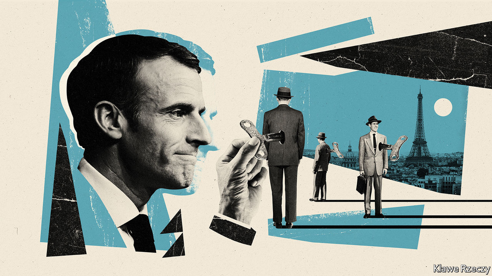

## The man with le Plan

# Emmanuel Macron revives a post-war institution for a post-covid era

> And announces a huge new stimulus as well

> Sep 5th 2020PARIS

Editor’s note: Some of our covid-19 coverage is free for readers of The Economist Today, our daily [newsletter](https://www.economist.com/https://my.economist.com/user#newsletter). For more stories and our pandemic tracker, see our [hub](https://www.economist.com//news/2020/03/11/the-economists-coverage-of-the-coronavirus)

IN 1946, AS France emerged from the horrors of war, Charles de Gaulle devised le Plan to rebuild his battered country. Centred on the theme “Modernisation or Decadence”, the first five-year plan identified six industries—coal, electricity, steel, transport, mechanised agriculture and cement—on which France would construct a modern economy. “Modernisation”, declared Jean Monnet, the first commissioner of the Plan (and later co-architect of European integration), is a “state of mind”. Indeed in the French mind, the Plan was in large part to thank for the 30 years of prosperity—les trente glorieuses—that followed.

The office of the Plan was not formally abolished until 2006, but France has not drawn up a five-year plan for nearly 30 years. A successor body, known as France Stratégie, scarcely mentioned the word Plan at all. From the mid-1980s, the forces of liberalisation and globalisation increasingly turned the former institution and its focus on planning into a quaint historical relic. Until now.

On September 3rd, as The Economist went to press, the French government was set to announce the resurrection of the mighty Plan. The first commissioner of the revived bureaucratic body will be François Bayrou. A veteran centrist, he is the leader of MoDem, a party that is crucial to President Emmanuel Macron’s governing majority in parliament. Mr Bayrou will not join the government, but will report to it.

State planning and the desire for autonomy in strategic industries have a long history in France, reaching back to Jean-Baptiste Colbert, Louis XIV’s finance minister. In more recent times, as liberal orthodoxy prevailed globally, it became the preserve of diehard French dirigistes, often to the disapproval of their German friends. The covid-19 pandemic, however, is now shifting the debate well beyond France. Shortages of masks have called into question the wisdom of relying on global supply chains. Overwhelmed hospitals have strengthened the case for investment in public health. Home-working and a fear of crowds have reset the discussion about the geography and greening of the city, just as border closures have thrown the travel, tourism and aerospace industries into disarray.

The point of resurrecting the Plan, says Mr Macron, is “to rediscover the sense of the long-term” and make sure that government is not only about crisis management. To the relief of many, five-year plans will not make a comeback. But Mr Bayrou will set out how France should prepare for 2030: how to move towards a lower-carbon economy, invest in the right skills for tomorrow’s world of work and strengthen local industries across the country.

“The French Plan was never a Soviet-style plan,” says Jean Pisani-Ferry, an economist and former head of France Stratégie, who cautions against caricature. In its early guise, the Plan was indeed about public investment in roads, railways, electricity and telecoms. But it also relied heavily on private-sector firms as well as on public planning. The uncertainties of the post-covid-19 world, argue the new Plan’s defenders, require new thinking. “Planning hasn’t become part of the new orthodoxy,” says Mr Pisani-Ferry; “but it’s no longer taboo.” Mr Bayrou’s role will be one of reflection rather than execution. Bruno Le Maire, the finance minister, remains firmly in charge of public spending.

Which is why it was no coincidence that Jean Castex, the new prime minister, was due to launch the Plan on the same day that he unveiled his €100bn ($119bn) stimulus package. This will be spent over two years, with two-fifths of the sum coming from the new European Union recovery fund. Part of the idea is short-term: to keep businesses afloat and people in jobs during a deep recession. The French economy shrank by a massive 13.8% in the second quarter—less than in Spain but more than in Germany—and is forecast to contract by 11% during 2020. The government has already said, for example, that it will extend for two years its generous furlough schemes, which have covered up to 12m people, albeit with a decreased state contribution. It has promised tax cuts for business. And Mr Castex has made an “absolute commitment” not to raise any taxes.

Yet the idea is also to turn the crisis into an opportunity to increase and redirect public investment. On the one hand, there will be plenty of green measures (insulation of buildings, investment in hydrogen and research), as well as the expansion of high-speed broadband and local infrastructure. On the other, there will be a boost for skills, apprenticeships and training, particularly for the young. Unlike Germany, France will focus less on demand-led stimulus than on supporting businesses and investment. Thanks in part to government help, French consumers built up savings during lockdown and incomes were broadly preserved. The hope is that, if confidence returns, they will now start to spend them.

Does all this add up to a U-turn for Mr Macron, a liberal centrist elected on a promise to disrupt France? The word planning was unuttered during his election campaign. Now, he has put reforms to benefits and pensions on hold and a bureaucrat, Mr Castex, in charge of the government. Mr Macron says he is using the moment to “accelerate” his transformation of France, not abandon it. The reforms, he insists, will eventually resume. It may be that the old-fashioned feel of the Plan is deliberate: not because it heralds a return to five-year plans, but because it aims to tell the French that, despite the pandemic, the government is still in control. “My philosophy,” says Mr Macron, with a nod to Monnet, is “the transformation, the modernisation of the country; it cannot stop.” ■

## URL

https://www.economist.com/europe/2020/09/05/emmanuel-macron-revives-a-post-war-institution-for-a-post-covid-era
