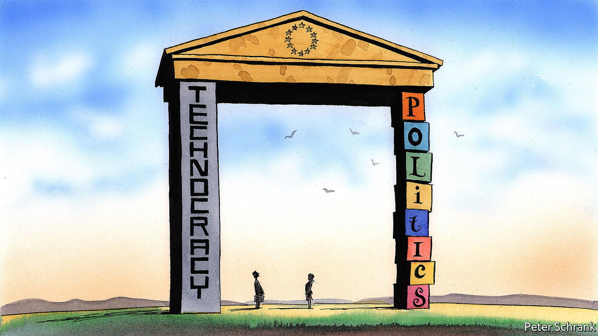

## Charlemagne

# The contradiction at the heart of the European Commission

> Are the people in charge of the EU’s bureaucracy politicians or technocrats?

> Sep 5th 2020

THE ECONOMIST is fond of handy descriptions. Sometimes, we admit, they can be a bit obvious (“Xi Jinping, the president of China”; “Goldman Sachs, a bank”). Occasionally, they aim to amuse (“Homer Simpson, an American philosopher”, or “Popeye, a sailor man”). But coming up with one for the European Commission is distinctly tricky.

After all, the commission does a bit of everything. It is the closest thing the EU has to a government, putting forward legislation (which then has to be approved by the European Parliament and national ministers). It has the trappings of one, too: Ursula von der Leyen, its president, will give a state-of-the-union address in front of the Parliament later this month. At times the commission is a referee, ensuring both business and governments follow EU rules. Sometimes it is a broker, forging compromise between sparring member states. From the perspective of some national capitals, it is a civil service, following the agenda of the European Council, the club of EU leaders which settles the political direction of the bloc. Bureaucrats in Brussels should be little more than dry technocrats, in this view. Different descriptions lead to different expectations—and different types of annoyance when they are not met. Boiled down, it is an issue of politics versus technocracy.

These tensions came to a head in the case of Phil Hogan, Ireland’s commissioner and the EU’s trade chief, who resigned last month. During a trip home, Mr Hogan attended a lockdown-busting dinner with lots of golf-loving Irish bigwigs. For a political body, such as Ireland’s government, the response was obvious: voters were baying for blood and had to be sated. An Irish minister who attended the banquet resigned, while guilty senators lost the whip. For a technocracy, it was more complicated. Brussels is supposed to be above national politics: Irish voters may have been upset about the actions of “Big Phil”, but most Europeans could not pick the six-foot-five-inch politician out of a line-up. Commissioners such as Mr Hogan can be sacked only by Mrs von der Leyen. If she had heeded Irish calls, the commission’s independence would have been damaged; if she had ignored them, she would have looked contemptuous of voters. Luckily, Mr Hogan jumped, sparing Mrs von der Leyen a difficult choice.

Such problems are common in a body that cannot decide whether it is a political entity or a technocratic one. It often ends up doing an awkward impression of both. What began as an independent monitor overseeing the dreary business of coal and steel production now helps to determine its members’ budgets. The politicisation of the commission became more explicit under Jean-Claude Juncker, its previous head. This mindset still prevails internally. Decisions such as whether to punish a country for overspending are inherently political, runs the argument. Pretending that they can be dealt with by neutral technocrats is absurd. “There has to be political ownership,” says one official. “It can’t be about numbers into a calculator.” At the same time, there are some areas, such as competition policy, that are for the most part left untouched by politics—a status that must be taken on trust by voters and national governments.

Not all are happy with this compromise. During the long negotiations over a €750bn ($890bn) recovery fund for the EU this summer, one of the main sticking-points was a lack of trust in the commission. Allowing countries such as France, Portugal and Spain leeway in their budgets may have been popular in Europe’s south, but it upset Dutch politicians, for whom the calculator approach is just fine. Politicisation throws up conflicts of interest, critics argue. The commission is the first responder if a member state shows signs of drifting from democratic norms. Yet Viktor Orban, Hungary’s prime minister, who has enthusiastically dismantled checks and balances, has been sheltered in part by belonging to the European People’s Party (EPP), the same European political alliance as Mrs von der Leyen and her two predecessors.

Though the principle of the commission’s independence is constantly proclaimed, party politics is never far from the surface. Mrs von der Leyen owes her job to her membership of the EPP. Jobs in the commission are carefully divided along partisan and national lines. But if this is acknowledged, complaints follow. In July a two-second appearance by Mrs von der Leyen in a political video for Croatia’s centre-right governing party—part of the EPP—triggered a row in Brussels. When the commission is involved, European politics resembles a scene in “Doctor Strangelove”: “Gentlemen, you can’t fight in here! This is the War Room!” Nationality still matters, too. Commissioners are supposed to leave their passports at the door, but the subtle scrap among member states for Mr Hogan’s powerful job (and Irish despair at having potentially lost it) suggests otherwise.

Those who dream of a return to technocracy are out of luck. If politics follows money, then the commission will become more political. It will oversee the issuance of €750bn in collective debt and monitor how the proceeds are spent. That will leave the EU itself with a bigger stack of debt than any of its member states bar Italy, France and Germany. But politics without democracy is not ideal. The experiment of allowing the European Parliament to pick the commission’s president, in effect, was aborted last year after EU leaders balked at Manfred Weber, the German MEP the system put forward. Instead, Mrs von der Leyen got the job after much haggling, as was customary when the commission was a more technocratic institution. When appointing the head of a civil service, the lack of a democratic mandate does not matter; when selecting the head of a de facto government, it does. Working out which role to embrace is essential if the commission wants to avoid impossible expectations. Until then, it will have to live with an unflattering description: a contradiction. ■

## URL

https://www.economist.com/europe/2020/09/05/the-contradiction-at-the-heart-of-the-european-commission
