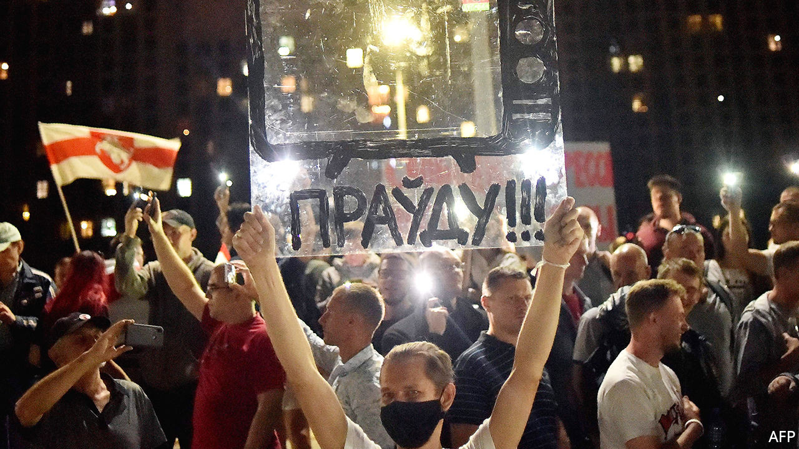

## A distorted Muscovite picture

# The information war over Belarus hots up

> Russia rules the airwaves but not social media

> Sep 5th 2020MINSK

IT WAS THE cables that gave them away. As foreign and local journalists in Belarus scrambled to report on the latest crackdown on peaceful protesters, one film crew was always in prime position. Its members were untouched whenever police hounded other journalists, stripping them of their accreditation and deporting them. The camera cables that stretched past several unmarked police minibuses led to the source of their protection: a white and green van belonging to Russia Today.

Russia’s “green men”, unbadged soldiers sent to Ukraine after its revolution in 2014, are yet to make an appearance in Belarus. But the Kremlin’s propaganda warriors have already occupied its airwaves. Their invasion was solicited by Alexander Lukashenko, Belarus’s embattled dictator, who has lost any claims to legitimacy first by rigging the recent presidential election, then by unleashing terror against the large numbers of his people who protested.

Shocked by the violence of the security services, workers in state-owned factories, who were once Mr Lukashenko’s most solid backers, went on strike. Journalists for state television, normally obedient servants of the regime, walked out of their studios in protest. Desperate to look more in control, Mr Lukashenko appealed to Russia’s president, Vladimir Putin, for help.

Mr Putin cannot afford to let Mr Lukashenko be overthrown by popular protests. He does not want to set a dangerous precedent. The attempt to kill Russia’s main opposition leader, Alexei Navalny, shows just how nervous the Kremlin is feeling. But Mr Putin has little desire to incur new Western sanctions by sending soldiers to save Mr Lukashenko. (Sanctions may be forthcoming anyway, following Germany’s confirmation on September 2nd that Mr Navalny was poisoned with a nerve agent similar to ones used in other Russian-sponsored assassinations, to which only state operatives could have access.) Helping Belarus improve its propaganda is more deniable and less provocative than sending troops.

The change in programming wrought by Russia is glaring. Before the information takeover, Belarusian state TV offered a largely ineffective diet of Soviet and second world war mythology—more Belarus Yesterday than Russia Today. The newly arrived propagandists from Moscow have wheeled out an arsenal of aggression and divisiveness. Breathless news reports have started to warn of the havoc caused by protests in France and Syria. Coverage also seeks to discredit and sneer at the local protests as creations of the West. Selective editing depicts them as feebly supported yet violent—and doomed to failure. A new legion of experts warns of the dangers of a split in Belarusian society.

Mr Lukashenko, who has spent the past two years rallying Belarusians around the flag and feeding his army and security services a yarn about Russia’s threat to the country’s sovereignty, has abruptly changed his tune. He talks these days about one fatherland stretching from Brest, a city in Belarus’s west, to Vladivostok in Russia’s far east. “We now have no other choice but to fasten our boat to the eastern shore,” one senior and somewhat disoriented government official says, landlocked Belarus being conspicuously lacking in shores.

But sprucing up state television’s news reports in this way may not have the intended effect. The change is so sudden and so obvious that it risks further alienating citizens who have experienced a national awakening in the past few weeks. The rush of Russian-made propaganda might persuade some wavering Belarusians against taking to the streets, but it seems unlikely to change the minds of the hundreds of thousands who are already there.

The Belarusians who brave police violence do not watch state television, but rely instead on social media and messenger groups, such as Nekhta (Someone), a Telegram channel run by young Belarusians from neighbouring Poland. It has quickly clocked up over a billion page views. Being told by Russia that they are mere extras in a Western plot will make the protesters all the more determined to prove themselves leading actors in an historic drama. ■

## URL

https://www.economist.com/europe/2020/09/05/the-information-war-over-belarus-hots-up
