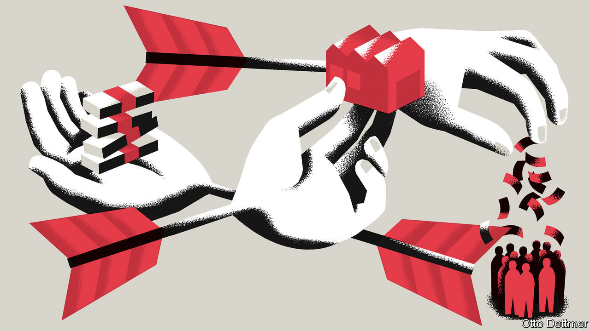
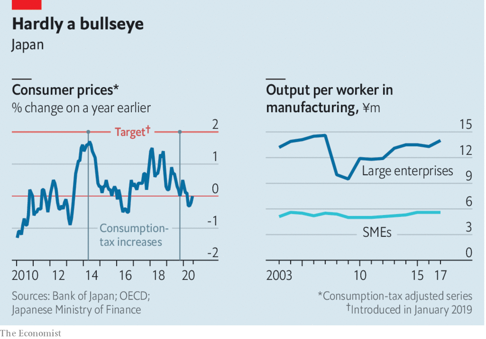

## Free exchange

# Did Abenomics work?

> And what did the world learn from it?

> Sep 3rd 2020

AS AN EXERCISE in political branding, Abenomics has been an unusual success. When Abe Shinzo returned to power as Japan’s prime minister in December 2012, he said he would revive the economy by loosing off three “arrows”. The first, expansive monetary policy, would banish deflation. The second, flexible fiscal policy, would restrain public debt without jeopardising the recovery. The third arrow, structural reform, would revive productivity and lift growth. The image stuck, even after the government tired of it.

Mr Abe’s archery excited keen interest elsewhere. Many other mature economies, after all, look a little Japan-ish. They combine greying populations, faltering growth, high public debt and stubbornly low inflation, despite miserly interest rates. “Yes, we are probably all Japanese now,” concluded Jacob Funk Kirkegaard of the Peterson Institute for International Economics, an American think-tank, last year, even before the covid-19 pandemic added to the debt, disinflation and despair. As Mr Abe departs after almost eight years in charge, what lessons can others draw?

The first lesson is that central banks are not as powerful as hoped. Before Abenomics, many economists felt Japan’s persistent deflationary tendencies stemmed from a reversible mistake by the Bank of Japan (BoJ). It had combined fatalism with timidity, blaming deflation on forces outside its control, and easing monetary policy half-heartedly. In 1999 Ben Bernanke, later a Fed chairman, called on the BoJ to show the kind of “Rooseveltian resolve” that America’s 32nd president showed in fighting the Depression.

Sure enough, in April 2013, the BoJ made a display of new determination, promising to buy enough assets, including government bonds and equities, to raise inflation to 2% within about two years. In 2016 it introduced negative interest rates, a cap on ten-year bond yields and a promise to let inflation overshoot its target (which the Federal Reserve emulated last month). These efforts stopped persistent deflation, a feat that is often forgotten. But they could not lift inflation close to the central bank’s target (see left-hand chart).

One reason may be peculiar to Japan: its regular workers are economically monogamous, enjoying long-term employment relationships with a single firm. They are almost impossible to fire but also difficult to poach. Thus, although Abenomics lowered unemployment to just 2.2% by the end of last year, regular workers did not benefit from a bidding war for their talents. Firms instead spent more on part-time workers. Yet because these recruits collect a relatively small share of the country’s wages, their improved pay put little upward pressure on prices.

Another threat to the power of central banks could recur elsewhere. Japan’s public became so accustomed to unchanging prices, it assumed the future would mirror the past. That assumption, which shaped pay negotiations between unions and employers, then became self-fulfilling. This was a difficult legacy for Abenomics to overcome. Proponents of monetary activism were right to criticise the BoJ for not fighting this mindset earlier. They were wrong to think those past mistakes were easily reversible once Abenomics began. “I was too optimistic and too certain about the ease with which a determined central bank could conquer deflation,” admitted Mr Bernanke in 2017.

As well as showing that monetary policy is less powerful than hoped, Abenomics has shown that high public debt is less dangerous than feared. Japan’s gross government debt was almost 230% of GDP when Mr Abe took charge and is even higher now. But the cost of government borrowing has remained negligible. Indeed, yields for five-year bonds are negative.

Fiscal scolds point out that yields on bonds are low because the central bank is buying so many of them: its holdings now amount to 99% of GDP, whereas the Fed’s equal about 20% of American GDP. The term “financial repression” gets bandied about, as if Japan’s central bank is conspiring to let the government spend more than it should, at the expense of the private sector. But that gets things backwards. The central bank is doing everything it can to revive private spending. Until it succeeds, though, the government has to fill whatever gap in demand remains. The shortfall in private spending is what makes government deficits necessary. It is also what makes them so cheap to finance.

What about the third arrow of Abenomics? Before its lost decades, Japan taught the world how to raise productivity in big firms, through “lean manufacturing”, just-in-time delivery, and so on. Unfortunately, the country also shows how badly productivity can lag in small firms. Many operate in service industries, where productivity is notoriously low. Yet even in manufacturing, small enterprises are less than 40% as productive as their larger counterparts, according to the Ministry of Finance (see right-hand chart).

Just because a firm is small does not mean it is new or particularly entrepreneurial. In Japan, three-quarters of small firms are over ten years old and two-thirds of the owners of small and middling enterprises will be 70 or older by 2025, according to the OECD. The government provides plenty of support to small firms. It guaranteed loans worth 4.4% of GDP in 2016, compared with an average of just 0.1% in the OECD, a group of mostly rich countries. In a report last year, the group expressed concern that such guarantees weaken the incentive for banks to monitor their borrowers and push them to improve.

For the many countries that have expanded similar guarantees in response to the covid-19 pandemic, Japan thus provides a useful lesson. Governments must be careful to ensure that this necessary effort to ensure the survival of small firms in the short term does not permit stagnation in the long term.

Abenomics will almost certainly outlast the prime minister who introduced it. None of Mr Abe’s potential successors, including Kishida Fumio, his party’s head of policy, Ishiba Shigeru, a former defence minister, or Suga Yoshihide, the chief cabinet secretary, are likely to renounce it. They may, however, be tempted to rebrand it. Suganomics, for example, has a nice ring to it. ■

## URL

https://www.economist.com/finance-and-economics/2020/09/03/did-abenomics-work
