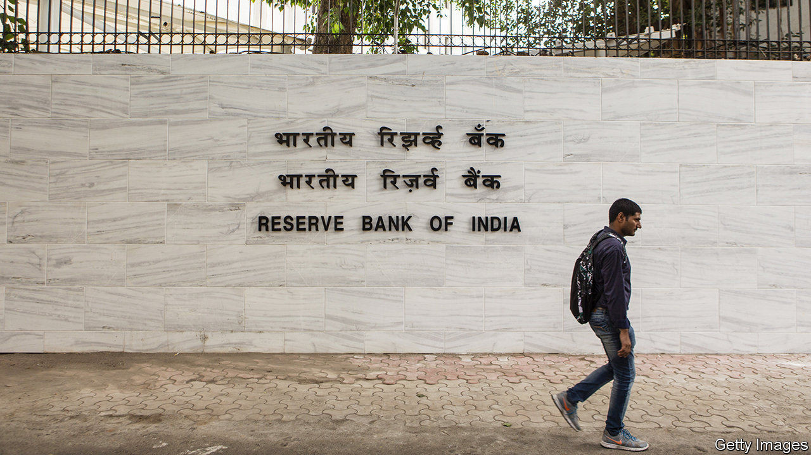

## Silent no more

# Two damning portrayals of Indian finance

> A pair of former central bankers spill the beans

> Sep 5th 2020

CENTRAL BANKERS who leave office often write memoirs. Few are as damning of the financial system they once served as Urjit Patel, the governor of the Reserve Bank of India (RBI) in 2016-18, and Viral Acharya, its deputy governor in 2017-19, who is now an academic at NYU Stern School of Business. In separate books, they tell stories of rampant government meddling in the banking system. Both stood down before their terms ended. Their books suggest why.

Mr Patel does not directly address his departure. But he appears to have reached breaking point when the government of Narendra Modi tried to dilute new bankruptcy rules that it had once championed to tackle the problem of zombie corporations.

In a chapter titled “The Empire Strikes Back”, he relates how the government lobbied the RBI to extend repayment times for companies with 2trn rupees ($27bn) in aggregate exposure. “Instead of buttressing and future-proofing the gains thus far”, he writes, the atmosphere became one of going “easy on the pedal”.

Mr Patel describes how Indian savers, to whom he dedicates his book, see their funds used by government-controlled banks and other financial institutions for “vague (and extraneous) objectives”, such as supporting politically connected states and companies and, sometimes, the stockmarket. The distortions undermine banks’ incentives to apply the scrutiny needed to properly allocate credit. Price signals become confused; interest rates for viable private companies must remain high to offset the ones that don’t pay.

Mr Acharya documents other forms of interference. These include constant pressure to provide stimulus, raids on the central bank’s reserves to cover budget deficits, and even threats to invoke a long-buried clause in the RBI’s enabling legislation, allowing the government to give directions to the central bank when it was in “the public interest”. Suggesting sympathy for Mr Patel, he says the ex-governor’s battle to defend financial stability made his job untenable.

Mr Acharya grimly concludes that a “silent crisis” has been unfolding in India’s banking system, with borrowers prevented from defaulting only because the government is presumed to prop everything up. That works until the government’s “solvency is itself considered to be on the brink”. With the economy shrinking by 24% in the April-June quarter, compared with the same period in 2019, and public finances under pressure, the strains are only likely to get worse. But at least with these two brave books the silence has been broken.■

Urjit Patel, Overdraft, Saving the Indian Saver. Viral Acharya, Quest for Restoring Financial Stability

## URL

https://www.economist.com/finance-and-economics/2020/09/05/two-damning-portrayals-of-indian-finance
