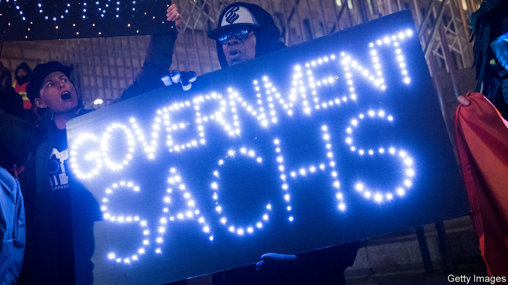
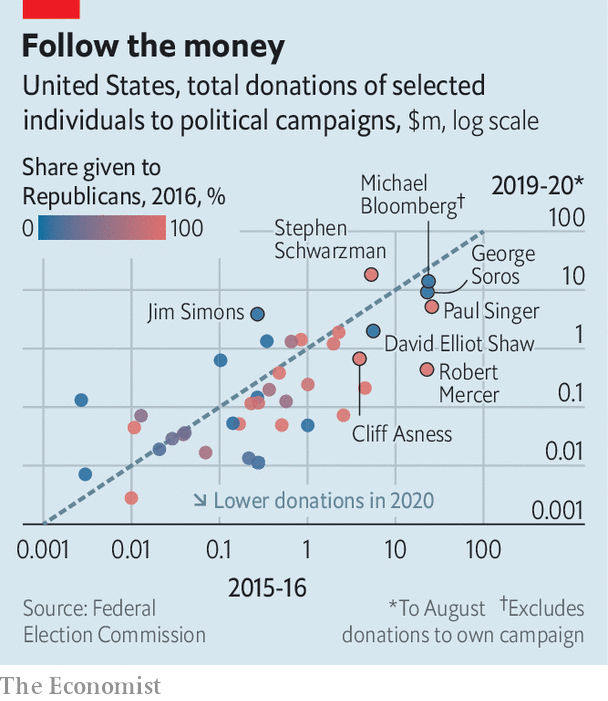

## Campaign finance

# Who does Wall Street back for president?

> Neither presidential candidate is bringing in the big bucks

> Sep 5th 2020NEW YORK

THE TIES between Wall Street financiers and politicians are the subject of a lot of scrutiny. Not for nothing is Goldman Sachs, a bank, sometimes nicknamed “Government Sachs”. But how important are the moneybags in New York to political success in Washington, DC? Quantifying the relationship can be done using the extensive data collected about campaign donations. It’s not an uplifting exercise.

The first task is to decide who counts as Wall Street’s elite. As well as encompassing the bosses of banks like JPMorgan Chase and Morgan Stanley, they also include the heads of some hedge funds, private-equity shops, asset managers and wealth-management firms in New York, New Jersey and Connecticut. In addition are billionaire New Yorkers on the Forbes list, who have earned their wealth via some form of finance, such as Michael Bloomberg of the eponymous financial-information firm. Totted up this way, the financiers amount to 68 people. Of these, 52 have given money to political campaigns in at least one of the two most recent general-election cycles (2015-16 and 2019-20). Together they are worth $310bn and manage firms with assets of over $32trn.

Estimates of their political contributions are drawn from campaign-finance data on individual donations* in the Federal Election Commisson, a regulator. The Economist has attempted to contact larger donors to verify them. Not all have responded. Most of these Wall Street donors hedge their bets; they give to campaigns from both parties. But the biggest contributors have, in the past, tended to be one-party loyalists (see chart). Eight of the 52—including Cliff Asness of AQR Capital Management, an investment-management firm; Robert Mercer, then co-CEO of Renaissance Technologies, a hedge fund; and Paul Singer of Elliott Management, an activist-investment firm—gave exclusively to Republican campaigns in the 2016 election cycle. Nine—including Mr Mercer’s then-colleague Jim Simons, who founded Renaissance, George Soros, a hedge-fund veteran, and David Elliot Shaw of D.E. Shaw, another hedge fund, gave only to candidates of the Democratic Party.

In the intervening years, the pro-Republicans have appeared to grow less partisan. Just three of them have remained Republican-only, including Mr Singer and Mr Mercer. Total donations went mostly to Republicans in 2016, but are now evenly split.

Political leanings aside, much else has shifted since the last election. Firstly, the sums given have fallen. In 2016 the financiers provided $130m to political campaigns, or 1.4% of the total raised. So far this cycle, their share is just 0.5%. Strikingly, many appear to be sitting 2020 out; around a fifth of those who gave meaningfully in the last election have given nothing in 2020. This decrease is largely the result of a drop in contributions to the presidential campaign, particularly that of Donald Trump. Stephen Schwarzman of Blackstone, a private-equity firm, who has given more than $18m this year, compared with around $5m last time, is the only titan who has increased his share to the president. Mr Mercer gave more than $15.7m to Trump-affiliated committees in 2016. This time he has given less than $400,000.

It is a similar story with Joe Biden, the Democratic challenger. His two biggest Wall Street supporters are Mr Soros and Mr Shaw, both of whom have given around $500,000 each—less than they had given to Hillary Clinton at this point in her race against Mr Trump in 2016.

The congressional races are attracting more attention. The Wall Street group has given over $8m to Senate races and $19m to House races, triple the total contributed to congressional races at this point in 2016. The “Senate Majority PAC” (SMP) is particularly popular with Democratic donors. Mr Shaw has given more to Senate campaigns than he has to Mr Biden. Mr Simons has given $3.5m to the SMP.

The Senate race is of keen interest because it is considered particularly tight. But the lowly sums in the presidential battle may reflect a dispiriting reality—that neither Mr Trump nor Mr Biden generates much enthusiasm. At least those worried that Wall Street has Washington in its pocket can console themselves that so far the financiers are not providing the sort of sums that can help define the race. ■

*Donors may also give money through charitable organisations, which are not always required by the Federal Electoral Commission to disclose their individual donors. A spokesperson for George Soros confirms that his political donations through his charitable organisation, Fund for Policy Reform, for the 2019-20 electoral cycle are significantly larger than his individual contributions.

Dig deeper:Read the [best of our 2020 campaign coverage](https://www.economist.com//us-election-2020) and our [presidential-election forecast](https://www.economist.com/https://projects.economist.com/us-2020-forecast/president), then sign up for Checks and Balance, our [weekly newsletter](https://www.economist.com//checksandbalance/) and [podcast](https://www.economist.com//podcasts/2020/08/28/checks-and-balance-our-weekly-podcast-on-american-politics) on American politics.

## URL

https://www.economist.com/finance-and-economics/2020/09/05/who-does-wall-street-back-for-president
