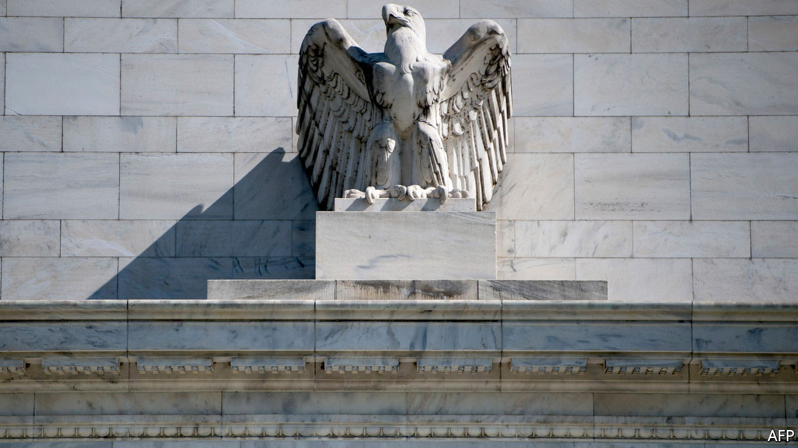

## New job description

# Will the Fed’s policy shift start a trend?

> A weaker dollar may force other central banks to follow

> Sep 5th 2020WASHINGTON, DC

IN 2018, WHEN America’s long recovery from the 2007-09 financial crisis pushed the unemployment rate below 4%, the Federal Reserve had a simple message for American workers: do not get used to it. The central bank’s economic projections revealed that its officials believed 4.5% to be the lowest sustainable jobless rate, to which America would need to return to stop inflation surging upwards. If higher interest rates and slower growth were needed to achieve that, so be it.

On August 27th Jerome Powell, the Fed chairman, acknowledged what common sense suggested two years before: that an intentional increase in unemployment is an odd thing to pursue after nearly 20 years of depressed labour-market conditions. Speaking at an annual central-banking shindig, Mr Powell unveiled the conclusions of a monetary-policy strategy review begun in 2019. The coming changes to Fed policymaking could initiate an important global shift in central-bank practice.

The Fed’s old framework was forged by the inflationary tumult of the 1970s. Post-war economists understood there to be a negative relationship between inflation and unemployment—known as the Phillips curve—such that policymakers could push unemployment as low as they liked, provided they were prepared to accept more inflation. But soaring prices persuaded many that this relationship did not hold below some minimum sustainable level of unemployment. Attempts to push joblessness lower would yield higher inflation, but at best only a temporary reduction in unemployment. By the 1990s, most central banks had resolved to target a low level of inflation, generally around 2%.

But since the embrace of inflation targeting in the 1990s, the relationship between employment and inflation has weakened. Soaring joblessness during the Great Recession failed to produce the expected plunge in prices. Neither have low levels of unemployment since then ended an era of historically low inflation. Precisely why the relationship between inflation and joblessness changed is uncertain. Some economists reckon central banks’ credibility in managing inflation anchored the public’s expectations too well. Others point to a decline in workers’ bargaining power, which has eased the pressure on firms to raise prices in order to cover the cost of expensive pay packets. Still others point to technological change and globalisation, which expand consumer options and allow firms to respond to increased demand without raising prices. Whatever the cause, the flattening Phillips curve biased monetary policy in an overly hawkish way, eventually prompting the Fed rethink.

The changes to its framework may seem modest. Because the maximum sustainable level of employment cannot be measured, the Fed will give up worrying about overshooting it and focus only on employment shortfalls. The 2% inflation target remains a constraint, but a more flexible one than before. It should be hit on average, Mr Powell explained, meaning that periods of below-target inflation can be offset by at least some time with inflation above the target as well.

But the conceptual change—abandoning the notion of a minimum sustainable unemployment rate—is significant. And the practical effects could be large. Had the Fed enjoyed more freedom in recent years, it could have raised interest rates more gradually, or not at all, enabling a faster and more complete labour-market recovery.

Whether policy will change much in practice is as yet unclear. Markets, for their part, appear not to see a radical change of regime in the offing. Market-based measures of inflation expectations are around 1.7%, below the Fed’s 2% target. American stockmarkets, which seem to soar at the gentlest of nudges, have rallied, some hitting record highs in the past week. More important is the reaction in foreign-exchange markets. The greenback has slipped nearly 1% against a basket of major currencies since Mr Powell’s speech, bringing its total decline since May to about 8%. A weakening dollar could indicate that markets see more room for policy divergence between the Fed and other central banks, most notably the European Central Bank, whose mandate does not explicitly require it to minimise joblessness.

Under any circumstances, the macroeconomic developments which led the Fed to revise its strategy would no doubt have influenced other central banks to adjust their own policies. But in weak advanced economies with interest rates close to zero, currency appreciation against the dollar places a drag on spending which cannot easily be offset by further easing. The Fed may thus find that its modest adjustment encourages imitators elsewhere in surprisingly short order. ■

## URL

https://www.economist.com/finance-and-economics/2020/09/05/will-the-feds-policy-shift-start-a-trend
