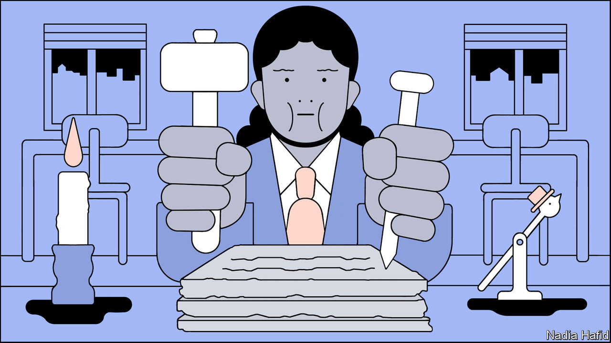

## Paper travails

# Covid-19 is spurring the digitisation of government

> It has accelerated the adoption of online services for everything from welfare to weddings

> Sep 1st 2020

Editor’s note: Some of our covid-19 coverage is free for readers of The Economist Today, our daily [newsletter](https://www.economist.com/https://my.economist.com/user#newsletter). For more stories and our pandemic tracker, see our [hub](https://www.economist.com//news/2020/03/11/the-economists-coverage-of-the-coronavirus)

FOR KARINA CELIS and her fiancé James, covid-19 could not have come at a worse time. The couple planned to marry in May and to move from London to Salisbury, a small English city whose cathedral impresses Russian tourists. In July they had a baby, their first. The wedding has been postponed indefinitely. Moving house during lockdown was surprisingly straightforward. But having the child proved a nightmare of bureaucracy.

In Britain pregnant women are often given a paper folder containing their medical records, which they must haul to their appointments. Ms Celis’s notes were not transferred properly from her hospital in London to a new one in Salisbury. She had to start a new folder—and to repeat all her appointments. Absurdly she and her fiancé had to listen again to an hour-long talk about what to do when expecting a baby.

For Ms Celis, a software-engineering manager, the lack of digitisation was shocking. “At almost every appointment I have been to, either in London or here, the staff mentioned their struggles with tech,” she says. Some maternity services have moved online, but mostly health care in Britain, as elsewhere, has stubbornly resisted digitisation. The National Health Service (NHS) remains among the world’s biggest purchasers of fax machines. A plan to create a unified digital system of patients’ records was abandoned almost a decade ago, after £10bn ($12.5bn) was spent on it. No further attempts have been made.

Neither health care nor Britain is unique in relying heavily on paper. By preventing face-to-face meetings and closing the offices where bureaucrats shuffle documents, the pandemic has revealed how big a problem that is. In many countries, it has been impossible to get a court hearing, a passport or get married while locked down, since they all still require face-to-face interactions. Registering a business has been slower or impossible. Elections are a worrying prospect.

Governments that have long invested in digitising their systems endured less disruption. Those that have not are discovering how useful it would be if a lot more official business took place online.

Covid-19 has brought many aspects of bureaucratic life to a halt. In England at least 73,400 weddings had to be delayed—not just the ceremony, also the legal part—reckons the Office for National Statistics. In France courts closed in March for all but essential services, and did not reopen until late May. They are still not operating at full capacity. Most countries have extended visas for foreigners trapped by the pandemic, but consular services stopped almost everywhere, meaning that people living abroad could not renew passports or register births. In America green-card applications were halted in April; they restarted in June. In Britain appointments to take biometric details of people applying for permanent residency ceased in March and resumed only partly in June.

Some applications cannot be delayed. As Florida was locking down, huge queues formed outside government offices to get the paper forms needed to sign up for unemployment insurance. In theory the state has a digital system, but it was so poorly constructed that many could not access it. At the start of the pandemic the website crashed for days. Even several months later people trying to apply had to join a digital queue and wait for hours before being able to log in. When government offices in Montgomery, the capital of neighbouring Alabama, reopened, people camped outside, hoping to see an official who might help with their claims.

Where services did exist online, their inadequacies became apparent. Digital unemployment-insurance systems collapsed under a wave of new claimants. At the end of March the website of the INPS, the Italian social-security office, received 300,000 applications for welfare in a single day. It crashed. Some of those who could access it were shown other people’s data. The authorities blamed not just the volume of applicants but also hackers trying to put in fraudulent claims. Criminals were a problem in America, too. In the worst-affected state, Washington, $550m-650m, or one dollar in every eight, was paid out to fraudsters who took advantage of an outdated system of identity verification (about $300m was recovered).

In America such problems were inevitable, says Michele Evermore of the National Employment Law Project, a think-tank, because the country has invested very little in modernising its unemployment-insurance systems. Spending on administration has fallen since 2001, even before accounting for inflation. Some states, including Florida, deliberately designed their systems to be difficult to use to discourage workers from applying. In August Ron DeSantis, Florida’s Republican governor, admitted that the state’s system was designed with lots of “pointless roadblocks”.

Yet elsewhere the pandemic has revealed how effective digitising government services can be. Governments have for the most part been able to transfer money into the accounts of hundreds of millions of people without queues at government offices or banks. In Britain the previously unloved Universal Credit system, which distributes welfare benefits, proved its worth when almost 1m people signed up to it in two weeks without having to go to a job centre. Britain has no national identity card or citizenship register—a problem in keeping track of people. But a digital workaround, whereby people were able to prove their identity by scanning the electromagnetic chip in their passports with a mobile phone, seems to have been effective. Though people had to wait five weeks for payments—a political decision—they mostly got them.

Governments that have embraced the idea of digitising their services—and invested in them—have performed admirably. In Estonia, a country where digital government is so advanced that it is possible to vote online, all citizens have a digital ID linked to their bank account and the tax system. That meant that working out which Estonians were furloughed and getting benefits to them was fairly straightforward. Taiwan, another digital pioneer, adapted its health-insurance system to implement an economic stimulus intended to help face-to-face businesses, says Audrey Tang, Taiwan’s digital minister. After paying at a restaurant, for example, citizens can use their insurance card at an ATM to reclaim cash from the government.

Covid-19 will probably accelerate a shift online. During the pandemic the governors of New York and California legalised digital marriages. When New Jersey’s leaders realised the extent of the shutdown, they invested in putting more services online, says Beth Noveck, the state’s chief innovation officer. Her office created a single government website through which residents can find information on the coronavirus and book tests for it, among other things. Other states have followed suit. Her office is also trying to find ways to streamline the awkward process of verifying people’s identities online in America, which like Britain has no national ID cards. In France social-security paperwork, which previously had to be sent by post, can now be submitted electronically.

Some think that a bonanza of digital investment may be coming. “Everyone now can see that the digitisation that will take place will be enormous and billions and billions will be spent,” says Daniel Korski, who runs Public, a venture-capital firm that invests in the digitisation of public services. He points to various government IT contracts that are nearing renewal. Britain’s NHS is among the services most likely to change. Harpreet Sood, a practising GP who is also in charge of technology for the NHS, says that before the pandemic 7% of his consultations were done remotely. During lockdown the figure jumped to 90%. Not everything can be diagnosed over the phone, he says, but a lot can.

Not everything works well digitally. At the height of the pandemic almost all family-court hearings in Britain stopped except for the most urgent cases, such as the removal of children from abusive parents. Those were put online, with judges expected to make decisions based on evidence delivered over sometimes patchy internet connections. But the backlog has forced some people to deal with the problems outside the courtroom. Couples going through contested divorces have not been able to get judgments on their financial disputes, so arbitration has thrived, says Samantha Woodham, a British barrister who runs the Divorce Surgery, which provides legal advice to spouses breaking up.

The pandemic has not just drawn attention to more efficient ways of operating; it has also required governments to do new things. Track-and-trace systems work only if governments know who their citizens are and can contact them reliably. Estonia’s officials can do so easily; Britain’s and America’s cannot. In China in order to board public transport or enter their own apartment buildings people have to show QR codes on their phones to verify that they have not been to a virus hotspot recently.

In Britain and America the lack of ID cards means that different government records are isolated in different departments. Health-care records do not identify where somebody works and vice versa. Local administrations do not always have access to central-government records. With no simple way of connecting names and addresses, Britain’s government has had to rely on data from credit checks to verify people’s identities before posting them covid-19 tests. When its track-and-trace system was being built, contact tracers were not able to connect swiftly clusters of cases linked to workplaces because local government did not have the data. As a result some local outbreaks were not spotted quickly enough to stamp out the spread.

Tony Blair, a former prime minister, is among those who have called for Britain to invest in a citizenship register like the one in Estonia. Such projects take time and money but could prove a worthwhile investment. Sharing information can help with more than stopping the virus. Better data-sharing would allow governments to improve even mundane services such as rubbish collection or managing street parking. Better digital identities would not just help track patients—they would also reduce the risk of digital fraud, one of the few industries to have thrived under lockdown. If Americans had digital identities like Estonians, organising November’s presidential election would be easier.

Such changes will not be cheap. And the implications for privacy must be taken seriously. Implemented badly, new digital systems could create new opportunities for fraud, instead of making it more difficult. A state that gathers more and more granular information ought to be able to make better policy—but it will also find it easier to snoop on citizens. Not all governments can be trusted with such powers. ■

## URL

https://www.economist.com/international/2020/09/01/covid-19-is-spurring-the-digitisation-of-government
