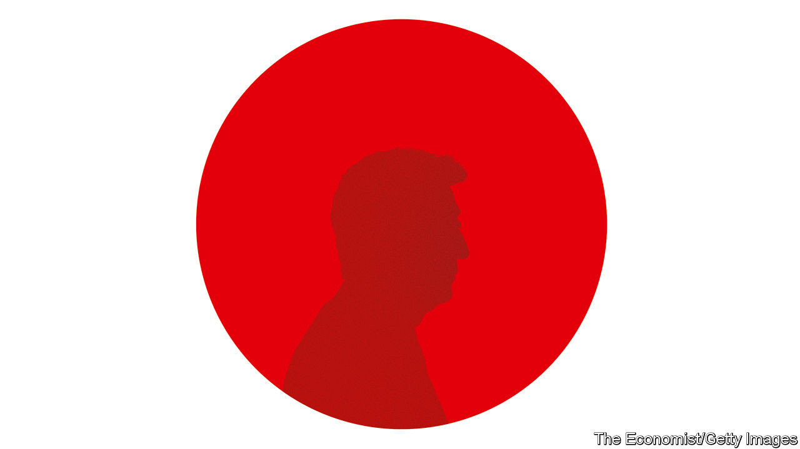

## A reformer bids farewell

# Abe Shinzo’s legacy is more impressive than his muted exit suggests

> He not only reshaped the economy and foreign relations—he also paved the way for future reforms

> Sep 3rd 2020

THE RECORD was beaten in late August. Then, just four days later, the record-breaker said that he was, too. After serving the longest continuous stint of any Japanese prime minister (as well as the longest time in the job overall) Abe Shinzo announced his resignation on August 28th.

Mr Abe blamed the abrupt decision, over a year before the rules of his Liberal Democratic Party (LDP) would have obliged him to step down, on an old digestive ailment. But many have cast his departure as an admission of defeat. The economy, which he has worked hard to revive after decades of listlessness, is swooning again because of covid-19. His campaign to revise Japan’s pacifist constitution to give the armed forces a proper legal underpinning has gone nowhere. His planned swansong, the Tokyo Olympics that were supposed to have taken place this summer, may never happen. His approval rating is dire.

It is a gloomy moment. What with the depredations of the coronavirus, the growing pugnacity of China and Japan’s shrinking and ageing population, Mr Abe’s successor, who will be chosen on September 14th by the LDP’s MPs, will have his work cut out (see [article](https://www.economist.com//asia/2020/09/03/abe-shinzo-has-left-an-impressive-legacy)). But all these problems have been made more manageable by Mr Abe’s eight years in office. The outgoing prime minister has done a far better job than is commonly acknowledged. Before covid-19 struck, “Abenomics” was succeeding, albeit slowly, in resuscitating the economy. Japan, something of a wallflower in global affairs since the second world war, was playing an unusually prominent and constructive role in Asia and around the world. And Mr Abe was pushing through difficult reforms that shorter-lived and less adept prime ministers had shirked for decades. He leaves a much more impressive legacy than his muted exit suggests.

Abenomics was supposed to banish deflation and spur growth through lavish spending, radical monetary policy and structural reforms. Mr Abe never met his own, ambitious target to pump up inflation to 2% a year, but he did at least turn it positive. Before he took office, prices had been falling for four years straight; they have risen in all but one of the seven years since. During his tenure the economy enjoyed a 71-month recovery, just two months shy of a post-war record. And productivity has risen faster in Japan than in America.

To get the economy moving, Mr Abe adopted policies previously considered politically or culturally impossible. As part of the Trans Pacific Partnership (TPP), a big regional trade deal, he agreed to slash tariffs and increase import quotas for agricultural goods, even though coddled farmers are some of the LDP’s most loyal supporters. Japanese women entered the workforce in droves, helped by free nursery school and other subsidies for child care. They are now more likely to work than their American counterparts. And there are more than twice as many foreign workers in Japan as there were when Mr Abe took office, despite a supposed national phobia about immigration.

Corporate governance has also improved dramatically. Almost all big listed firms have at least one independent director, compared with less than 40% in 2012. That in turn has broadened Japan’s appeal to foreign investors. Just this week Warren Buffett piled into Japanese conglomerates (see [article](https://www.economist.com//node/21791413)). The main stockmarket index has more than doubled on Mr Abe’s watch, having barely budged for the previous decade.

There have been mistakes, too, of course, most notably the decision to raise the sales tax twice, both times sending the economy into brief recession. But the pundits’ grim warnings—that the scale of government borrowing would prompt unaffordable rises in the interest rate it had to pay or, conversely, that the central bank’s adoption of negative interest rates would fatally injure the big banks—were simply wrong (see [Free exchange](https://www.economist.com//node/21791407)).

Mr Abe confounded expectations even more with his vigorous and adroit diplomacy. As the grandson of one of the architects of Japan’s imperial war machine and an avowed nationalist himself, he was expected to spark dangerous rows with China while alienating Japan’s allies (see [article](https://www.economist.com//books-and-arts/2020/09/03/a-timely-comprehensive-biography-of-abe-shinzo)). He has, it is true, got locked into a pointless historical feud with South Korea. For the most part, however, he has managed to rally like-minded governments in the region to counter China’s military and economic might without unduly provoking China’s ire. When America pulled out of the TPP it was Mr Abe who kept the project alive. He also strengthened military co-operation with fellow democracies like Australia and India. He has stayed chummy with President Donald Trump, yet he is also, remarkably, on goodish terms with Xi Jinping, China’s president, who had been due to visit Japan in April until covid-19 intervened.

The constitution may remain unchanged, but Mr Abe has nonetheless made Japan a more credible force on the world stage. He has increased spending on the armed forces and pushed through legal changes allowing them to take part in joint-defence pacts and peacekeeping missions. Despite constant Chinese prodding, he has held firm on a territorial dispute over some tiny islands in the East China Sea.

Mr Abe leaves plenty of pressing problems to his successor. Japan’s shrinking population makes it all the more important to get as many people as possible into the workforce and to raise their productivity. Although more women are working, corporate culture remains too sexist to make the most of their skills: most are in dead-end jobs. The rigid divide between salaried and part-time workers also makes the labour market inefficient. Far too little, especially of the work of government, is digital. And Japan has made little progress in greening its energy mix.

Although Mr Abe leaves lots of unfinished business, he also leaves his successor the tools to complete the job. Perhaps his most important and least recognised achievement is to have made Japan more governable. He managed to quell, at least for now, factional jockeying within the LDP, which doomed previous prime ministers to short, turbulent stints in office. And he brought the bureaucracy, which used to run the show as the politicians rotated, more firmly under the control of its elected bosses. Japan’s economy, in particular, still needs a lot of help. But if the next prime minister manages to get anything done, it will be thanks in large part to the groundwork laid by Mr Abe. ■

## URL

https://www.economist.com/leaders/2020/09/03/abe-shinzos-legacy-is-more-impressive-than-his-muted-exit-suggests
