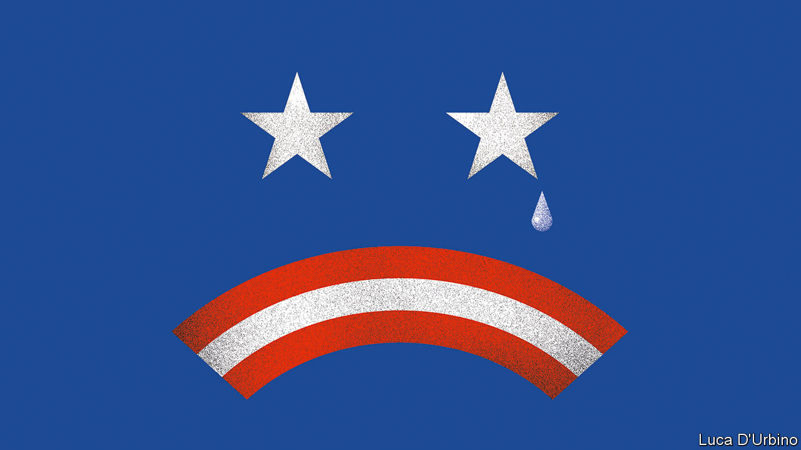

## What could go wrong?

# America’s ugly election

> A disputed result in November could be dangerous

> Sep 3rd 2020

LABOR DAY marks the beginning of the home straight in a presidential election. This one threatens to be ugly. The president’s supporters are clashing with Black Lives Matter protesters in Portland, Oregon. Donald Trump flew to Kenosha, Wisconsin, for a photo-op in front of burned-out buildings, a week after police shot and paralysed an unarmed African-American man and one of the president’s supporters shot and killed two demonstrators, possibly in self-defence. Having adopted a strategy built around profiting from fears about unrest, the president has an interest in stoking it. Many Americans worry that November could herald not a smooth exercise of democracy but violent discord and a constitutional crisis.

Is this all hyperbole? America has had violent, contested elections in the past. In 1968 one of the candidates, Bobby Kennedy, was assassinated. In 1912 Teddy Roosevelt was shot in the chest while making a speech in Wisconsin. (He finished the speech before heading to hospital, and survived.) Historians are still arguing about who really won the election of 1876. Yet the country has always managed to gain the consent of the losers in its presidential elections—even in the midst of the civil war. That long unbroken streak suggests that doomsayers need to keep things in proportion. However, there is a real risk that things could go wrong in November.

To ensure the peaceful handover of power, democracies need the losing candidates and most of their followers to admit defeat. A clear result on polling day helps a lot: the losers may hate it, but they accept it and start preparing for the next election. When the result is unclear, a backup system is needed. Contested election results are rare in mature Western democracies, but they happen. In 2006 Silvio Berlusconi narrowly lost an election in Italy and claimed, without evidence, that there had been widespread fraud. The country’s Supreme Court ruled in favour of his opponent, and Mr Berlusconi grudgingly surrendered. In 2000 America’s presidential election was settled in the Supreme Court after contested recounts in Florida. In both cases, decrees from judges were just about enough to end the squabbling and let the country move on.

In the case of a landslide win for Mr Trump or Joe Biden, about half of America will be miserable. Many Democrats view Mr Trump as a threat to democracy itself. If he wins again millions of them will be distraught. Among Republicans, by contrast, Mr Trump still enjoys an 87% approval rating. If he loses, many will grouse that the other side cheated. But that need not stop a smooth transfer of power if the margin of victory is big enough. If Mr Trump were to lose by eight points, as polls currently suggest he will, there will be no way to challenge the result plausibly—though he may try anyway, possibly fomenting further unrest.

If the election is much closer, things could get even uglier. America is unusual in the degree of power it gives to Republican and Democratic partisans to administer elections. Decisions over who is removed from lists of eligible voters when they are updated, the design of ballot papers, where polling stations are situated, whether early voting is allowed and how many people have to witness a postal vote—things which in other mature democracies are in the hands of non-partisan commissions—are all taken by people with a D or an R by their name. If the election is close then all this will be litigated over, and ultimately end up in courts presided over by judges who have also been appointed by Republican or Democratic governors and presidents.

As if that were not worrying enough, covid-19 could add to the legal slugfest. Already more than 200 covid-related lawsuits have been filed by the campaigns (see [Briefing](https://www.economist.com//briefing/2020/09/03/donald-trump-is-very-likely-to-challenge-the-results-of-the-us-election)). The evidence from party primaries suggests that though some states, such as Wisconsin, conducted a relatively orderly election despite the virus, others did not. Postal ballots were still being counted weeks after election day in New York’s primary. In November some swing states, including Michigan, will experiment with widespread voting by mail for the first time.

If the election is close and there are delays in counting ballots on election night, it could well appear that Mr Trump is winning in some key states. He might then claim victory before the results were in, as he did in Florida’s 2018 mid-terms. As more postal votes are counted, the result could then shift in Mr Biden’s favour. America would have two candidates claiming victory. Electoral cases in multiple states might have to be heard in the courts. Protests would surely erupt, some of them armed. The president might call out the national guard, as he threatened to do this summer, or send federal agents into Democratic cities to police restive crowds, as happened in Portland. At this distance, it is easy to forget quite how wrenching a disputed presidential election was in 2000. And that dispute took place at a time of maximum American self-confidence, before 9/11, before the rise of China, before elections were fought on social media, and when the choice was between two men who would be considered moderate centrists by current standards.

Now imagine something like the Florida recount taking place in several states, after an epidemic has killed 200,000 Americans, and at a moment when the incumbent is viewed as both illegitimate and odious by a very large number of voters, while on the other side millions are convinced, regardless of the evidence, that their man would have won clearly but for widespread electoral fraud.

Were Mr Trump to lose the popular vote but win in the electoral college, as happened in 2016, then almost 40% of Democrats say that the election ought to be re-run. It should not. Were he to lose the presidency, then almost 30% of Republicans think that it would be appropriate for Mr Trump to refuse to leave office if there were claims of widespread illegal voting—claims he has already made in relation to postal voting. It would not.

There is so much riding on this election—for America and for the rest of the world—that state officials must do everything they can to make sure it goes as smoothly as possible, remembering that they owe loyalty to the constitution, not their party. Even a landslide election win will be fraught. In the event of a narrow one, America might not be able to generate losers’ consent. And without that, democracies are in big trouble.■

Dig deeper:Read the [best of our 2020 campaign coverage](https://www.economist.com//us-election-2020) and our [presidential-election forecast](https://www.economist.com/https://projects.economist.com/us-2020-forecast/president), then sign up for Checks and Balance, our [weekly newsletter](https://www.economist.com//checksandbalance/) and [podcast](https://www.economist.com//podcasts/2020/08/28/checks-and-balance-our-weekly-podcast-on-american-politics) on American politics.

## URL

https://www.economist.com/leaders/2020/09/03/americas-ugly-election
