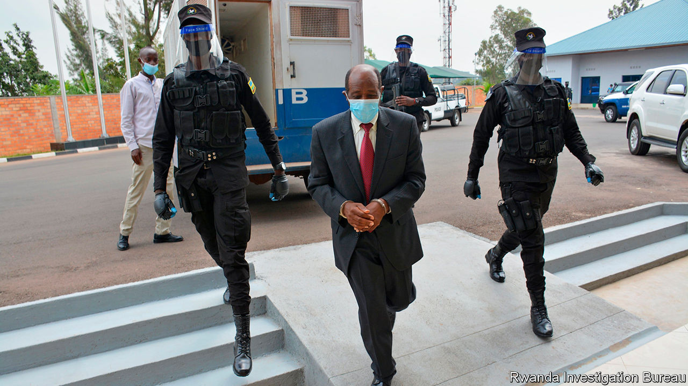

## Nowhere to hide

# What the arrest of a hero of the genocide says about Paul Kagame’s rule

> Paul Rusesabagina, whose story inspired “Hotel Rwanda”, faces charges of terrorism

> Sep 3rd 2020

TOURISTS WHO gawp at gorillas and foreign businessfolk who meet in Kigali’s convention centre sometimes call Rwanda the Switzerland of Africa. It has beautiful mountains, clean streets, a functional bureaucracy and low levels of petty corruption and crime. But it differs from Switzerland in ways that casual visitors often miss. Rwandans are terrified of their government. They are constantly watched for hints of dissent, which is ruthlessly suppressed. History is rewritten to suit the present. Heroes can become “unheroes” overnight.

One such person is Paul Rusesabagina, who as the manager of the Hotel des Mille Collines saved more than 1,200 people from a genocidal army and machete-waving militias that were hunting down members of Rwanda’s minority Tutsi group in 1994. Although a member of the majority Hutus, Mr Rusesabagina risked his life to keep Tutsis and moderate Hutus safe. He bribed militiamen with booze so they would not attack. When an assault seemed imminent he phoned contacts in the regime, begging them to order the killers back. The genocide ended only after rebels seized the country under the command of Paul Kagame, who is now in his third presidential term.

Mr Rusesabagina’s courage inspired a film, “Hotel Rwanda”. America awarded him the Presidential Medal of Freedom, commending his “remarkable courage and compassion in the face of genocidal terror”. Some compared Mr Rusesabagina to Oskar Schindler, who risked his life saving Jews during the Holocaust. Yet in Mr Kagame’s Rwanda, Mr Rusesabagina is now portrayed as the equivalent of a Nazi fugitive, who must be abducted and brought home to justice (see [article](https://www.economist.com//node/21791385)).

Although Mr Rusesabagina initially won official plaudits in Rwanda, too, this changed after he criticised Mr Kagame for rigging elections and spoke of entering politics. Government officials swiftly (and absurdly) accused him of genocide denial, a crime in Rwanda. Mr Rusesabagina disappeared after flying to Dubai. He reappeared a few days later in manacles in Kigali, Rwanda’s capital. His family says he was kidnapped. Rwanda says he was arrested “through international co-operation”.

Mr Kagame’s opponents have often met with misfortune far from home. His former intelligence chief was strangled in a Johannesburg hotel. A former interior minister was shot in Nairobi after starting an opposition party. But the grabbing of Mr Rusesabagina marks a new level of brazenness.

Rwanda says that he supported armed groups trying to overthrow the government. There is some truth to this: he once called for an armed struggle against the regime. This is a terrible idea, though the government has produced no evidence that he ever tried to turn words into deeds. And dissidents in Rwanda note that they have few options. Elections are a sham—Mr Kagame won 99% of the vote in 2017, and could remain in office until 2034. Peaceful opponents often end up behind bars, or worse. When Diane Rwigara, a businesswoman, tried to run for the presidency, she was arrested and jailed for more than a year on charges of insurrection. A Rwandan court later said the charges were baseless. Her mother was also held and the family’s assets were confiscated.

Western governments occasionally tut at Mr Kagame’s abuses, but they also sell arms and provide aid to his government. They see Rwanda as an island of stability in a volatile region and him as a leader who gets things done. Yet 26 years after he first shot his way to power, he seems ever less constrained. His authoritarianism, once deemed by many a necessary evil to hold the country together, now risks pushing it back towards conflict. And that, in Rwanda, is a terrifying thought. ■

## URL

https://www.economist.com/leaders/2020/09/03/what-the-arrest-of-a-hero-of-the-genocide-says-about-paul-kagames-rule
