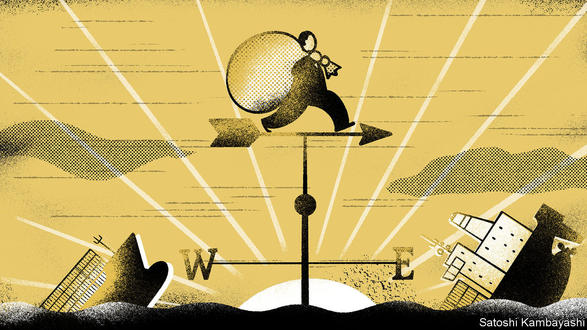
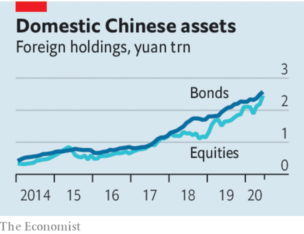

## The exception

# Why is Wall Street expanding in China?

> It may be a step on the way to China becoming a financial superpower

> Sep 5th 2020

IN THE TECH industry the rupture between China and America continues to grow. Will Uncle Sam force a sale of TikTok, a Chinese-run app popular in the West (see [article](https://www.economist.com//node/21791418))? Can Huawei survive the embargo? Is Apple shifting its supply chains from China? Yet in one part of the global economy the pattern is of superpower engagement, not estrangement: high finance. BlackRock, a giant asset manager, has got the nod to set up a Chinese fund business. Vanguard, a rival, is shifting its Asian headquarters to Shanghai. JPMorgan Chase may spend $1bn to buy control of its Chinese money-management venture (see [article](https://www.economist.com//node/21791377)). Foreign fund managers bought nearly $200bn of mainland Chinese shares and bonds in the past year. Far from short-term greed, Wall Street’s taste for China reflects a long-term bet that finance’s centre of gravity will shift east. And unlike in tech, both sides think they can capture the benefits of interaction without taking too much risk.

Western, and in particular American, capital markets still reign supreme on most measures. Derivatives are often traded in Chicago; currencies in London. American firms dominate the league tables in asset management and investment banking. The White House has sought to weaponise America’s pre-eminence, by pushing Chinese firms to delist their shares from New York, for example. But if anything the trade war has shown the growing muscle of China in finance. A big wave of IPOs is taking place in Hong Kong, often done by firms keen for an alternative to New York. China’s prowess in fintech will soon be centre-stage with the listing of Ant Group, which may be the world’s largest IPO ever. And then there is the surprising rush of Wall Street firms and other foreign investors into mainland China.

They have been knocking on the door for 30 years with little success. Now they are betting that China is serious about welcoming foreign finance. With its current-account surplus set to fall over time, or even fall into deficit, it needs to attract more foreign capital. The terms of access have improved. China is at last allowing Western firms to take control of their mainland operations and has made it easier for fund managers to buy and sell mainland securities. The potential prize is vast: a new source of fees for Wall Street banks, and for fund managers a huge universe of potential customers and companies to invest in.

There are risks. China could bend the rules to protect local banks and brokers. Corruption is a hazard: in 2016 JPMorgan Chase was fined by American regulators for giving jobs to well-connected Chinese “princelings”. Worries over human-rights abuses may intensify. And navigating America’s sanctions regime will be tricky—global banks active in Hong Kong, such as HSBC, are already under pressure to cut off some Chinese officials there. Yet American financial firms’ exposure to China is low enough that they have little to lose. The tech industry is dangerously dependent on China: Apple assembles many of its devices there. By contrast, the top five Wall Street banks have only 1.6% of their assets exposed to China and Hong Kong.

China’s ability to attract Wall Street firms during a bitter trade war shows the clout its capital markets have. But to become a financial superpower it would need to create its own global finance and payments infrastructure and make the yuan more freely convertible. The leading Chinese firms have a tiny presence abroad (just 5% of revenues for Ant) and most of China’s trade is invoiced in dollars, making it vulnerable to American sanctions. Building an alternative to America’s global monetary network is a huge task that will take years and require China’s control-obsessed officials to loosen their grip further. Still, the trade war has given China a big incentive to take the next step.■

## URL

https://www.economist.com/leaders/2020/09/05/why-is-wall-street-expanding-in-china
