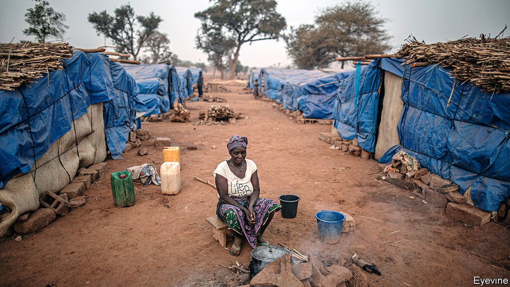

## Sacking the voters

# Burkina Faso says its poll will be valid, whatever the turnout

> Rising jihadist violence may keep millions of voters from the polls

> Sep 3rd 2020

WHAT MAKES a national election national? One answer is that everyone is able to vote. But politicians in Burkina Faso disagree. With little consultation, the main political parties have voted to change the electoral code so that presidential and legislative elections to be held in November will be deemed valid even if people are unable to vote in the vast tracts of the country that are plagued by jihadists.

One MP, Aziz Diallo, describes the change as an “attack on democracy”. Another, Alexandre Sankara, says it “violates the constitution”. It is but the latest worrying sign in a country at the heart of the fight against violent extremists in the Sahel.

Only a few years ago Burkina Faso looked on the road to democracy after a popular uprising toppled its longtime dictator, Blaise Compaoré, leading to free elections in 2015. The first big setback was a spillover of jihadist violence from neighbouring Mali that has intensified since 2018. More than 1,700 people were killed in the first half of this year in fighting that often involved ethnic militias, up from about 300 in the whole of 2018. Roughly half the country (mainly rural areas) has been overrun by armed groups, says Héni Nsaibia of Menastream, a research consultancy. Over 1m people, of a population of 20m or so, have been forced to flee their homes.

Many more than that may struggle to vote. In July 52 of 127 MPs said it was not safe to campaign in their constituencies. Voters in the countryside are the most likely to be left out. In almost a fifth of villages no voters have been registered at all. Polling stations will probably be abandoned in many more villages on election day, when the security forces will be stretched thin. Mr Sankara reckons that people may be disenfranchised across five of Burkina’s 13 regions.

In July politicians ruled out delaying the elections because they feared that would deprive the government of legitimacy. But ignoring the rights of millions may be no better, particularly since those who will be unable to vote because of insecurity are precisely those who have most reason to be angry with incumbent politicians.

What with widespread accusations of atrocities by the security forces, Burkina Faso’s government could soon face a crisis of legitimacy much like the one that is tearing Mali apart. There, too, jihadists have overrun swathes of the countryside. Dodgy parliamentary elections with a paltry turnout earlier this year were followed by massive anti-government protests and then a coup. ECOWAS, the regional bloc, has told the soldiers running Mali to hand back power to a civilian administration and hold elections within a year. But the men in uniform want to stay in power for three years. When democracy falls, it is hard to restore. Burkina beware. ■

## URL

https://www.economist.com/middle-east-and-africa/2020/09/03/burkina-faso-says-its-poll-will-be-valid-whatever-the-turnout
