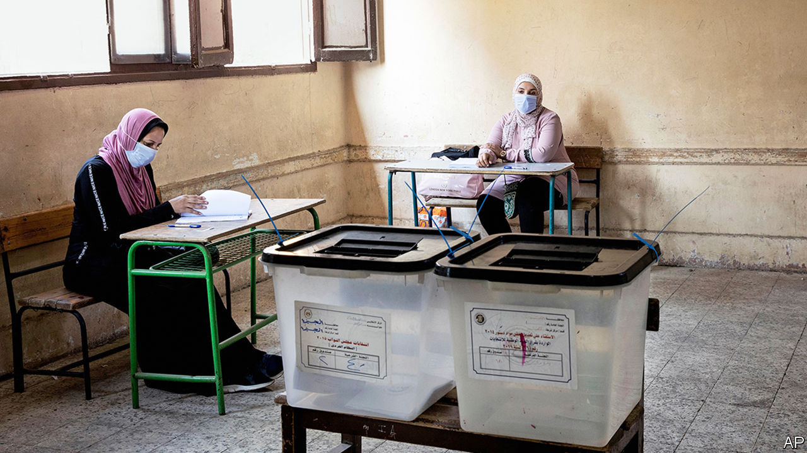

## Defendant number 54,000,000

# Egypt looks to prosecute millions of non-voters

> Low turnout for a sham election has made the government bristle

> Sep 5th 2020BEIRUT

ASSEMBLY-LINE justice is nothing new to Egypt. Since 2013, when Abdel-Fattah al-Sisi led a coup against an elected government, judges have presided over trials with enough defendants to fill a jumbo jet. At a hearing in 2014 more than 500 people were sentenced to death for killing one policeman. But that exercise is Lilliputian compared with the latest labour of Egypt’s judiciary. On August 26th the state referred 54m people for prosecution over a single case.

The defence might rise here to object: surely that number is in error. But Egypt has indeed opened a case against more than half its population, and fully 86% of the electorate. Their crime—one rarely punished—was failing to vote last month in elections for the upper house of parliament. (Compulsory-voting laws are not unique to Egypt: Australia, Belgium and others have them too.)

A lawyer for the defence would surely focus on mitigating factors. Sweltering August is not a pleasant time to be queuing outdoors, especially for the elderly or infirm. Nor should people be gathering amid a pandemic. Though far from their June peak, covid-19 cases are rising; officials warn of a second wave.

Most defendants would just plead apathy. The upper house, formerly called the Shura Council, was abolished after the coup but reinstated in a referendum last year. Rebranded as the Senate, it has no legislative powers. A third of its 300 members are directly elected. Another third are elected via party lists, of which there was exactly one on offer: a pro-government bloc. Mr Sisi appoints the last third. Little about this stirred the souls of Egyptian voters.

Arab autocrats have a touching attachment to the trappings of democracy. Some use elections as shows of power. Saddam Hussein was re-elected with an impressive 100% turnout and not a single No vote in an up-or-down referendum in 2002. Others use elections as safety valves. Hosni Mubarak, who ruled Egypt for 30 years, kept a firm grip on parliament but allowed a measure of competition and opposition.

Elections serve neither purpose for Mr Sisi. The lower house has deteriorated into a rubber stamp and the Senate will be more feckless still. Paltry turnout undermines his claims of popular support. Over half of Egyptians voted in the parliamentary election of 2011-12, a genuinely democratic exercise. In 2015 turnout fell to 28%. Mr Sisi’s own election in 2014 was scheduled as a two-day affair. When turnout looked low, officials abruptly added a third day so they could drag more bodies to the polls.

Mr Sisi may hope that the threat of punishment spurs Egyptians to vote in November, when the lower house is up for grabs. Many citizens cannot afford to pay the fine of up to 500 pounds ($32). (Prosecuting 54m people could net the state 27bn pounds, 1% of its annual budget.) But threats only work if they are credible. Egypt’s judiciary lacks the resources for such an undertaking. A better way to increase turnout would be to hold elections that matter.

## URL

https://www.economist.com/middle-east-and-africa/2020/09/05/egypt-looks-to-prosecute-millions-of-non-voters
