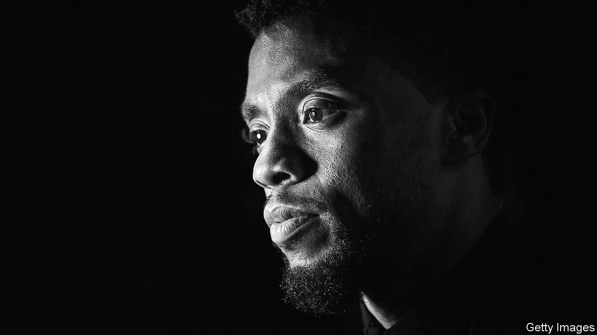

## To be a king

# Chadwick Boseman died on August 28th

> The actor who embodied the character of Black Panther was 43

> Sep 5th 2020

AS HE SLIPPED into each role, studiously, scene by scene, Chadwick Boseman kept one thought in mind. His character was a strong black man in a world that conflicted with his strength. It didn’t want him to be great; it tried to keep him down. But there was something in him, some particular talent, or obsession, or part of his past, that made him stand tall. That made him say, “No.”

It was fitting, then, that the role he became most famous for was a tested but triumphant black king, T’Challa, in “Black Panther” in 2018. The film was a sensation. It tipped Hollywood on its head: a $1.3bn-grossing movie whose cast and makers were, almost to a man and woman, black. Black Panther (T’Challa’s moonlighting persona) had appeared in film before, but in the “Captain America” and “Avengers” series, among a crowd of white Marvel superheroes. Now he stood alone. In a white-focused world he ruled a country, Wakanda, that was more advanced than any other, both technologically and spiritually. Never colonised, never enslaved. He himself was both an acrobatic righter of wrongs and a ruler who was cool, stately, wisecracking and wise. Even before the film came out, schools were booking cinemas for pupils to see it. For him, as the lead, success was not just black children, in their Panther costumes, crying “Wakanda for ever!” and giving the crossed-arm salute. He had put in their heads the idea that they could be great. And he had also sown in little white heads the rare, enlightening thought: “I want to be him.”

Less obviously, his major roles before then had also made that point. All were men the world could not keep down. In “42” as Jackie Robinson, the first black player in modern Major League Baseball, he struggled through white disdain, but always knew how good he was. In “Marshall”, as the lawyer who became the first black Supreme Court justice, he combined sharp clothes with a razor-sharp mind as he defended his innocent black client. And in “Get on Up” as James Brown, the firebrand singer who electrified music in the 1960s, he bowed to no prejudice but strutted through life, seizing what he wanted. All these were fighters in their way, as effective as Black Panther crouched on a speeding car to spring. Brown had that one-two step, then a punch like a boxer’s at the microphone. Marshall could floor a racist thug with one blow. Robinson would stand at the plate, ready, about to hit a homer that would shock the crowd into silence. Then cheers.

Each character he played left little bits in him, whether Brown’s sexy dance moves or Marshall’s liking for fine outfits. But Robinson taught him he should confront the world squarely, calmly, and think he was infallible. He had not been too good at doing that, in his past. Growing up in South Carolina, even well after the Civil Rights Act, he had been run off the road by rednecks, called “boy” and passed by trucks that flew Confederate flags. He had faced it, and failed at facing it. Now, in playing his characters, he could relive those things and respond in a different way.

He prepared as thoroughly as possible. For “42” he spent weeks learning to play baseball like a pro. Mick Jagger helped him with “Get on Up”, teaching him how to tease and seduce an audience. He dug deep into the backstories of the characters, filling out their weaker sides and their humanity. It was important to walk in their shoes through the world. Black characters on screen were too often one-dimensional, as if they were second-class.

Yet the fictitious role of T’Challa and his kingdom of Wakanda engaged him even more. This was a work of recovery, the celebration of a severed African past that belonged to all black people. Every part of it had to be properly done. It was he who insisted the cast spoke Xhosa, with its clicks and smacks. He found it beautiful and rhythmical, like ancient music. He helped devise the salute, which reminded him of tomb effigies of the pharaohs. (In 2016 he had played Thoth in “Gods of Egypt”, the one face of African descent among them, taking the part only because, without him, there would have been none.) For close combat he studied Zulu stick-fighting and Dambe boxing from west Africa. Costumes, sets and moves fused together different aspects of the continent he loved, a mixing and reconnection that went to his own roots: almost the moment he got the part, he had his DNA tested and found he was Yoruba from Nigeria and Limba from Sierra Leone. Last, he reinforced the film’s relevance by making T’Challa a peacemaker in the Mandela mould while his nemesis Killmonger, his abandoned cousin, was inspired by Malcolm X. That echoed a conversation he had long had with himself: forbearance, or violence.

The film’s huge success was difficult in one way. As an actor he worked at his craft by observing people. He had existed in the shadows, watching from a back table as he sipped a vegan smoothie or dined on brussels sprouts. He liked to hide. Now people spotted him from the end of the street and chased after him, a star. But in all other ways success had to be good, well beyond the audience reaction. It showed the Hollywood moguls that a thoroughly black film was viable and bankable. It opened the way, or ought to, for substantial roles for more black actors. There were countless stories in their culture that had not yet been told. Or not by them.

A storyteller was how he saw himself, part of an ancient tradition in both Africa and the West. When a friend had been shot dead in high school, writing a play about it seemed the best way to channel his emotions. Later, forging a path as an actor-director in New York, he wrote a hip-hop play on classic themes, “Deep Azure”, based on the shooting of a young black man by a black policeman. That victim, he explained, was not just another casualty lost to violence. He was a would-be leader, a would-be king.

He was already a king in the public mind when his cancer took hold. He went on making films with as much vitality and as full a laugh as before. “Black Panther II” was on: he was in the Marvel teaser, regally striding as before. One of his last texts, to his white co-star in “Marshall”, urged him to inhale, exhale and enjoy the rare rain that was falling on Los Angeles. Fate was pushing him down, but he confronted it. For as long as he could, he said “No.” ■

## URL

https://www.economist.com/obituary/2020/09/05/chadwick-boseman-died-on-august-28th
