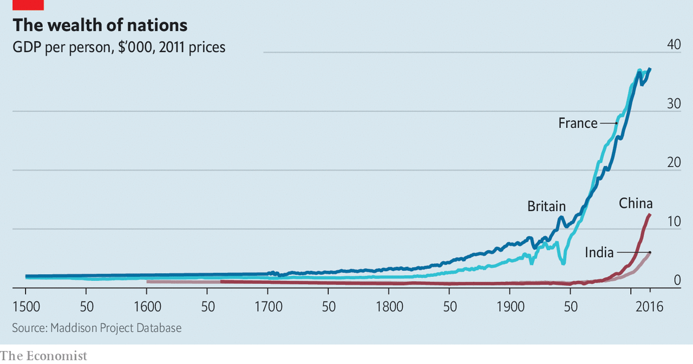

## Hard work and black swans

# Economists are turning to culture to explain wealth and poverty

> As a result, the ideas of the earliest economists are being revised and improved

> Sep 5th 2020

THE EMERGENCE of the discipline of economics in the 18th century was the result of people trying to explain something that had never happened before. At the time a handful of countries were becoming fabulously rich, while others remained dirt-poor. In 1500 the world’s richest country was twice as well-off as the poorest one; by 1750 the ratio was five to one. It is no coincidence that the most famous book in economics, published in 1776, inquired into “the Nature and Causes of the Wealth of Nations”.

In order to explain such a divergence between rich and poor countries, the early economists were obsessed with culture, a catch-all term encompassing a society’s beliefs, preferences and values. Adam Smith, the author of “The Wealth of Nations”, explored the ways in which culture helped or hindered capitalism. He argued that certain norms were required in order for market economies to thrive—most importantly, that people would be self-interested, but that they would satisfy their self-interest by adapting to the needs of others. Karl Marx, a few decades later, worried that a culture of “oriental despotism” prevented the emergence of capitalism in Asia.

The speculations of Smith, Marx and others were often vague. Max Weber’s “The Protestant Ethic and the Spirit of Capitalism”, published in 1905, made them concrete. Weber argued that Protestants, in particular Calvinists, drove the emergence of capitalism due to a strong work ethic.

In the middle of the 20th century such cultural explanations began to fall out of favour. The rapid rise of Japan’s economy in the 1950s, and later of the Asian “tigers”, quashed the Marxist-Weberian notion that Western culture alone was conducive to industrialisation. At the same time the increasing availability of data with which to do statistical analysis meant that economists’ attention went elsewhere. Why bother with hard-to-measure matters such as morals, when it is possible to plug hard data such as capital accumulation, wages or employment into a regression model? In 1970 Robert Solow, a Nobel prizewinner, quipped that attempts to explain economic growth with reference to culture ended up “in a blaze of amateur sociology”.

But an interest in culture remained—and indeed is now making a comeback. Since the 1980s datasets such as the World Values Survey and the General Social Survey have made it easier to quantitatively measure cultural preferences and relate them to economic outcomes. Top economic journals now regularly include papers on the importance of culture. Even many hardline wonks have come to realise the limits to pure economic reasoning.

Perhaps the most influential text in the revival of cultural economics was “Making Democracy Work”, a book from 1993 by Robert Putnam. Mr Putnam tried to understand why for many decades northern Italy had been richer than the south, folding the explanation under the catch-all term “social capital”. People in the south were fiercely loyal to their family, but more distrustful of outsiders—whereas in the north people were happier to form connections with strangers, Mr Putnam argued. In the north people read more newspapers, were more likely to participate in sports and cultural associations, and voted more frequently in referendums. This, the theory went, contributed to better local government and more efficient economic transactions, which in turn produced greater wealth—though Mr Putnam was not clear about the precise mechanism by which one thing led to the other.

A group of researchers, largely dominated by Italians who were inspired by Mr Putnam’s work, has since extended his ideas, seeking cultural explanations of why some areas are rich and others poor. A paper from 2004 by Luigi Guiso, Paola Sapienza and Luigi Zingales, also looking at Italy, finds that in high-social-capital areas, households invest less in cash and more in stocks, and make less use of informal credit. In areas where people do not really trust those outside their family, it may be hard to form large business organisations which can benefit from economies of scale and which can drive the adoption of new technologies. This suggests that it is no coincidence that the average business in Lombardy, a rich northern region in Italy, has 13 employees, compared with five in Calabria, a poor southern one.

Others look beyond Italy. In “A Culture of Growth”, published in 2016, Joel Mokyr of Northwestern University puts the “principle of contestability” as the reason why some countries industrialised but others did not. Organisations such as the Royal Society, founded in London in 1660, were forums for the exchange of ideas, where people put forward their discoveries and fiercely interrogated the theories of others. Crucially, too, over time the goal of western European science shifted from one concerned with the “mindless piling up of empirical facts”, as Mr Mokyr puts it, towards discoveries which could be put to use in the real world. Scientific inquiry laid the groundwork for European economic exceptionalism. Nothing quite comparable happened in other parts of the world.

The revival of cultural explanations for wealth and poverty seems to be a methodological step forward. Yet it raises two big questions. The first concerns the origins of cultural traits: where do they come from? The second is why people from apparently similar cultures sometimes have very different economic outcomes. To answer these questions, economists have come to appreciate the importance of history—and, in particular, historical accident.

Take first the question of the origin of cultural traits. Some research suggests that they are the product of changes which took place hundreds of years ago. A 2013 paper by the late Alberto Alesina and two of his colleagues looks at why countries have very different rates of female labour-force participation. Egypt and Namibia are about as rich as each other, but the share of Namibian women in the labour force is more than twice that of Egyptian women. The paper puts such differences largely down to differences in pre-industrial agriculture and environmental conditions. Plough cultivation, common in Egypt, required lots of upper-body strength—so men were at an advantage. Shifting cultivation, more common in Namibia, used hand-held tools like the hoe which suited women better. The effect of these agricultural technologies echoes in statistics today.

Other economists look to the distant past to explain contemporary disparities in income and wealth. A paper from last year by Benjamin Enke of Harvard University finds evidence that pre-industrial ethnicities which were exposed to a high local prevalence of pathogens exhibited tighter kinship systems—meaning, in effect, that people were strongly loyal to their extended family but suspicious of outsiders. In a place threatened by disease, tight family ties were beneficial because they reduced the need to travel, and therefore the risk of being exposed. Places which had tighter kinship systems hundreds of years ago tend to be poorer today, a relationship which first emerged during the industrial revolution. Other research has looked even further back, suggesting that contemporary cultural traits are the result of genetic variation. But this remains a niche pursuit, and most economists turn queasy when it comes to talking about genetics.

A separate body of research focuses on cases where culture is not a sufficient explanation for economic outcomes. Take the case of Guatemala and Costa Rica. “The two countries had similar histories, similar geographies and cultural inheritance, and were faced with the same economic opportunities in the 19th century,” write Daron Acemoglu and James Robinson in “The Narrow Corridor”, a book published last year. But today the average Costa Rican is more than twice as rich as the average Guatemalan. The cause of the divergence initially appeared random, according to Mr Acemoglu and Mr Robinson. Eventually it became clear it was down to coffee. In Costa Rica the development of coffee plantations for the European market led to a more balanced relationship between state and society, possibly because the country had more marginal land and more smallholders. In Guatemala, by contrast, it led to the emergence of a rapacious government.

In addition to culture, therefore, a growing band of economists is looking at “institutions”, often taken to mean the legal system and regulations. Some cultural economists argue that the focus on institutions proves their point: what are institutions if not the product of norms, values and preferences? Americans’ and Europeans’ differing beliefs about the causes of inequality, for instance, go a long way towards explaining why European welfare states are more generous than America’s.

But in many cases the emergence of different institutions may have nothing to do with a country’s culture. Sometimes it is just luck. Mr Mokyr shows that Europe, which was fragmented into lots of states, was the perfect setting for innovation: intellectuals who challenged received wisdom and incurred the wrath of the authorities could move elsewhere (Thomas Hobbes wrote “Leviathan” in Paris). By contrast in China, Mr Mokyr argues, free thinkers had few escape routes. Europeans did not plan such a system. It just happened.

Other work by Mr Acemoglu and Mr Robinson, along with Simon Johnson of MIT, has found a further element of randomness which may explain contemporary patterns of wealth and poverty—namely, which countries are more prone to certain diseases. The mortality rate of settlers was low in some colonised countries, such as New Zealand and Australia, in part because the kinds of diseases that were there were less virulent. In others, such as Mali and Nigeria, mortality rates were far higher. Colonisers did not want to settle in countries with a high risk of disease, even as they wanted to take those countries’ raw materials. So in countries such as Mali and Nigeria, rather than permanently settling, they set up systems which enabled the maximum of resource extraction with the fewest boots on the ground. That, say Messrs Acemoglu, Johnson and Robinson, produced rapacious political systems which have endured to this day.

Are economists any closer to answering the foundational question of their science? Far from the simplistic certainty of Weber, it seems likely that some countries are rich and others poor because of a messy combination of economic incentives, culture, institutions and chance—which is most important remains unclear. In 1817 Thomas Malthus, one of the early economists, wrote in a letter to David Ricardo, another, that “the causes of the wealth and poverty of nations [were] the grand object of all enquiries in Political Economy”. The revival of cultural economics two centuries on has helped in that quest, but it is not over yet. ■

## URL

https://www.economist.com/schools-brief/2020/09/05/economists-are-turning-to-culture-to-explain-wealth-and-poverty
