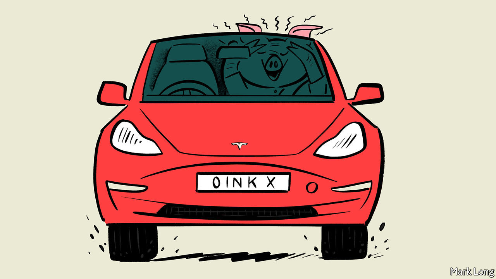

## Brain-computer interfaces

# Elon Musk’s vision of the future takes another step forward

> A pig now has one of his implants in its brain

> Sep 2nd 2020

IN IDLE MOMENTS, people sometimes dream about the future. Of cars that can drive themselves. Of travelling to other planets. Of moving objects by the power of thought. Whichever particular dream you have, though, Elon Musk is probably trying to make it real. Self-driving cars and travel to Mars are the provinces of two of his firms, Tesla and SpaceX respectively. Moving objects by the power of thought is the province of a third, Neuralink. And on August 28th, at a presentation broadcast over the internet, Mr Musk showed off the firm’s progress. The highlight was the appearance of Gertrude, a pig with a chip implanted into her brain.

Reading the brain’s electrical signals, a technique called electroencephalography (EEG), started more than 100 years ago and is now routine. It generally involves placing electrodes non-invasively on the scalp, though it sometimes requires the invasive insertion of wires into the scalp or the brain itself.

Non-invasive EEG provides useful information, and can even be employed to do things like playing simple computer games via software which interprets the signals received and turns them into instructions. It is, though, a crude approach to monitoring the activity of an organ that contains 85bn nerve cells and trillions of connections between them. Invasive EEG offers higher resolution readings from those nerve cells, albeit at greater risk because of the surgery involved. The device Gertrude carries, known technically as a brain-computer interface (BCI), carries invasiveness one stage further still by making the EEG recorder a potentially permanent implant.

Signals from implants such as this might be employed to control a prosthetic limb, or even a real one that brain or spinal-cord injury has deprived of its normal nerve connections. They might also be used to control non-medical machinery, if someone thought it worth the risk of having a BCI implanted to do this. And it is possible to use them to send signals in the opposite direction, too, to give instructions to the brain rather than receive them. That might be used to generate signals which suppress an incipient epileptic seizure.

Neuralink’s BCI, the size of a British tuppenny piece, carries 1,000 flexible electrode threads, each of which has a diameter less than a quarter of that of a human hair. This flexibility is important because the brain moves around in the skull and the electrodes must be able to accommodate this movement while continuing to work. The device communicates wirelessly, and is recharged by induction. This means that, unlike many previous attempts to build BCIs, it requires no skin-penetrating cable that might admit infections to the body.

Along with this improved interface Neuralink has built a robot that will implant it. To do so, the robot first takes a high-resolution scan of the recipient’s brain. Using this, it is able to sew the electrode threads into place with a precision that avoids any blood vessels in the area. That, Mr Musk said, reduces the risk of damage during surgery. The robot can put the interface in place in less than an hour, he said, though it cannot yet open the skull in order to do so. General anaesthesia is not, he said, needed for the procedure.

The highlight of the show, though, was not Mr Musk’s presentation but rather the arrival of Gertrude. Her BCI is connected to nerve cells in a part of her brain called the olfactory bulb. As she snuffled around her pen searching for food, and also sniffed her handler’s hand, a display showed the electrical activity which those cells were manifesting in response to these stimuli.

Not everyone is impressed. Andrew Jackson, a professor of neural interfaces at Newcastle University, commented that there was not anything “revolutionary” in the presentation, saying it was “solid engineering but mediocre neuroscience”. Mr Musk replied, in a tweet, that it was common for academia to undervalue the benefits of bringing ideas to fruition.

Admiration will surely increase if and when Neuralink performs on people a similar procedure to that which Gertude has undergone. The firm received a “breakthrough device designation” from America’s Food and Drug Administration (FDA) in July. This means the FDA thinks the gadget shows promise (in this case for the treatment of paraplegia), and offers it a faster pathway for regulatory review.

The next challenge the firm wants to tackle is that of sending electrical signals into the brain. Mr Musk says this will require a range of inputs, as some brain areas require delicate stimulation while others take a “lot of current”. The point of doing so will be to establish two-way communications. This could allow entirely new areas of treatment to be explored. Besides epilepsy suppression, some think that such brain stimulation might also work to treat depression and anxiety. More important in the long run, it is also essential to Mr Musk’s vision of widespread engagement, at a neurological level, between people and machines. This, he hopes, will result in a future in which memories can be downloaded and stored elsewhere, and human beings can form a “symbiosis” with artificial intelligence.

Critics worry that Neuralink is too secretive, and that Mr Musk’s vision promises more than he can deliver. He does, though, have a record of doing what he says he is going to, albeit sometimes not as rapidly as he says he will. He more-or-less single-handedly introduced battery-electric cars to the market and he built a successful space-rocket business out of nothing. Brains are a lot more complicated than cars, and even than rocket science. But do not bet against the coming into being at some point of the Musk vision of brains and computers collaborating directly. ■

## URL

https://www.economist.com/science-and-technology/2020/09/02/elon-musks-vision-of-the-future-takes-another-step-forward
