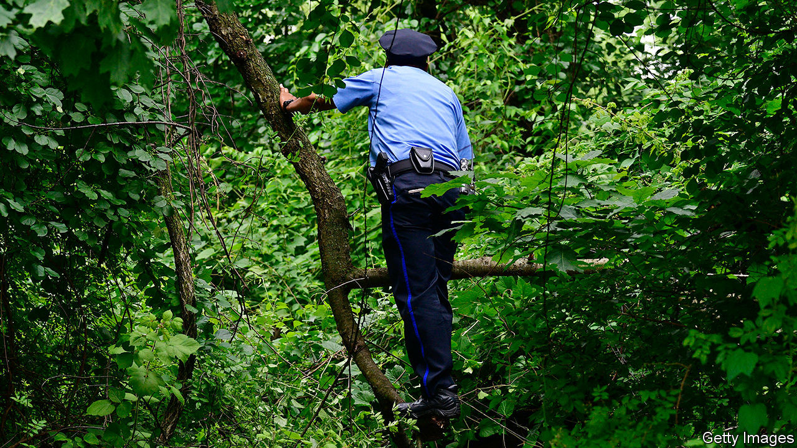

## Forensic botany

# Finding bodies in forests

> Buried corpses may change the colours of surrounding plants

> Sep 5th 2020

THE BODY FARM, known officially as the University of Tennessee Anthropological Research Facility, is a gruesome place. It is a hectare of land near Knoxville, cut off from the rest of the world by razor wire, that has, for more than three decades, been at the forefront of forensic science. It is both a laboratory which examines how corpses decay in different circumstances, so that matters such as time of death can be established more accurately, and a training facility for those whose jobs require an understanding of such processes.

To study a body forensically, though, you first have to find it. For a corpse dumped in a city this is hard enough. If the burial site is a forest it can be nigh impossible. Searchers must cover huge amounts of ground, and may therefore not do so as thoroughly as might be desirable. Vegetation broken by people burying bodies is easy to overlook. And soil perturbed by digging tends not to remain perturbed for long once it has been exposed to wind and rain.

For homicide detectives, then, woodlands are a problem. At least, they have been until now. For Neal Stewart, co-director of the Tennessee Plant Research Centre, another part of the university, reckons that a bit of botanical thinking brought to bear on the matter may turn trees from being cover for the disposal of bodies to signposts showing just where they are hidden. To pursue this idea, he has organised a group of researchers from various departments of the university, one of whom is Dawnie Steadman, the head of the Body Farm. And, as they write this week in Trends in Plant Science, this group has come up with three ways in which vegetation might flag up illicit burials.

The most obvious is fertilisation—for bodies are good fertilisers. Calculations suggest that a decaying adult human body releases about 2.6kg of nitrogenous compounds (mostly ammonia) into the surrounding soil. That, the researchers found when they looked through the relevant literature, is 50 times the average annual recommended level of nitrogenous fertiliser for trees and shrubs native to temperate North America.

Such an overdose would surely have consequences for nearby plant life. In particular, it would increase chlorophyll production, and thus cause a perceptible greening of plants near a buried body. In principle, this would be true of the decay of the body of any large animal. But the remains of wild creatures, left on the surface, are usually scavenged quickly. People with a human body to dispose of generally prefer to inter it so that it cannot be seen.

A more subtle change in the foliage near a buried body would be brought about by any cadmium present within its flesh and bones. Cadmium is rare in nature, but not in some human bodies. Smokers, and also those who work in industries involving welding or electroplating, have high concentrations of this metal. Cadmium is easily taken in by plants through their roots and, once present in their leaves, affects the structure of a molecular complex called photosystem two, which houses chlorophyll. That changes the way this complex absorbs and reflects light. This, in turn, affects the colour of the leaves.

A third change which might be detectable in foliage is induced by the artificial polymers found in clothing and shoes. These can be taken up by plants, too—ending up in their leaves and sometimes altering those leaves’ colour.

Crucially, all these effects would be visible from above. Drones fitted with spectroscopes that seek abnormal colours in foliage are already used by farmers to check crops for disease and drought. Dr Stewart, Dr Steadman and their colleagues are now investigating whether a similar approach can be used to scan woodlands for telltales of buried bodies.■

## URL

https://www.economist.com/science-and-technology/2020/09/05/finding-bodies-in-forests
