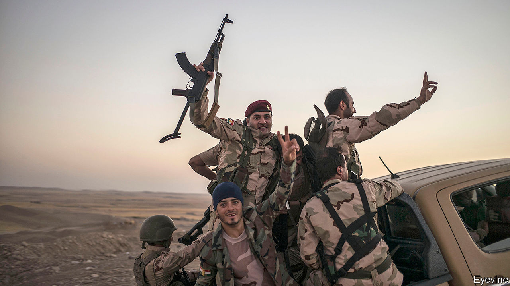

## Predicting pugnacity

# How to forecast armies’ will to fight

> What motivates the dogs of war?

> Sep 5th 2020

IN JUNE 2014 around 1,500 partisans of Islamic State (IS) attacked Mosul, a city in northern Iraq. They were outnumbered almost 15 to one by government troops defending the place. The result was a rout. But not in the direction those numbers might have suggested. In the face of the enemy, the government soldiers ran away. Reflecting shortly thereafter on America’s failure to foresee what would happen, James Clapper, then Director of National Intelligence (and thus America’s top spy) described a force’s will to fight, or lack thereof, as an unpredictable “imponderable”.

Many in the past have felt the same. Military history is, as a consequence, littered with disastrously wrong assumptions about belligerents’ will to fight. America, for instance, famously underestimated the determination of Vietnam’s National Liberation Front when it involved itself in that country’s civil war in the 1960s and 1970s. Similarly, in 1916, during the first world war, Germany underrated France’s will to defend its fortress at Verdun against what the Germans hoped would be a war-winning assault. Casualties in that battle exceeded 300,000 on each side.

Assessing enemy morale is crucial to warcraft. Bruce Bueno de Mesquita, a political scientist at New York University, reckons human will matters enough for four wars in ten to be won by what starts off, in strict military terms, as the weaker side. Behavioural scientists are now, however, bringing the power of modern computing to bear on the question. Defence planners have long used computers to forecast the results of conflicts by crunching data on things like troop numbers, weapons capabilities, ammunition supplies and body- and vehicle-armour. The next step is to extend the idea into the area of morale, by quantifying the psychological variables that determine whether troops will flee, or stand and fight.

One leader in the field of morale research is Artis International, a think-tank in Arizona that is supported by America’s defence department. To understand better what has been going on in Iraq, for example, Artis’s researchers have interviewed Iraqi-government soldiers, Sunni militiamen, Peshmerga fighters (pictured) defending the autonomy of Iraqi Kurdistan, and also captured IS troops. Participants were asked about their willingness to further their causes by doing various things. These ranged from protesting in the street and donating money to torturing or killing opponents, volunteering as a suicide-bomber, or even sacrificing one’s family.

The researchers charted participants’ responses on a seven-point scale of ascending willingness. The responses suggested that, among other things, those who declared themselves willing to sacrifice the most were the ones who also seemed least interested in material comfort and economic prospects. The researchers then embedded themselves with troops from the interviewed groups (save the IS prisoners), in part to seek differences between stated and actual willingness to fight. The bits of action they witnessed, and post-battle mapping of where (and when) casualties were suffered, broadly confirmed the findings from the interviews.

Crucially, this fieldwork revealed much about the casualties various types of units can take before survivors lose the will to fight. A typical fighting force, it is generally thought, will collapse sometime before a third of it has been destroyed. Some Kurdish and IS units in Iraq, however, fought on in a co-ordinated fashion after sustaining far more grievous losses. Artis therefore tried to classify and measure the belief systems behind such remarkable bravery.

One finding was that a fighter’s identity must have fully “fused” with those of his brothers in arms. The top priority of such fighters must, says the think-tank’s boss, Richard Davis, have shifted from family to another cause, a transcendental ideal that has become so “sacralised” that it would not be traded away for anything. Artis’s researchers identified fighters who had mentally downgraded their families to second or third place. Some were Peshmerga, who most valued “Kurdeity”—a love for the homeland steeled with commitment to fellow Kurds and Kurdish culture. Many IS captives, for their part, had shunted their families into third place behind the caliphate and sharia. Units girded with those beliefs had fought on effectively even after seven-tenths of their comrades had fallen.

The broad outline of this analysis would, of course, be familiar to any student of military history. Fanaticism has long been recognised as a plus in a soldier, be it the Zealots of ancient Israel, the Roman Catholic conquistadors of the Americas, or the Nazis’ 12th SS “Hitler Youth” Panzer Division. What is different about the Artis approach is its attempt to quantify, or at least to approximate, what is going on. That should help both in assessments of an enemy’s performance on the battlefield, and in designing training and indoctrination programmes for your own side.

Based on their work in Iraq, Artis’s 45 or so behavioural scientists have now led studies on willingness to fight and die for customers in 21 countries as diverse as Britain, Egypt and Guatemala. The goal is to incorporate such insights into predictive software. One organisation working on doing this is the United States Air Force Academy’s Warfighter Effectiveness Research Centre (WERC), in Colorado. WERC’s researchers are using Artis’s data to quantify how different levels of the will to fight alter the performance of tasks. For example, according to Lieutenant-Colonel Chad Tossell, WERC’s director, aircraft pilots whose wills are flagging are unlikely to buckle completely, but their reaction times typically slow down. His team is developing equations that reflect this. These are then fed into a version of “Far Cry”, a video game that the air force is modifying to incorporate will-to-fight calculations into combat simulations.

Comparing how unblooded cadets play the game with the approach taken by combat veterans will permit WERC to compile data on how experience, sex, age and other factors affect the speed with which players do things like throwing their virtual selves onto a grenade to save their comrades. How much a willingness to perform such an action in a game translates into behaviour on the battlefield remains to be seen. But the hope, Lieut-Colonel Tossell says, is that this study will, within two years, help the air force to nudge recruits into combat positions that make the most of their level of will to fight. The research, he adds, has already led to greater emphasis in training on the transcendental ideals that underpin America’s support for its own driving ideological creed: liberal democracy.■

## URL

https://www.economist.com/science-and-technology/2020/09/05/how-to-forecast-armies-will-to-fight
