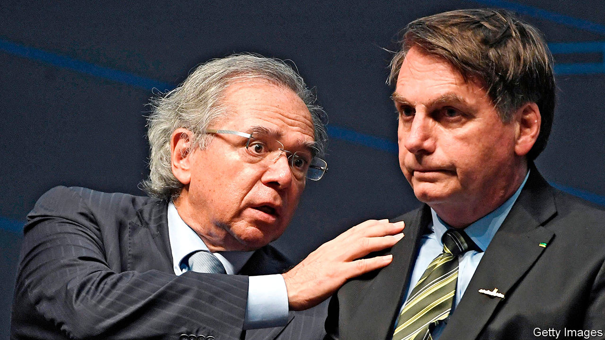

## A prickly partnership

# Brazil’s president and his economy minister start to disagree

> In the pandemic, Jair Bolsonaro sees merit in busting the budget. Paulo Guedes has reservations

> Sep 5th 2020RIO DE JANEIRO

Editor’s note: Some of our covid-19 coverage is free for readers of The Economist Today, our daily [newsletter](https://www.economist.com/https://my.economist.com/user#newsletter). For more stories and our pandemic tracker, see our [hub](https://www.economist.com//news/2020/03/11/the-economists-coverage-of-the-coronavirus)

JAIR BOLSONARO, Brazil’s president, ought to be in trouble. His is one of the countries worst affected by covid-19. It has had nearly 4m confirmed cases, second only to the number in the United States, and 123,780 known deaths. That is largely the president’s fault. He has downplayed the pandemic, railed against lockdowns and promoted unproven cures.

A crusader against corruption before he became president, Mr Bolsonaro is surrounded by scandal. One of his sons is the target of a corruption investigation. The justice minister, Sérgio Moro, quit in April, accusing the president of interfering with the probe. And yet Mr Bolsonaro is gaining political strength. The share of Brazilians who deem his performance “good” or “great” is 37%, its highest since he took office at the beginning of last year, according to Datafolha, a pollster. 

This is a side-effect of covid-19. While Mr Bolsonaro has done little to contain it, he has spent generously to shield poor Brazilians from its economic effects. At the same time, he has strengthened his weak position in Congress. His tiny Alliance for Brazil, formed last November, has teamed up with the centrão, a big bloc of centre-right parties. That will help the government pass legislation and, perhaps, shield him from impeachment. The centrão is blocking 49 impeachment motions stemming from the scandals and the mishandling of the pandemic.

But as Mr Bolsonaro grows stronger, his commitment to keeping his promises becomes weaker. The alliance with the centrão employs the grubby dealmaking that Mr Bolsonaro once denounced. Friends of centrão politicians have got plum government jobs. Also in doubt is Mr Bolsonaro’s pledge to reform the economy, which had encouraged some bankers and businessmen to overlook his authoritarian views.

Mr Bolsonaro, a former army captain, is not an economic reformer by instinct. Economic liberals have put their faith in Paulo Guedes, the economy minister (pictured left), who favours small government and free markets. He justified their confidence last year by helping to reform the pension system, whose lavish benefits would have led to crippling debt. But Mr Guedes is visibly uneasy about the spending provoked by the pandemic. In late August two of his top aides quit, prompting a fall in the stockmarket and pushing the real to its lowest level against the dollar since May.

Whatever happens to Mr Guedes, Mr Bolsonaro’s presidency has entered a new phase. In its proneness to scandal, its cynical deal with Congress and its generosity to poor voters, it is coming to resemble past administrations. Mr Bolsonaro’s government has “some similarities” to that of the left-wing Workers’ Party (PT), which governed from 2003 to 2016, says Arminio Fraga, a former head of the central bank.

No one would have said that before the pandemic. The government had trimmed Bolsa Família, the PT’s flagship welfare programme, which transfers cash to families that promise to send their children to school and to clinics for check-ups. Last year the Bolsonaro government cut the number of families enrolled by 1.2m to 13m.

With the pandemic the penny-pinching has stopped. The government has spent 213bn reais ($39bn), about 2% of GDP, on an emergency handout of 600 reais a month to Brazilians who earn the minimum wage of 1,045 reais a month. That benefits 67m people, a third of the population. The payout lifted out of extreme poverty 72% of families in that condition. Among the beneficiaries are recipients of Bolsa Família, who get a much larger sum than the programme’s minimum payment of 89 reais. In the poor north-east, the PT’s heartland, the share of people who call the government’s performance “bad” or “terrible” fell from 52% in June to 35% in August.

The government has extended to December the emergency benefit initially meant to last three months (but will reduce it by half). Mr Bolsonaro wants to replace Bolsa Família with his own Renda Brasil (Brazil Income), a benefit that will unify all social programmes. Its details are still vague. To give the economy an extra boost Mr Bolsonaro wants to borrow 5bn reais more this year to build infrastructure.

Pro-poor spending makes sense. The economy shrank by 9.7% in the second quarter. It is the same size as it was 11 years ago. Without the relief programme it would have shrunk more. The jobless rate climbed to 13.3% in the second quarter from 12% in the same period last year.

But the prospect of big deficits worries Mr Guedes. The government is set to smash through a ceiling on spending, which is inscribed in the constitution. (A workaround can probably be found.) The primary deficit, ie, before interest payments, jumped to $94bn in July from $6.5bn the year before. It is expected to reach $147bn for the full year, 11% of GDP.

Disagreement between president and minister flared in late August, when Mr Guedes said the government should pay for Renda Brasil by cutting back other welfare programmes. Mr Bolsonaro rebuffed him. He would “not take away from the poor to give to the poorest”, he said.

The two men seem to have reached a truce. Mr Guedes may accept a breach of the spending cap if Congress acts to control future spending, says Chris Garman of Eurasia Group, a political-risk consultancy. His other demand is reform of the tax system, which is among the most complex in the world. A mid-sized Brazilian firm typically spends 1,500 hours a year dealing with tax, compared with 175 for an American firm, according to the World Bank.

But reforming tax is as complex as taxation itself. One of Mr Guedes’s ideas—replacing two taxes on company turnover with a 12% VAT—would anger farmers, who have a powerful lobby, notes Marcos Cintra, the chief of the federal revenue service until September. Consumers would also object. Reform, if it happens, will be “a very noisy process”, says Mr Garman.

Mr Guedes has apparently decided he can still do some good. After tax reform could come measures to reduce public-sector employment and benefits. Perhaps. But Mr Bolsonaro has now seen that enlarging the state is more popular than shrinking it. As the presidential election approaches in 2022, the salience of that lesson will grow. Brazil’s experiment with economic liberalism may prove short-lived. ■

## URL

https://www.economist.com/the-americas/2020/09/05/brazils-president-and-his-economy-minister-start-to-disagree
