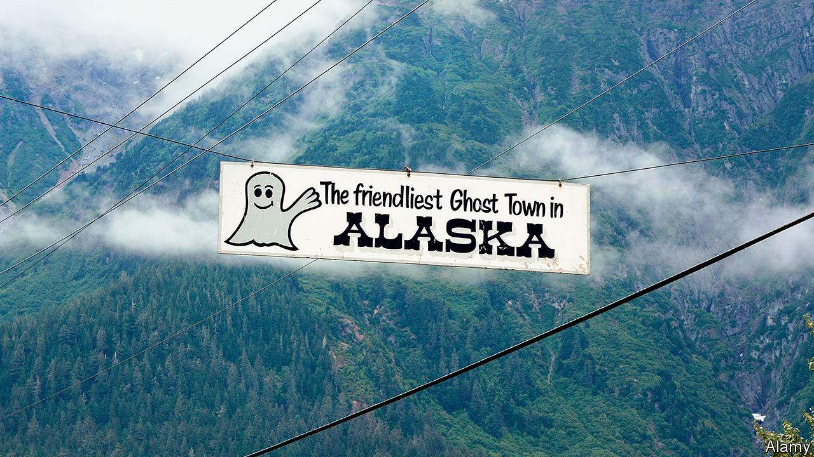

## Frontier friendship

# The closure of Canada’s border with Alaska has split a remote community

> The people of Hyder, Alaska, and Stewart, British Columbia, want to be able to come and go

> Sep 5th 2020VANCOUVER

FEW AMERICAN towns are as remote as Hyder, a settlement of 65 people in the panhandle that juts south from the rest of Alaska between Canada and the Pacific. Its only road connection passes through Stewart, British Columbia, 2km away. For generations, Stewardites and Hyderites paid little attention to the border. They celebrate Canada Day on July 1st in Stewart, then move the party to Hyder, “the friendliest ghost town in Alaska”, for the United States’ Independence Day three days later. Activities include an ugly-vehicle contest and the “chicken-shit board”, in which bets are placed about which square in a grid a chicken will defecate on. Hyderites buy petrol and groceries in Stewart. Their telephone numbers use Canadian area codes (250 or 778).

The back-and-forth between the former gold-mining towns stopped in March when the border between the two countries closed because of covid-19. Under a special dispensation, Canada allows Hyderites to go to Stewart once a week for four hours. That is not enough. Wes Loe, Hyder’s postmaster and unofficial mayor, would normally drive to Terrace in British Columbia, 300km away, to stock up for winter, but the lockdown rules don’t allow that. Soon, the roads will be too dangerous. “Things are deteriorating, and I mean emotionally and mentally,” says Mr Loe.

The border is lightly policed. There is no American post. The Canadian guard’s shift ends at 4.30pm. Cameras and a telephone connection to an agent somewhere else in Canada keep watch after that. If Hyderites break the rules, “an alarm and sirens would be set off and the RCMP [Royal Canadian Mounted Police] will be notified, and that’s just not the thing we would do,” says Mr Loe.

Most Canadians are eager to keep Americans out. The United States’ covid-19 infection rate is five times Canada’s. Canadians post pictures of suspected American intruders on social media. Some in cars with American plates affix signs to their windows saying they’re Canadians returning home. From March 21st to August 19th Canada turned away 14,000 Americans from its borders. It allows Alaskans to travel home across Canada from the lower 48 states, but they can enter in only five places and must take the most direct route.

But Hyderites and Stewardites value togetherness. Mr Loe and Gina McKay, Stewart’s mayor, want the towns to be able to form a bubble that would let their citizens mingle freely. Alaska’s governor, Mike Dunleavy, and Taylor Bachrach, the Canadian MP who represents Stewart, have lobbied the Canadian security minister to let that happen. So far, they have had no luck. “We’re two countries, two communities but for as long as anyone can remember, we’ve essentially operated as one,” says Ms McKay. “We’re used to isolation up here but we don’t want to be isolated from each other.”

Editor’s note: Some of our covid-19 coverage is free for readers of The Economist Today, our daily [newsletter](https://www.economist.com/https://my.economist.com/user#newsletter). For more stories and our pandemic tracker, see our [hub](https://www.economist.com//news/2020/03/11/the-economists-coverage-of-the-coronavirus)

## URL

https://www.economist.com/the-americas/2020/09/05/the-closure-of-canadas-border-with-alaska-has-split-a-remote-community
