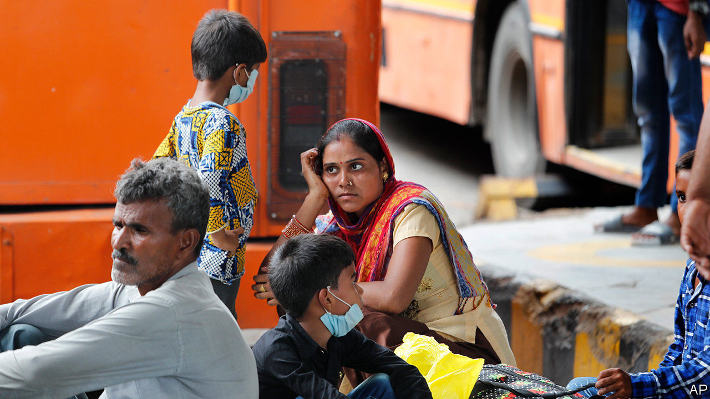
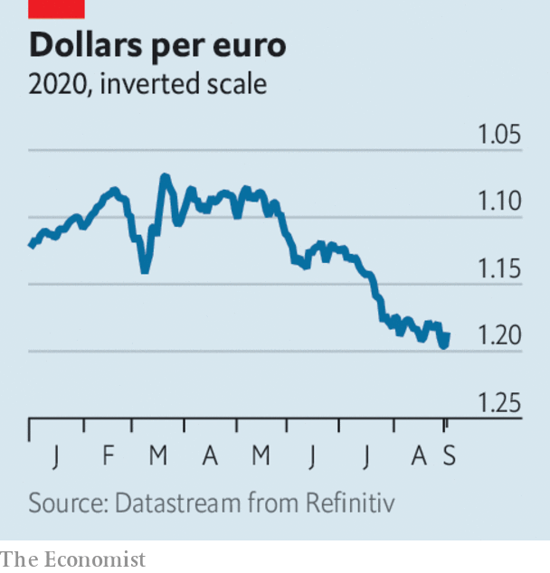

# Business this week

> Sep 3rd 2020

Another raft of data underscored the toll that covid-19 is taking on economies, as more countries reported record-breaking contractions in quarterly GDP. India’s economy was around a quarter smaller in April to June than in the first three months of the year. Australia’s GDP shrank by 7%, Brazil’s by 9.7%, and Turkey’s by 11%. Those countries are in recession, in Australia’s case for the first time in nearly three decades. See [article](https://www.economist.com//node/21791422).

The dollar fell to another two-year low against the euro, notching up a fourth consecutive month of losses, after Jerome Powell announced a major shift in policy at the Federal Reserve. The central bank’s chairman said that “maximum employment” and a “strong labour market” would guide future decisions, in effect suggesting the Fed will not raise interest rates for years to come. It will now allow inflation to run above 2% sometimes, rather than strictly target that figure as a goal. See [article](https://www.economist.com//node/21791405).

A first estimate showed that the annual rate of inflation in the euro zone fell to -0.2% in August, the first time in four years that the currency bloc has slipped into deflation. Cheaper energy was the main factor behind shrinking prices.

Tesla announced that it would sell new shares “from time to time” to raise up to $5bn on capital markets. This came after the electric-car maker completed its stock split, which provided existing investors with more shares but at a lower price. Before the split Tesla’s stock traded above $2,210 a share, up by 500% since the start of the year. It reopened at $496. After the split Elon Musk, Tesla’s boss, joined the club of just five men in the world who are worth over $100bn.

Stockmarkets had their best August since 1986. The MSCI World Index of share prices rose by 6.6% over the month. Fuelled by a rally in tech shares, and by quarterly earnings from companies that were more positive than had been expected, the S&P 500 and NASDAQ are at record highs.

Unilever became the first big provider of everyday household goods to commit to green sourcing for its cleaning and laundry products. The conglomerate, which sells a wide range of familiar brands, including Persil (in Britain), Surf and Domestos, said that it would shift to renewable or recycled sources of carbon, and by 2030 no longer use chemicals derived from fossil-fuel feedstocks, such as petroleum and natural gas.

With food allergies on the rise, Nestlé struck a deal to buy Aimmune Therapeutics, which makes the only approved remedy in America to treat a reaction to peanuts among children. Up to 240m people worldwide suffer with food allergies, peanut allergy being the most common.

Lee Jae-yong, the de facto boss of Samsung, was indicted on new charges in South Korea, including manipulating share prices. The latest claims focus on the merger in 2015 of two of the conglomerate’s affiliates. Mr Lee is already being retried in a related bribery case.

Zoom’s customer base (firms with at least ten employees) rose by 458% in the three months ending July compared with the same quarter last year, generating soaring profits.

India’s Supreme Court compromised and gave the country’s mobile-phone operators ten years to pay a collective $13bn in retrospective licence fees and penalties that an earlier ruling found were owed to the government. The court had been insisting on immediate payment, which threatened to wipe out Vodafone’s venture in the country.

In a surprise announcement, SoftBank said it would sell $14bn-worth of shares in its telecoms business, which it bought from Vodafone in 2006, reducing its stake from 62% to 40%. Proceeds of the sale will go some way towards shoring up the debt-laden conglomerate’s balance-sheet.

Apple removed Epic Games’s access to its app store in a dispute over the fees that Apple levies. It had already removed “Fortnite”, Epic’s most popular game. Deleting the firm’s account means its other games are also unavailable; iPhone users who have installed “Fortnite” can continue to play, but not with Android or PC gamers. People claiming that “Fortnite” is already on their iPhone are selling their devices for thousands of dollars online.

Britain’s public broadcaster, the BBC, did a U-turn and will allow the lyrics to “Rule, Britannia!” and “Land of Hope and Glory” to be sung on the last night of a popular festival of music that it broadcasts. The decision to rearrange the patriotic songs without words was criticised for being soppy and woke. Restoring them is a wise move by Tim Davie, the BBC’s new boss, as he negotiates funding with the government. It reportedly wants the BBC, which is funded by a household television-tax, to look for alternative sources of revenue.

## URL

https://www.economist.com/the-world-this-week/2020/09/03/business-this-week
