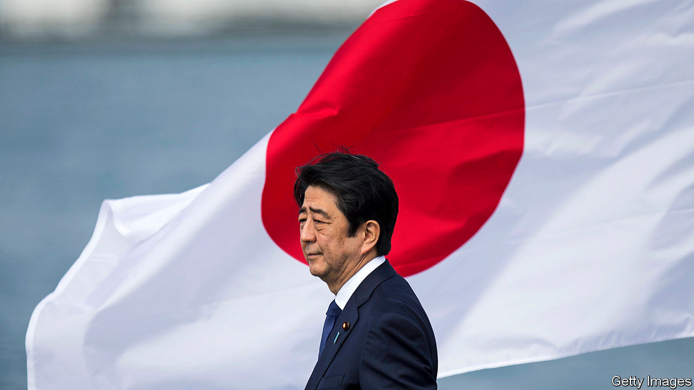
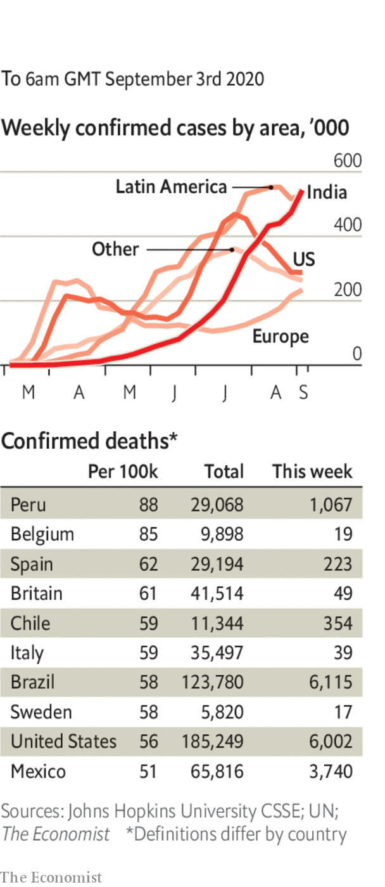

# Politics this week

> Sep 5th 2020

Abe Shinzo announced that he was stepping down as prime minister of Japan because of ill health. Mr Abe has held the job longer than anyone else. He will be remembered for “Abenomics”, a programme of monetary easing, spending and structural reforms. The ruling Liberal Democratic Party will choose a successor on September 14th. The leading candidate is Suga Yoshihide, Mr Abe’s cabinet secretary. See [article](https://www.economist.com//leaders/2020/09/03/abe-shinzos-legacy-is-more-impressive-than-his-muted-exit-suggests).

Thailand’s King Maha Vajiralongkorn restored Sineenat Wongvajirapakdi to her position as royal “consort”. Last year the king made her Thailand’s first officially designated consort in almost a century, but she was stripped of her privileges a few months later for trying to elevate herself as an equal to the queen, the king’s fourth wife.

Tensions flared anew in a disputed border area between India and China. India accused China of violating an agreement reached during recent peace talks by carrying out “provocative military movements” in the Himalayas. China said its troops had not violated the status quo.

Ethnic-Mongol parents in the Chinese province of Inner Mongolia kept their children at home in protest against a government effort to extend the use of Mandarin in schools. Some parents fear the new policy will diminish young people’s knowledge of the Mongol language. See [article](https://www.economist.com//china/2020/09/05/chinas-drive-to-boost-the-use-of-mandarin-in-schools-angers-ethnic-mongols).

Australia said one of its citizens, a prominent journalist working for Chinese state television, had been detained by the Chinese authorities. No details of any charges against the woman, Cheng Lei, have been released.

Venezuela’s dictator, Nicolás Maduro, pardoned 110 opponents who had been charged with crimes by his regime. They include associates of Juan Guaidó, the president of the National Assembly, who is recognised as Venezuela’s interim president by more than 50 countries. Most opposition leaders intend to boycott the legislative election due in December.

Protesters in Montreal pulled down a statue of John Macdonald, Canada’s first prime minister. They accuse him of perpetrating “genocide” by founding the residential-schools system, where tens of thousands of indigenous children were forcibly enrolled. Many were abused.

The German government said that Alexei Navalny, a prominent Russian opposition leader taken ill on a plane in Siberia and evacuated to Berlin, had been poisoned by a form of Novichok, a nerve agent used in Britain in 2018 in an assassination attempt on another enemy of Vladimir Putin. The confirmation increases the likelihood of more sanctions on Russia. Mr Navalny remains in a medically induced coma. See [article](https://www.economist.com//europe/2020/09/02/germany-says-that-alexei-navalny-was-poisoned-with-novichok).

France released details of a €100bn ($119bn) stimulus package, aimed at countering the recession brought on by covid-19, and also reintroduced the concept of a national economic plan. See [article](https://www.economist.com//europe/2020/09/05/emmanuel-macron-revives-a-post-war-institution-for-a-post-covid-era).

Mustapha Adib, Lebanon’s ambassador to Germany, was selected as the country’s next prime minister. This came a day before a visit by Emmanuel Macron, the president of France, who pushed Lebanese officials to tackle corruption and implement political reform. Lebanon was already mired in a financial crisis when its capital, Beirut, suffered billions of dollars in damage from an explosion four weeks ago. See [article](https://www.economist.com//middle-east-and-africa/2020/09/03/old-colonial-powers-are-bidding-for-influence-in-lebanon).

A delegation of American and Israeli officials took the first official flight from Israel to the United Arab Emirates. The two Middle Eastern countries agreed to normalise relations last month. The flight crossed Saudi Arabian airspace, which had been closed to Israeli air traffic. The UAE also repealed a law boycotting Israel.

King Salman of Saudi Arabia sacked six defence officials over allegations of corruption. Prince Fahd bin Turki bin Abdulaziz Al Saud, who commands the Saudi-led coalition in Yemen, and his son were among those removed from their posts. Muhammad bin Salman, the crown prince, has used past anti-corruption drives to consolidate power.

Alpha Condé, the president of Guinea,will stand in an election scheduled for October, after he abolished a two-term limit in a contested referendum earlier this year. Mr Condé has run the country since 2010; under the new law he may rule until 2032, when he will be 94.

The government and rebel groups in Sudan signed a peace deal promising to end a civil war centred largely in the Darfur region that has lasted 17 years. Several earlier ceasefires and peace deals have been signed and then broken.

Donald Trump visited Kenosha, a town in Wisconsin that has been embroiled in violence since a black man was shot by police and paralysed. The president reiterated his resolute message on law-and-order, which he hopes will help him win re-election. In Portland, another scene of widespread disturbances, a white man who took part in a pro-Trump demonstration was fatally shot amid clashes with left-wing protesters. See [article](https://www.economist.com//united-states/2020/09/02/donald-trump-tries-out-law-and-order-talk-on-suburban-voters).

A member of the Kennedy clan lost an election in Massachusetts, a first for the state. Joseph Kennedy, a congressman, failed to wrest a Senate seat from Ed Markey in the Democratic primary.

The World Health Organisation recommended the use of cheap, everyday steroids for the treatment of severely ill covid-19 patients, after a meta-analysis of data found they reduced deaths by over a third.

The United States passed 6m cases in total; the number of new cases continues to fall. France and Spain recorded their most infections in a day since March. Argentina registered its biggest jump since the start of the pandemic.

India reported 2m infections in August, the highest monthly tally for any country since the outbreak of the coronavirus. It has recorded 3.9m cases in all.

As in many other countries, pupils in England started returning to school for the first time since March. New York City postponed the reopening of its schools as it resolved a dispute with teachers over testing (for covid-19, not students’ academic ability).

## URL

https://www.economist.com/the-world-this-week/2020/09/05/politics-this-week
