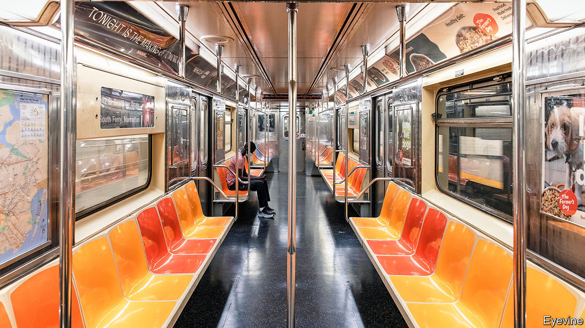

## Train wreck

# America’s biggest transit system is in trouble

> As the MTA flounders, so New York City will struggle to recover

> Sep 3rd 2020NEW YORK

BEFORE THE pandemic, packed subway cars were signs of the vitality of New York City. Squeezing into a packed carriage just as the doors closed was the norm until mid-March. By the time a train reached Manhattan people would be wedged in, shoving past each other to leave. It is difficult to imagine anyone enduring that crush now. Yet it is also hard to see New York truly bouncing back without it. “The subway is the barometer of New York,” says Tom Wright, head of the Regional Plan Association. “If the transit system falls apart, New York will not recover.”

The system is on the verge of financial collapse. Pat Foye, chairman of the Metropolitan Transportation Authority (MTA), the state entity in charge of the subway, buses and regional commuter lines as well as some bridges and tunnels, painted a bleak picture at a recent board meeting. The agency is losing $200m a week because fare revenues, tolls and subsidies are all down, while the MTA is shouldering new pandemic-related expenses (mostly shutting down the normally 24-hour subway for nightly cleaning). Passenger numbers collapsed as covid-19 spread and have risen only modestly as New York City has reopened. On August 31st 1.4m straphangers rode the subway, but that was still 75% below a typical weekday in 2019. The pandemic has taken a greater toll even than the Great Depression; passenger numbers declined by only 12% in 1929-33.

The MTA hopes for $12bn in federal funding to get through this year and next. Without help, Mr Foye will be obliged to take “draconian measures”, which will be felt across the city and the region for decades. He spoke of a 40% reduction in subway and bus journeys and a probable reduction of up to 50% in services to the suburbs. Long-promised capital projects will be delayed or suspended. Fares and tolls will go up and the agency will lay off 8,400 employees, who have already had a tough time. Thousands of MTA workers were infected with covid-19, more than 130 died and many lost family members to the virus. Mr Foye repeatedly drew parallels with the 1970s, when New York City sought a federal bailout to avoid fiscal collapse and hundreds of thousands of residents fled.

When, and if, office workers will return to Manhattan is uncertain. Many have not swiped their MetroCard for six months. Most are afraid to use the subway, despite the transit authority’s aggressive disinfecting. Service cuts could deter them from commuting regularly. There is anecdotal evidence that those who fled from the city are not returning. Many may drive back in, increasing congestion. A decrease of 10% in subway passengers means an increase of more than 30% in road traffic, says Nicole Gelinas of the Manhattan Institute, a New York think-tank. “If you are not investing in your capital asset, if you are driving away ridership with service cuts, you are just accepting much, much lower revenues for a long time,” she adds. All that leaves people who depend on the transit system, such as shift workers and shop workers, to bear the brunt of higher fares.

The system has long had fiscal problems. Little more than a decade after it opened in 1915, it faced a crisis when inflation raised operating expenses for the private companies then running the subway. After the second world war, New Yorkers abandoned the subway for cars. During the 1960s and 1970s the system was not well maintained, which caused delays and disruption. Every surface was covered in graffiti. Crime was rife. Even before the pandemic the MTA was paying nearly 20% of its operating budget on debt service and its infrastructure was crumbling, with some of its signal systems dating back to the 1930s.

In the past few months the MTA has been downgraded by various credit agencies, which makes borrowing more expensive. The agency is not allowed to file for bankruptcy and is required by law to balance its books. In the past it has turned to the city and state for help, but they are cash-strapped, too. New York’s officials say Congress should help, since if New York does not recover, the whole country will suffer. Senate Republicans have not been sympathetic, however. Congress gave the beleaguered agency $4bn in May as part of the CARES Act, but the MTA had spent all that by July 24th.

It may start to make cuts in November. If Joe Biden wins, it may get a little more time. But delaying track upgrades and signal systems will cause problems fast, which will further hobble the city’s recovery. “New York without its subway system,” says Philip Plotch, author of “Last Subway” and a political scientist at Saint Peter’s University in Jersey City, “is like a skyscraper without an elevator.”■

Editor’s note: Some of our covid-19 coverage is free for readers of The Economist Today, our daily [newsletter](https://www.economist.com/https://my.economist.com/user#newsletter). For more stories and our pandemic tracker, see our [hub](https://www.economist.com//news/2020/03/11/the-economists-coverage-of-the-coronavirus)

## URL

https://www.economist.com/united-states/2020/09/03/americas-biggest-transit-system-is-in-trouble
