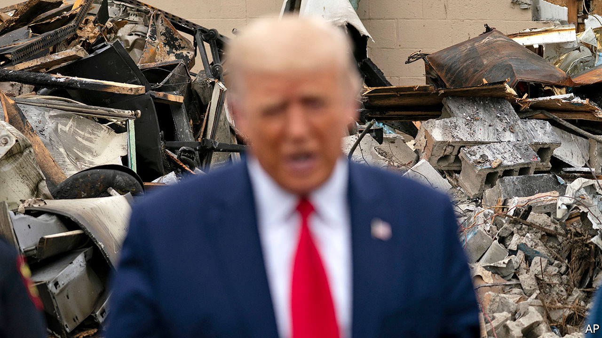

## The suburban strategy

# Donald Trump tries out law-and-order talk on suburban voters

> A dispatch from the pundits’ favourite county suggests the president has not yet made a breakthrough

> Sep 2nd 2020CEDARBURG, WISCONSIN, AND WASHINGTON, DC

IN THE MOST genteel suburbs around Milwaukee, in southern Wisconsin, the quaintness can be overpowering. Enormous baskets of flowers hang from Victorian-style street lamps along the main street of Cedarburg, a riverside town in Ozaukee County. Tourists, caught in a summer downpour, may choose to take their shelter with a chocolatier, a cakemaker, two wineries or a French bakery.

Cedarburg is also an avowedly conservative place. In the previous presidential election, the county preferred Donald Trump by a margin of 19 percentage points. Although a poster for Black Lives Matter adorns the front door of one shop—a purveyor of colourful socks—a worker whispers that it has provoked several complaints. One customer called to say he would never return because of it. Another declared it offensive (even here, cancel culture reigns). Locals exist in a “Cedarbubble” says a young barista nearby. The city’s population was 94% white at the last census. The barista says many folk avoid visiting Milwaukee, the large and much less white metropolis just 30 minutes away, fearful of its reputation for crime.

Ozaukee and the other similarly populous, wealthy and twee counties west of Milwaukee are usually comfortable terrain for Republicans. High turnout and high margins typically counterbalance Democratic voters in the cities. But the suburbs now look rocky for Mr Trump’s re-election chances, which, just as last time, may require knife-edge victories in the Midwest. He has consistently trailed Joe Biden, his Democratic opponent, by five percentage points in Wisconsin since May, notes Charles Franklin, who runs polling at Marquette University Law School.

The president’s re-election campaign has noticed and alighted on a new strategy to court the suburbs again. The campaign has clothed itself in the Nixonian garb of “law and order”, alleging that the protests against racism in American cities, which have recently become violent again, are but a preview of “Joe Biden’s America”. For evidence he pointed to nearby Kenosha where looting, arson and two murders have followed the shooting by police of Jacob Blake, an unarmed black man. A man who may well have been a supporter of Mr Trump, in turn, was also shot dead in Portland, Oregon, at the weekend. 

The coded, racialised appeal is not difficult to decipher. To make it even clearer, Mr Trump has also taken to arguing that Democrats plan to “destroy our suburbs” by building public housing and inviting crime—an effort he for some reason insists will be spearheaded by Cory Booker, a black senator from New Jersey. On September 1st Mr Trump visited Kenosha, praising the police and arguing that Democratic mayors and governors across the country are soft on looters. He compared the upheaval there to “domestic terror”. Earlier, when asked about the white teenager charged with killing two protesters and injuring another in Kenosha, who has become a cause célèbre among some conservative media hosts, the president suggested he had acted in self-defence.

Promises to restore law and order might seem more persuasive coming from an insurgent outsider than from an incumbent president. When Mr Trump took office in 2017, he pledged “I alone can fix it,” and promised an end to “American carnage” in his inaugural address. Now he argues that the explosion of urban violence under his administration is proof of Democratic mismanagement and the need for him to have a second term. Some accept the argument. According to a poll released by YouGov on August 28th, 32% of adults believe re-electing Mr Trump would make the country safer (though a plurality, 43%, think he would make it less safe).

Can such a strategy work? Some commentators, perhaps scarred by the last contest where Hillary Clinton seemed to be the heavy favourite throughout, already spy a polling bounce for Mr Trump. At least in the national polls, the purported bounce looks quite dainty. His vote share has increased by one percentage point, from 45% on June 17th to 46% in The Economist’s average of presidential-election polls. Some of that bump came in the week after the party convention—when incumbents usually enjoy a real, if ephemeral, boost in support during the post-coronation bliss.

Previous racial unrest has not been especially kind to the president. According to our maths, Mr Trump experienced the worst three weeks of the campaign after George Floyd was killed by police in Minnesota on May 25th. His deficit in the polls ballooned then from seven points to 11 points in a relatively short span of time.

It is still too early to determine how large Mr Trump’s national bounce will ultimately be, or whether it will subside. So far, the president’s average support over the course of the election has been both low and the most stable on record. And since the national election will not be decided by the popular vote but by the electoral college, if he ekes out a victory again this time, it is likely to come by a similar route.

At the state level, our election modelling finds Mr Trump’s position in the Midwest has improved relative to his June low. Whereas he was down 11 points in Michigan two months ago, he is down just six now; in Wisconsin, an 11-point hole is now a six-point one; and the president is down just five points in Pennsylvania, up from nine earlier this year. These are still significant deficits, but the trend is certainly looking up for Republicans.

Mr Franklin, the Wisconsin pollster, is also cautious. Older voters are dismayed by the president’s handling of covid-19. Many disapprove of his approach to race relations, although they still trust him on the economy. For weeks, polls have shown public support for Black Lives Matter to be slipping. In Wisconsin, approval peaked at 61% in June before falling to 48% in August. It may be even lower now. So far, however, Mr Franklin has seen no evidence of that shift affecting overall support for either Mr Biden or Mr Trump.

The foot soldiers feel the strain. “We’re ground zero, we’re under the gun,” says Terry Dittrich, the Republican chairman in neighbouring Waukesha County—the bellwether county for election-night pundits. Should Mr Trump fall short here, “the rest of the state has to make up for that”. Mr Dittrich admits there has been a wobble of late. The Republican Party typically expects to scoop 65-70% of votes in his county. In the midterms, in 2018, the Democrats’ victorious candidate for Senate, Tammy Baldwin—an openly gay war hero—scooped a heady 38% support in Waukesha, points out Matt Mareno, the Democrats’ party chairman in the county. If Mr Biden could match her result, then he predicts “it’s game over” in the state.

So far, Republicans have cheered the new suburban strategy. “The more chaos and anarchy and vandalism and violence reigns, the better it is for the very clear choice on who’s best on public safety and law and order,” said Kellyanne Conway, a close adviser to the president, in a television interview. Mr Dittrich also applauds the new approach. He says he has received a surge of texts, “general feedback” and (unspecified) polling evidence in the past week to suggest voters are startled by the urban violence and are flocking back to Mr Trump. Kathy Broghammer, the Republican party chairwoman in Ozaukee County, is even more enthusiastic, pointing to a surge in interest among Republican volunteers because of “the threatening feeling we see in Kenosha”. “We love our law and order,” she says. “People are saying, by golly I’m gonna roar.” ■

Dig deeper:Read the [best of our 2020 campaign coverage](https://www.economist.com//us-election-2020) and our [presidential-election forecast](https://www.economist.com/https://projects.economist.com/us-2020-forecast/president), then sign up for Checks and Balance, our [weekly newsletter](https://www.economist.com//checksandbalance/) and [podcast](https://www.economist.com//podcasts/2020/08/28/checks-and-balance-our-weekly-podcast-on-american-politics) on American politics.

## URL

https://www.economist.com/united-states/2020/09/02/donald-trump-tries-out-law-and-order-talk-on-suburban-voters
