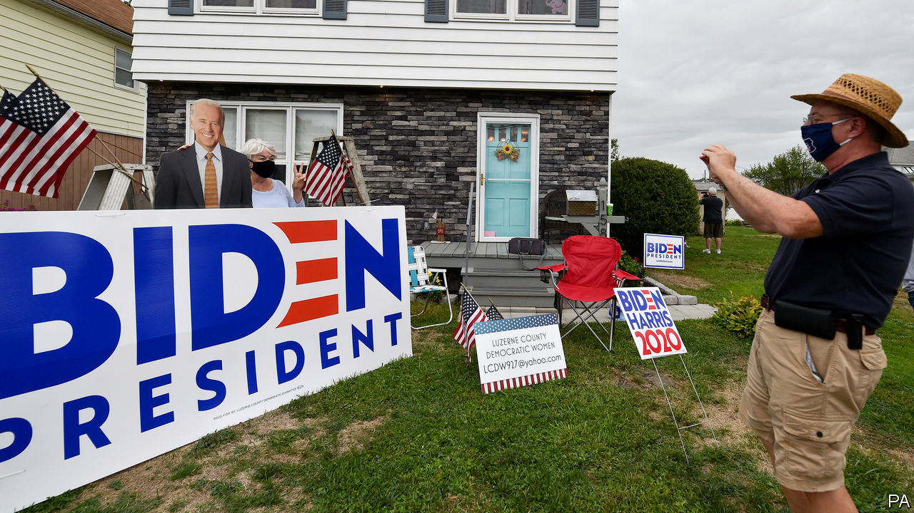
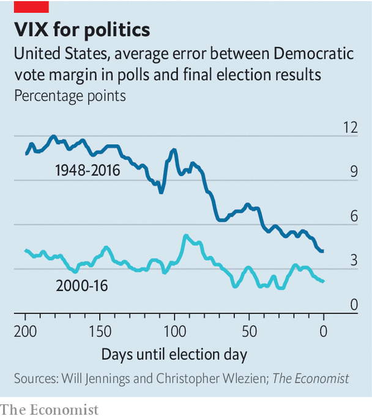

## Shorting volatility

# How much do polls move after Labor Day?

> Since 1952, every candidate who was ahead at this point went on to win the popular vote

> Sep 5th 2020WASHINGTON, DC

THERE’S A REASON that the period from Labor Day to election day is considered the home straight in a presidential contest. Robert Erikson and Christopher Wlezien, two political scientists at Columbia University and the University of Texas at Austin, have studied the history of American election-polling since 1952 and found that the leader in the polls one week after the second party convention has always won the popular vote. Two candidates have trailed in the polls around Labor Day, then won in the electoral college: George W. Bush in 2000 and Donald Trump in 2016. In both cases the polls were much tighter than they are now. Joe Biden therefore has past performance on his side.

Mr Trump’s odds have improved in betting markets, suggesting that many think the combination of the Republican National Convention and the protests in Portland, Kenosha and elsewhere are working in his favour. That in turn suggests they expect a lot more volatility in the polls than has ever been seen before.

Going back to 1948, how wildly polls have changed in the first seven months of the election cycle helps explain how much they vary in the last three. The standard deviation of the average of national polls—a measure of how much they jump around from day to day—over the first two-thirds of the election cycle has explained 50% of the variance in the last third (a perfect relationship would be 100%). Polls in the last third of the campaign have tended to be about 40% as volatile as the first two.

Mr Trump’s poll numbers have been low and stable. Mr Biden’s numbers have moved with a historically low standard-deviation of 0.9 percentage points so far. Mr Trump is a known quantity. Few voters are yet to make up their minds about him and political polarisation has decreased the share of true swing voters in the electorate. A bet on volatility in the polls is therefore highly contrarian. History is on the side of the herd.

Dig deeper:Read the [best of our 2020 campaign coverage](https://www.economist.com//us-election-2020) and our [presidential-election forecast](https://www.economist.com/https://projects.economist.com/us-2020-forecast/president), then sign up for Checks and Balance, our [weekly newsletter](https://www.economist.com//checksandbalance/) and [podcast](https://www.economist.com//podcasts/2020/08/28/checks-and-balance-our-weekly-podcast-on-american-politics) on American politics.

## URL

https://www.economist.com/united-states/2020/09/05/how-much-do-polls-move-after-labor-day
