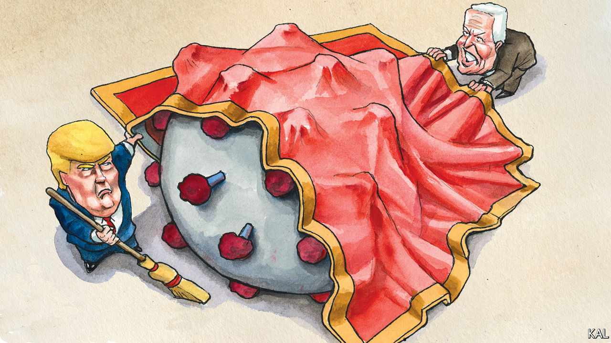

## Lexington

# It’s the covid-economy, stupid

> Contrary to what some fearful Democrats believe, law-and-order looks unlikely to decide this election

> Sep 5th 2020

SHORTLY AFTER George Floyd was killed by a Minnesotan policeman last May, Joe Biden condemned the riots that his killing had sparked. “Protesting such brutality is right and necessary,” he said. “Burning down communities and needless destruction is not. Violence that endangers lives is not.” He repeated his denunciation several times over the next few days. President Donald Trump meanwhile accused him of ignoring the issue.

So it has continued. Though Mr Biden has more often expressed support for the ongoing racial-justice protests against police brutality, he has not failed to condemn the violent fringe that, in Oregon, Illinois and now Wisconsin, continues to haunt them. “There is no justification whatsoever for violence, looting,” he said last week, after the shooting of Jacob Blake in Kenosha sparked yet more rioting. The following day—at the Republican convention—Mr Trump for the umpteenth time accused him of failing to condemn what Mr Biden had just condemned.

The hammering the former vice-president has taken on this issue—every evening on Fox News as well as from Mr Trump—has unnerved some of his supporters. Some suggest a 1968-style silent majority, sickened by the violence, is building against the Democrats. It sounds plausible. But there is no strong evidence for it yet. That means the Democrats anxiously demanding that Mr Biden issue ever more and louder denunciations of the street violence are essentially taking their cues from Mr Trump and Tucker Carlson, who do not have their interests at heart.

The evidence of the past three months is that Republicans do not want to set Mr Biden straight on law-and-order. They want to see him hopelessly entangled in the issue—bullied into expressing ever more forceful denunciations of the riots (as he did again this week, in a speech in Pittsburgh), which they will duly dismiss as “too little too late”. A better course for Mr Biden’s advisers would be to consider what the canny Mr Trump does not want his Democratic opponent to talk about. Could it be a public-health catastrophe, for which a majority of voters blame the president, which is predicted to take a quarter of a million lives by election-day? That is a likelier conjecture.

Especially when you consider the promise of Mr Biden’s recent efforts to recast the politics of the coronavirus catastrophe: by treating it as not merely a public-health crisis, but also an inextricably connected economic one. “We will never get our economy back on track…until we deal with this virus,” the former vice-president told the Democratic convention last month.

That was shrewd on two counts. First, because it linked the two issues that voters care about most—notwithstanding Mr Trump’s fiery rhetoric, even Republicans are more worried about the pandemic and the economy than they are about violent crime. Second, because Mr Biden is in effect trying to use Mr Trump’s biggest weakness, his acknowledged failures on the coronavirus, to undercut his biggest remaining strength: a diminished, but somehow enduring, reputation for effective economic management.

The economy is the only issue on which Mr Trump outpolls Mr Biden. For that matter, it is the only issue on which he has consistently out-performed his low approval ratings ever since his inauguration. Founded upon his years as a TV boardroom titan, as well as his more recent success in spinning the strong economy he inherited as his creation, Mr Trump’s reputation for economic wizardry was the single main reason he had looked highly competitive before the coronavirus struck, despite his unpopularity.

With the unemployment rate now at 10%, the gap between how Americans rate the president on the economy and overall has shrunk significantly. According to Gallup, 48% of Americans approve of him on the economy, while 42% approve of him overall. That is the main reason he now looks much less competitive. Yet in a closer election than the polls currently predict, this residual strength could still save him. At the least, it appears to be Mr Trump’s best hope.

A survey of suburban voters in the swing states of Arizona, Michigan, North Carolina, Pennsylvania and Wisconsin—published last month by Third Way, a think-tank—underlines that. Though only 39% approved of Mr Trump, 48% said he was still making a decent fist of the economy. That might look like a losing hand. But the survey suggested that even a fairly modest uptick in the economy could move opinion in Mr Trump’s favour pretty dramatically. The respondents chose Mr Biden over Mr Trump by a nine-point margin. But asked how they would feel if the unemployment rate were to drop to 8%, they split their vote between the two candidates. Given how likely that order of economic improvement is over the next two months, this should worry Biden strategists rather more than the spectre of a 1968-re-run.

At the same time, the survey suggests Mr Biden’s effort to blunt Mr Trump’s economic edge—by offering a more expansive definition of the coronavirus crisis—could succeed. A small majority of Third Way’s suburbanite voters already attributed the economic crisis in part to Mr Trump’s poor management of the epidemic. A much larger majority said the economy could not be fixed until the virus had been brought under control. Both views are anathema to Mr Trump, who has shirked responsibility for the health crisis, even as he claims to have a recovery from the economic crisis in hand. They appear to represent a clear opening for Mr Biden’s claim that the president is not only culpable for the crisis but incapable of leading America out of it.

It is his strongest attack-line and, though it is never wrong to denounce violence, he should not be swayed from it. With apologies to James Carville, this election is about the covid-economy, stupid. (Albeit that, with additional apologies to Bill Clinton’s oft-quoted strategist, Mr Biden must not forget law-and-order.) ■

Dig deeper:Read the [best of our 2020 campaign coverage](https://www.economist.com//us-election-2020) and our [presidential-election forecast](https://www.economist.com/https://projects.economist.com/us-2020-forecast/president), then sign up for Checks and Balance, our [weekly newsletter](https://www.economist.com//checksandbalance/) and [podcast](https://www.economist.com//podcasts/2020/08/28/checks-and-balance-our-weekly-podcast-on-american-politics) on American politics.

## URL

https://www.economist.com/united-states/2020/09/05/its-the-covid-economy-stupid
