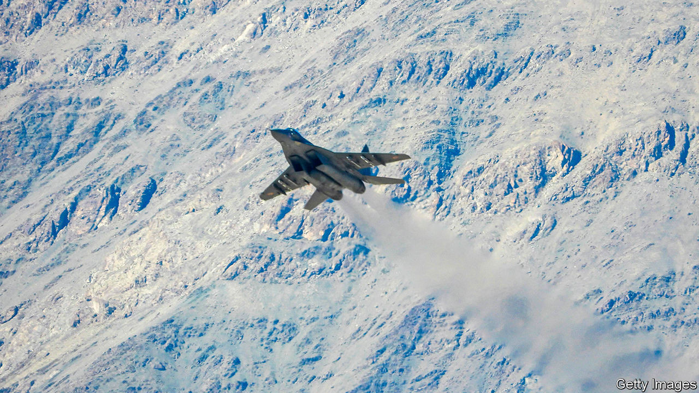
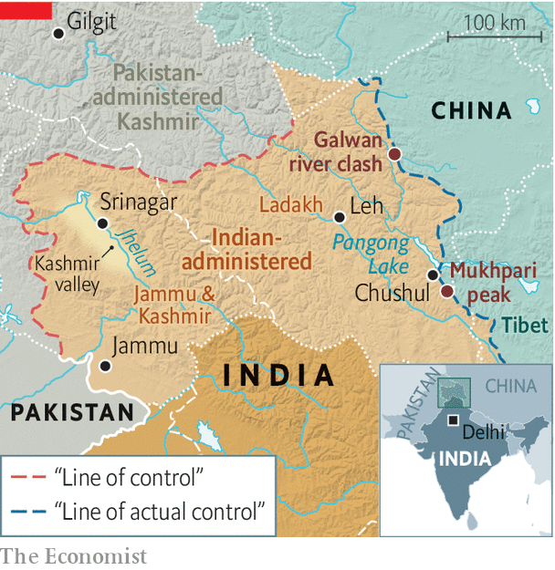

## Ice and fire

# India and China exchange the first gunshots in 45 years

> The Asian giants are locked in a dangerous standoff over their disputed Himalayan border

> Sep 8th 2020

INDIA’S CONDUCT was as reckless as “doing a handstand on the edge of a cliff”, fulminated the Global Times, a state-run tabloid in China, on September 8th. “We must warn India seriously: you have crossed the line!” In India’s telling, it was Chinese troops who crossed the line, approaching an Indian position near Mukhpari peak on September 7th and firing “a few rounds” into the air. In China’s version, it was Indian troops who fired the warning shots, forcing the People’s Liberation Army (PLA) “to take an emergency response”. Either way, the bullets were the first to fly along the vast Himalayan frontier between the countries in 45 years.

For several months India and China have been locked in a tense standoff in Ladakh, a plateau to the west of Tibet (see map). India has accused the PLA of massing forces, building outposts and nibbling territory at several points along the hazy and disputed Line of Actual Control (LAC), which serves as a frontier in the absence of an agreed border. In June the two sides agreed to disengage. Days later a deadly but gun-less brawl took place at the Galwan river valley. At least 20 Indian troops were killed and many injured in hand-to-hand fighting with makeshift weapons (the number of Chinese casualties is unknown). The incident dissipated what little trust was left between the pair.

With talks over the summer going nowhere, both sides reportedly gathered tanks and other forces on the south bank of Pangong lake, where the overlap between Indian and Chinese claims—and therefore the scope for disagreement—is particularly large. In late August troops “yelled at each other and surged to within a yard or two”, according to the New York Times.

On August 30th India appears to have taken the initiative, sending its Special Frontier Force, a secretive military unit manned by Tibetans, on a six-hour trek to capture peaks in the Chushul sector, to the south of Pangong lake, supposedly to pre-empt a Chinese move. That gave its forces a commanding view of PLA positions and important passes below, as well as a potential bargaining chip in future talks (Indian officials contend that, since April or so, China has occupied 1,000 square kilometres of territory on what India believes to be its side of the LAC).

The pair also appear to be locking horns well beyond Ladakh. On September 2nd India banned 118 Chinese apps, including a hugely popular video game, China’s leading search engine and its most widely used digital-payments system. It had already banned 59 others, including TikTok and WeChat, after the June clashes. A day later India’s most senior soldier, General Bipin Rawat, said that he wanted the bloc known as the Quad (comprising America, Australia, India and Japan) to “ensure freedom of navigation operations” in Asia, referring to naval shows of force in Chinese-claimed waters in the South China Sea. Though America routinely conducts such operations, India has trodden more cautiously. Expanding its naval presence in disputed waters in the Pacific would mark a big widening of its confrontation with China.

The scramble for territory in the mountains is particularly dangerous because old rules seem to be crumbling. Over decades, India and China had agreed on various protocols at the border: firearms were forbidden, patrols that bumped into one another should not follow one another and heavy weapons should be kept to a minimum. The deadly clash at Galwan in June dealt a heavy blow to these understandings; the use of guns, if only in warning, at Mukhpari on September 7th struck another. “All past agreements have broken down,” says General D.S. Hooda, a former head of the Indian army’s Northern Command. S. Jaishankar, India’s foreign minister, acknowledges that the situation is “very serious”.

Indian and Chinese troops remain very close to one another, though it will get harder to maintain their new outposts over the coming months. “In winter this is not a good place for humans to live,” noted Zhao Lijian, a spokesman for China’s foreign ministry, on September 8th. “So we hope, through diplomatic and military channels...we can achieve disengagement as soon as possible.” That does not look likely. “All this points to the likelihood of future military escalation unless the Chinese change their obdurate attitude on disengagement,” says General Hooda. ■

## URL

https://www.economist.com/asia/2020/09/08/india-and-china-exchange-the-first-gunshots-in-45-years
