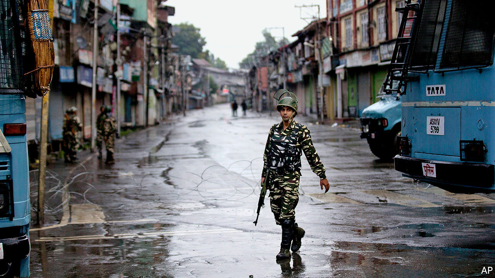

## Highland brig

# India is still trampling on civil liberties in Kashmir

> Some in the Muslim-majority region have been detained without trial for over a year

> Sep 12th 2020SRINAGAR

SAIFUDDIN SOZ is not under house arrest; he is just not allowed to leave his home. Now 82 years old, he once represented the northern Kashmir valley in the national parliament in Delhi. He spent five years as a minister in the government of Manmohan Singh, the prime minister who preceded the present one, Narendra Modi. Since August 5th, 2019, the day parliament deprived Jammu & Kashmir of its statehood at Mr Modi’s behest, the police have forced Mr Soz to remain in his home. “You are under house arrest,” they told him. His family petitioned the courts for his release, since he has not been charged with any crime, much less convicted. But the Supreme Court dismissed the request, since the authorities had informed the honourable justices that Mr Soz was “never detained nor under house arrest”. When local journalists went to Mr Soz’s home to get his reaction to the happy news, he tried to speak to them over the fence—until uniformed soldiers pulled him away.

The government’s blatant lying to the court (which is otherwise prickly about what it considers contempt) gives a sense of how far it is willing to go to have its way in Kashmir and how little it cares about abusing the rights of even the great and the good in the process. The state’s peculiarities have long angered the Hindu nationalists of the ruling Bharatiya Janata Party (BJP). They see it as an affront that Pakistan, which like India claims all of the former British protectorate, seized part of it in 1947. Worse, the Muslim majority in the Indian part has long chafed under Indian rule, prompting frequent popular protests and an endless insurgency. Most infuriating of all, in spite of their ingratitude, the 12m people of Jammu & Kashmir, including some 7m Muslims in the Kashmir valley, used to benefit—until last year—from a special form of autonomy accorded to no other state in India.

Mr Modi’s decision a year ago to rescind that autonomy and split the state into two territories (Jammu & Kashmir and Ladakh—see map) run directly by the national government was intended to please his supporters. It was always going to enrage Kashmiris, who were not consulted, even though the constitution demanded it. (To get around this, Mr Modi dismissed the elected state government, appointed his own lieutenant to run the state and then got this appointee to consent to the loss of autonomy and statehood on Kashmiris’ behalf.) To keep a semblance of order, the government has had to suspend local politics and many civil liberties for over a year—with no end in sight.

Even before the change, there were some 500,000 troops deployed in Kashmir (the government does not disclose precise numbers). About 35,000 more were sent last year to help enforce the new order. Phone lines and the internet were cut and politicians of every stripe, along with businessmen and other prominent citizens—some 7,000 people in all—were arrested without charge. Gatherings of all kinds were banned. The government claimed all this was to prevent terrorists backed by Pakistan from organising any kind of retaliation and not to prevent ordinary Kashmiris from expressing their views. In fact, the government maintained, Kashmiris were not really protesting at all, even though, as with the unfortunate Mr Soz, video footage suggested otherwise. Thirteen months later, most of the restrictions remain in some form.

The internet is back, but only sporadically and in many parts of Kashmir only via a rickety 2G service. The covid-19 pandemic has provided a new rationale to prohibit all gatherings. Such rules are enforced in Kashmir in ways not seen in the rest of India: on August 29th a procession marking the Shia Muslim holy day of Muharram was broken up by police firing shotguns. Dozens were wounded, some of them blinded, in theory to preserve public health.

Hundreds of bunkers covered in camouflage netting have popped up across Kashmir. A dozen line the embankment of the Jhelum river in Srinagar, the capital, where couples used to stroll in the evening. Blast-hardened military vehicles with gunners at their turrets roar along the highways, forcing civilian traffic to halt. Drivers can be held up for hours at the many new checkpoints, often waiting for a long military convoy to pass.

A host of repressive laws give the security services free rein. The Public Safety Act allows preventive detention at will. The Unlawful Activities (Prevention) Act criminalises speech and organisations the government considers secessionist. The Armed Forces (Special Powers) Act allows troops to kill with impunity. In May police and soldiers were filmed ransacking a village in northern Kashmir, where they beat men and women, looted stores and burned goods on the street. The rampage was a reprisal: a senior officer had been hit by a stone-thrower. If not for the footage, the episode would have gone unnoticed.

That gives the authorities an incentive to stop information flowing. A new media policy, introduced in June, allows the prosecution of publishers associated with reporting deemed “anti-national”. In August about 300 young people, mostly teenagers, were rounded up for saying things considered to be critical of the state on social media. Some were beaten, others forced to promise not to post anything political.

All this has upended ordinary life. The economy, already battered by the lockdown that came with the end of statehood, is now reeling from a second one, owing to covid-19. Schools have been open for only 20 days in the past year—and the disruption to the internet has made online learning impossible. The legal system is hamstrung: many of those detained without charge could not challenge their incarceration because the lawyers’ guild went on strike to protest the arrest of its president.

To all these tribulations Kashmiris add an extra concern—that an influx of migrants from the rest of India will turn them into a minority in their homeland. The revoked autonomy included restrictions on who could own land in the state. The government promised that the new order would preserve locals’ say over who gets to live among their alpine peaks. Yet new criteria have made many more Indians eligible for “domicile certificates”. Instead of seeking to allay such fears, Mr Modi chose to celebrate the anniversary of the abolition of Kashmir’s autonomy by laying the foundation stone of a new temple, to be built on the site of a demolished mosque. ■

## URL

https://www.economist.com/asia/2020/09/12/india-is-still-trampling-on-civil-liberties-in-kashmir
