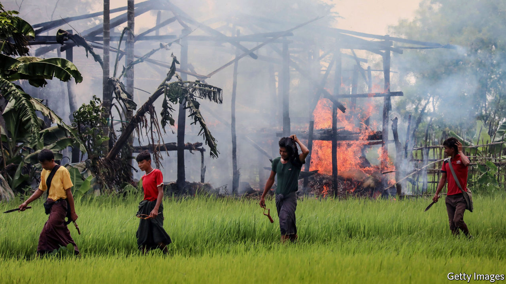

## They shot the smoking guns

# Two Burmese soldiers confess to war crimes against the Rohingya

> They are being questioned by the International Criminal Court

> Sep 12th 2020SINGAPORE

PRIVATE MYO WIN TUN looked steadily into the camera as he recounted two weeks in August 2017 when he and his battalion laid waste to several villages in Rakhine, a state in the far west of Myanmar. They were there, he said, as part of the Burmese army’s “clearance operations” targeting the Rohingya, a persecuted Muslim ethnic minority, which sparked the exodus of more than 740,000 Rohingyas to neighbouring Bangladesh. Mr Myo Win Tun confessed to participating in the massacre of 30 Rohingyas, whom he helped to bury in a mass grave, and to raping one woman. In another video, Private Zaw Naing Tun said that his battalion “wiped out about 20 Muslim villages”, and that he stood sentry while his superiors raped women. Based on their accounts, Fortify Rights, a human-rights NGO which obtained the footage, believes these two men may be directly responsible for killing 180 Rohingyas.

On September 8th the New York Times reported that the men are being questioned by the International Criminal Court (ICC), which is investigating Burmese civilian and military leaders for crimes against humanity for their treatment of the Rohingya. Whether the soldiers will be prosecuted remains unclear. Their confessions were filmed in July by the Arakan Army (AA), a rebel outfit fighting the Burmese army. Twan Mrat Naing, the AA’s commander, says that the AA helped them desert the Tatmadaw, as the Burmese army is known. They fled to Bangladesh, whose government was eventually persuaded to turn them over to the ICC, says Paul Reichler, a lawyer involved in a different case against Myanmar at the International Court of Justice (ICJ), which considers crimes committed by countries, rather than individuals.

The Burmese courts have convicted seven soldiers of killing ten Rohingyas in Rakhine in 2017. But otherwise the Burmese authorities have failed to investigate detailed accounts of widespread human-rights abuses gathered from fleeing Rohingyas, much less punish anyone. The Burmese government maintains—entirely implausibly—that any harm inflicted on civilians was neither orchestrated from on high nor systematic, but simply an unfortunate side-effect of the army’s pursuit of armed Rohingya rebels. So the testimony to the contrary of two former Burmese soldiers marks a significant strengthening of the evidence against the Burmese top brass.

Major General Zaw Min Tun, the Burmese army’s spokesman, says the soldiers’ statements are false. But evidence gathered by the UN suggests their battalions, as well as other units they mention in their statements, did indeed commit atrocities in Rakhine state in 2017. Several locals interviewed by the New York Times verified the locations of mass graves the soldiers discuss in their confessions.

The soldiers’ testimony will be of interest not just to the ICC but also the ICJ. A group of Muslim countries have accused Myanmar of genocide, but must establish not just that widespread atrocities took place but also that they were part of a deliberate policy to get rid of the Rohingya. The men’s claims that, in different areas and under different commanders, they were both instructed to kill all Rohingyas “point in the direction of genocidal intent”, says Michael Becker, a lawyer who used to work at the ICJ. Rohingya activists are encouraged: “This gives a strong signal to…top generals that they will be held accountable,” says Tun Khin of the Burma Rohingya Organisation UK. ■

## URL

https://www.economist.com/asia/2020/09/12/two-burmese-soldiers-confess-to-war-crimes-against-the-rohingya
