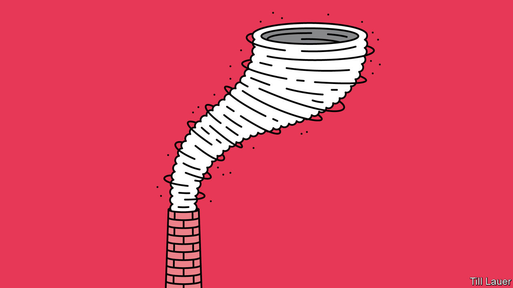

## Banyan

# Typhoon season makes Japan and the Koreas ponder climate change

> But Japan, in particular, is a climate laggard

> Sep 12th 2020

SENSO-JI IN TOKYO, dedicated to the boddhisattva of compassion, is Earth’s most visited sacred site. Some 30m people a year pass through the temple’s imposing entrance, known as Kaminarimon, or Thunder Gate, flanked by Fujin, the god of wind, and his even fiercer brother, Raijin, the god of storms and rain. They are just one of countless reminders across North-East Asia that the natural calamities of downpours and floods (not to mention earthquakes and tsunamis) are deeply enshrined in the region’s collective psyche.

Yet some recent meteorological punishment looks less divine than man-made. Two years ago Japan’s summer monsoon season was the wettest on record. In their usual iteration, the life-giving rains are welcome. In excess, they sweep away roads and houses: 225 people died across 15 prefectures in 2018. The rains of 2019 set a new record as, in turn, did this summer’s deluge.

In South Korea, too, the 54 days of rain this summer marked the longest monsoon on record. The Han river, which runs through Seoul, the capital, burst its banks. The heavy rains threatened North Korea’s already meagre food supply.

No sooner did the monsoon end than the typhoon season began. The Korean peninsula typically gets one direct hit from a typhoon a year. Over the past two weeks it got three in succession, another record. On September 8th Kim Jong Un, the North’s dictator, assembled his top brass to review the damage a week earlier from the second of the typhoons, Maysak, which destroyed 2,000 homes and washed away 60km of roads and 57 bridges. As the meeting took place, the third, Haishen, was sweeping inland. Although it had weakened before it made landfall, Haishen was the first “supertyphoon” of the season. It packed sustained winds of 135 knots (250kph).

Most of the western Pacific, the world’s biggest typhoon factory, has actually seen unusually few this season. Meteorologists had predicted that. Thanks to a regular rhythm in the climate known as the El Niño-Southern Oscillation, their models said tradewinds in lower latitudes would be stronger than usual, making it harder for typhoons to form.

Yet something man-made may be at work farther north. A facet of global warming is that the tropics are expanding. That may account for increased monsoon flooding and a shift north in the intensity of typhoons. Surface temperatures in a huge patch of ocean south of Japan have been at record highs. The heat gives strength to the typhoons passing over. As Maysak unwound, the energy it dumped into the jet stream may have contributed to savage swings from hot to cold in western America (see Science section).

Japan and South Korea grew rich by pouring concrete. Construction—dams, levees, pumping stations—still delights planners confronting threats from the weather. A shrine for the world’s disaster experts is a cathedral-like cistern under Tokyo, a 6.3km-network of tunnels and tanks supported by 500-tonne columns.

Flood mitigation is essential. Yet though Japan and South Korea have few climate-change deniers, the sense that warming is a problem generated elsewhere has persisted for too long, says Ohbayashi Mika of the Renewable Energy Institute in Tokyo. That is changing faster in South Korea. Its civil society is more vigorous than Japan’s—and in a recent Gallup poll seven out of ten Koreans said recent floods underlined the seriousness of climate change. President Moon Jae-in promises to close ten coal plants before the end of his term in 2022. This week he used the typhoons as a reason to push for a trebling of renewable generation by 2025. South Korea’s coronavirus-related spending packages have had a strongly green element, says Ms Ohbayashi, unlike Japan’s.

There, media coverage of weather events makes the link to climate change. Yet Japan’s own hefty carbon emissions rarely come up, says Watanabe Eri of 350.org, a green pressure group. Coal’s share in power generation has risen in the past decade, especially after Japan shut its nuclear plants. Targets adopted under the outgoing prime minister, Abe Shinzo, are feeble: coal will still be more than a quarter of the mix by 2030. Japan also promotes coal plants abroad.

Change is always possible. Japanese businesses are under pressure from Western partners to cut their carbon use. Three years of floods have boosted new volunteers at Ms Watanabe’s group fivefold. The numbers remain tiny—around 250 a year. But all typhoons start with the merest waft of air.

For more coverage of climate change, register for The Climate Issue, our fortnightly [newsletter](https://www.economist.com//theclimateissue/), or visit our [climate-change hub](https://www.economist.com//news/2020/04/24/the-economists-coverage-of-climate-change)

## URL

https://www.economist.com/asia/2020/09/12/typhoon-season-makes-japan-and-the-koreas-ponder-climate-change
