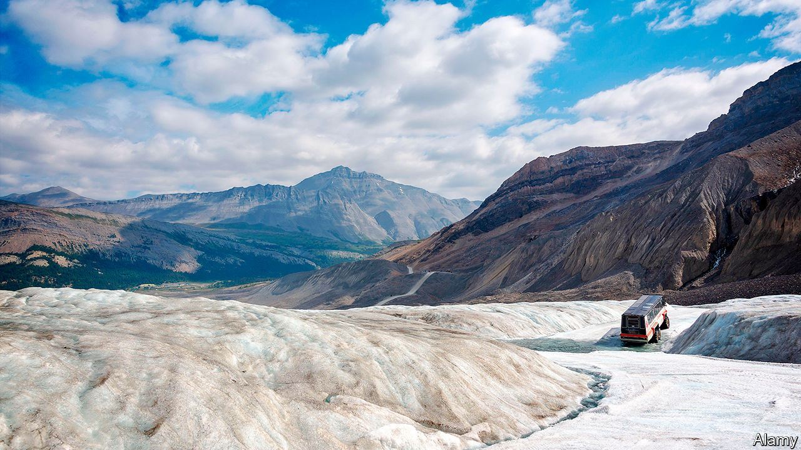

## Thicker than water

# A chilling memoir of troubled parents

> Even when the ice recedes, writes Vicki Laveau-Harvie, it still shapes the landscape

> Sep 12th 2020

The Erratics. By Vicki Laveau-Harvie.Knopf; 224 pages; $25.95.

“I’M GETTING DAD 2.0, director’s cut,” writes Vicki Laveau-Harvie of her visit to her father at his ranch in Southern Alberta, Canada—where the phone rings unanswered near a windowless library, a grand piano and a bomb shelter. When she and her sister decide to clean the big house, “sealed against the outside world for a decade”, they discover a cupboard of shoe boxes filled with cancelled cheques. It would take “carbon dating” to identify the items in the refrigerator.

This is a part of North America where people commute in darkness and cars start at minus 40 degrees. It is a world of harsh winters, black ice and septic-tank disputes; a place where ranchers and farmers still make crab-apple jelly and tomato chutney in the summer. In this tough environment, Ms Laveau-Harvie’s parents’ marriage was a saga of disappointment and bitterness. They neglected her and her sister, then disowned and disinherited them.

Their mother keeps their father in rural isolation and starves him. Only late in life is she diagnosed with a personality disorder. Things begin to unravel when she breaks a hip; she tells a social worker that Interpol is looking for Ms Laveau-Harvie in South America. “The Erratics” is an account of the author’s travels back and forth from her home in Sydney, Australia to care for the old man and make sure her mother stays in hospital.

Wit and generosity seep through the poised prose. “The leaves of the trembling aspens can shake all day like gold coins in air as clear as cider,” Ms Laveau-Harvie writes, “but this is not a welcoming place.” Insight compensates for a lack of dramatic tension. She fathoms the heart’s reserves of both ruthlessness and vulnerability; she considers the natural urge to embellish “the stories of who we are or who we think we are”.

In recent years a niche genre of memoir has focused on the ministrations of the middle-aged to elderly parents. For instance, George Hodgman, an editor at Vanity Fair, left New York to care for his nonagenarian mother in Missouri, an experience which became the basis of his book “Bettyville”. Ms Laveau-Harvie, a retired academic and translator, has won acclaim for this contribution to the trend in Australia. She deserves it. Lives can be scarred, she muses, by the gap between what you take and what you give.

Despite the emotional abuse her parents inflicted, or because of it, Ms Laveau-Harvie has never escaped them; sometimes she can even hear them, “like people who pick up the local radio station broadcasts through the fillings in their teeth”. You can’t blank out the past, her book insists. As with the glacier which, tens of thousands of years ago, swept from Alaska to Alberta—pushing the kind of giant rock known as an erratic—even when the old ice fractures, it will always dominate the landscape.

## URL

https://www.economist.com/books-and-arts/2020/09/12/a-chilling-memoir-of-troubled-parents
