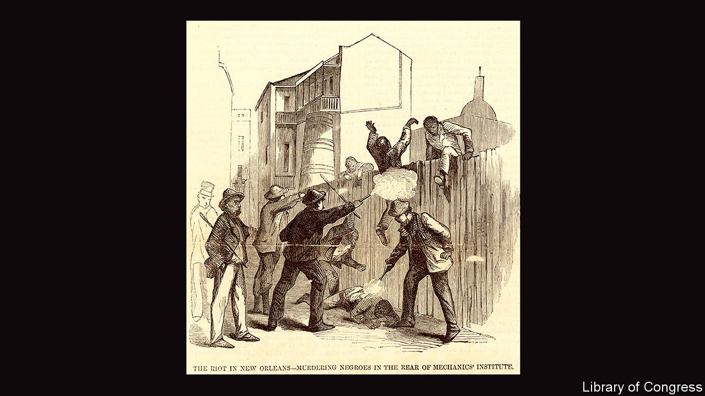

## White supremacy in America

# “Life of a Klansman” brings the past out of the closet

> This family history is not exceptional, Edward Ball writes. It is ordinary

> Sep 12th 2020

Life of a Klansman: A Family History in White Supremacy. By Edward Ball.Farrar, Straus and Giroux; 416 pages; $28 and £17.99.

THIS IS A story of horrors, albeit of a tragically widespread kind. It is also a conjuring trick. It recounts the “insignificant and yet calamitous, strange but common life” of Polycarp Constant Lecorgne, a carpenter, terrorist and Edward Ball’s great-great-grandfather. Few records of Lecorgne survive, obliging Mr Ball to patch his narrative together from documents of the era and the biographies of similar men—of whom there were many.

In “Slaves in the Family”, published in 1998, Mr Ball told the stories of his slaveholding paternal ancestors in South Carolina and the black people they owned, and sometimes fathered. He harrowingly showed how pain and racial injustice cascaded through generations. By contrast, his new book is a tale of wilful forgetting. “Life of a Klansman” turns to his mother’s forebears in Louisiana, a state which was (and is) at once an extreme example of wider problems and a special case—because of its large populations of free people of colour and Francophones, overlapping categories that were a legacy of French control.

Lecorgne’s father was a sailor in Napoleon Bonaparte’s navy. Mr Ball speculates that he was involved in ferrying refugees from the revolution in Haiti around the Caribbean, before jumping ship in New Orleans, where the author himself partly grew up. The father married into the slaveholding Creole gentry—an upward mobility that his son quickly reversed. Born on a family plantation in 1832, Lecorgne seems to have been a habitual flop. During the civil war, his first unit disgraced itself in a drunken riot before it saw combat. Lecorgne and his wife, who had arrived from Guadeloupe via Cuba, sank their savings into Confederate bonds. Five of their children died young.

Probably, Mr Ball says, his ancestor was an inadequate and unhappy man, humiliated by his failings and enraged by the post-war influx of freedmen into New Orleans, some of them in uniform. Like many such men, he found a bitter solace in violent prejudice, joining a series of Ku Klux Klan-like militias (though plenty of successful whites also signed up). In tandem with repressive local laws, these groups harassed, raped and killed black people and sometimes white Republicans. They aimed to fix elections, annul their results, and ultimately thwart and overturn Reconstruction—the federal effort to impose a fairer settlement on the recalcitrant South in the years after the war.

The brazenness of these crimes, which included mass murder and treason, and their perpetrators’ more or less complete impunity, cannot fail to shock even readers familiar with the period. Because he was arrested—though not punished—Lecorgne is known to have taken part in an attempted white-supremacist putsch in New Orleans in 1873. He was probably implicated in a massacre of black supporters of a constitutional convention seven years earlier.

To begin with, all the “probablys” in Mr Ball’s chronicle seem a weakness. Soon, though, the conjectures become pointed. All of this happened, whether or not it happened to Lecorgne. He is a looming spectre in a book that is really a portrait of his time. (The men, women and children whom his family bought and sold are indistinct ghosts, too; Mr Ball strains to imagine their lives, separate from their owners’ yet intimately entwined, though the evidence is even scantier than it is for Lecorgne.)

This is also, the author insists, a book about modern times. He decries the ready moral condescension of the present towards the past—the blithe confidence that “if we were alive then, we would do it all differently”. Working with data from the time of the Klan’s revival in the 1920s, he calculates that half of white Americans have an ancestor who was involved. “The rarity is not in having a Klansman around,” he says in his clipped, epigrammatic style. “The unusual thing is to bring him out of the closet to interrogate under light.” He goes further. Regardless of their own views on race, he argues, today’s white Americans are beneficiaries of the havoc once wreaked by the likes of Lecorgne. And, in their unconscious biases, Mr Ball thinks, they have a trace of the Klan in their psyches as well as in their family trees.

Some white Americans have already embraced that chastening conclusion; some will bridle at it. No one can deny that the Klansmen won. Another white-supremacist insurrection in 1874 succeeded in taking over New Orleans, at least for a few days until the army showed up. Louisiana, scene of so much bloodletting, eventually played a pivotal role in the contested presidential election of 1876, which led to the end of Reconstruction. Twenty years later the Supreme Court’s ruling in Plessy v Ferguson, a case that originated in New Orleans, affirmed the constitutionality of segregation. “None of this”, Mr Ball sighs, “is long ago, when you think of it.” ■

## URL

https://www.economist.com/books-and-arts/2020/09/12/life-of-a-klansman-brings-the-past-out-of-the-closet
