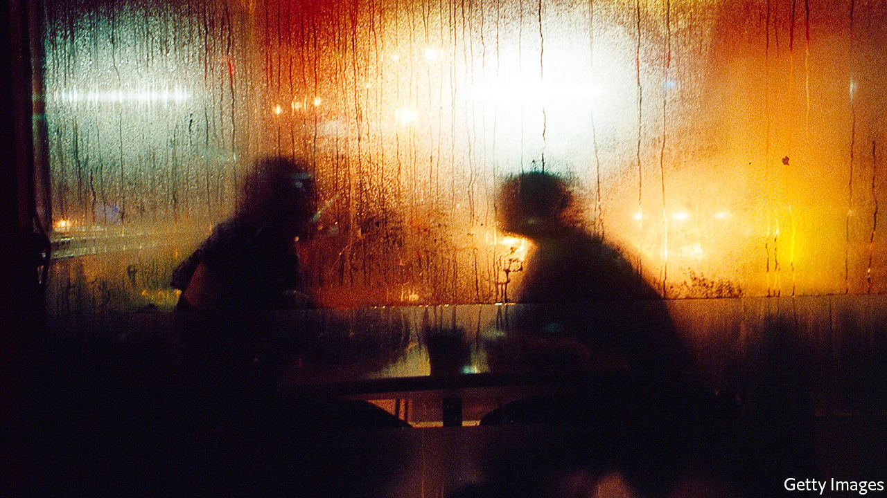

## Memory lane

# Roddy Doyle’s new novel is funny and moving

> In “Love”, his characters are once again in Dublin—and in the pub

> Sep 12th 2020

Love. By Roddy Doyle.Viking; 336 pages; $27. To be published in Britain by Jonathan Cape in October; £18.99.

THE SPRIGHTLINESS of Roddy Doyle’s writing makes it hard to believe that “Love” is his 18th work of fiction. As well as novels and short stories, his output has included theatrical adaptations and books for children. His first novel, “The Commitments” (published in 1987), was made into an award-winning film; having been shortlisted for the Booker prize for “The Van” in 1991, he went on to win it two years later with “Paddy Clarke Ha Ha Ha”. Amid the intimate stories he tells, Mr Doyle has chronicled the evolution of modern Ireland and Irish identity over the past few decades. As always, beneath the zing of his prose beats a warm heart.

In “Love” the author is on familiar ground: the city of Dublin, his home town. Not for the first time his principal settings are pubs and other hostelries. Joe and Davy, old friends, are catching up over a few pints. And then a few more. The pair are well into middle age, with all the perspective and regret that entails. The occasion is a rare and unexpected appearance back home by Davy, who now lives in England with his wife Faye and their children. The reason for this visit is fully explained only in the novel’s final, urgent pages.

Mr Doyle is justly renowned for his whip-smart dialogue, which combines salty humour and the loving use of local vernacular (and helps his writing transfer easily and entertainingly from page to screen and stage). The back and forth between Joe and Davy covers decades and relationships, the twists and turns of paths pursued and of roads not taken. For all the camaraderie, beneath the exchange flows an undercurrent of wariness and rivalry dating back to their early adulthood.

At first it is Joe’s story which takes precedence. He has left his long marriage to Trish for a fellow parent at his children’s school. The woman, Jessica, is an enigmatic figure from the friends’ past, part of a group of music students whom they used to encounter in an unremarkable city-centre pub which became their weekend haunt in the early 1980s. Jessica, whose name was then unknown to them, had been an unobtainable, much-discussed object of desire, an attractive cello player to whom neither man later recalls speaking. But as the novel unfolds memories and recollections become slippery.

Mr Doyle juggles his time-frames with characteristic aplomb: from a grey Dublin that still observes “the holy hour”, during which pubs shut every afternoon, to a 21st-century city sweltering in the unaccustomed heat of a tropical summer. The book is infused with male concerns and disappointment but ranges beyond them, too. Flashbacks to two-handed scenes between Davy and Faye, and between Joe and Trish, give a satisfyingly rounded perspective on these lives. Sometimes the effect is comic; more often it is moving.

And there is beauty and compassion in Mr Doyle’s sculpted, spare writing. Among all the banter and gags he manages to articulate feelings that are rarely expressed so fittingly. Whether it is describing the agonising death of an elderly parent, or evoking the euphoria of an unlikely late-life passion, “Love” is a reminder that its author is one to treasure. ■

## URL

https://www.economist.com/books-and-arts/2020/09/12/roddy-doyles-new-novel-is-funny-and-moving
