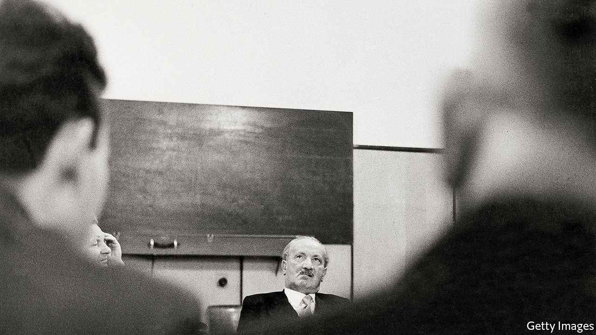

## New speak

# The philosophers who imagined a new world

> In the 1920s they walked the walk, as well as doing a lot of dizzying talk

> Sep 12th 2020

Time of the Magicians: The Invention of Modern Thought, 1919-1929. By Wolfram Eilenberger. Translated by Shaun Whiteside.Penguin; 432 pages; $30. Allen Lane; £25.

TIMES OF CRISIS breed upheavals in intellectual as well as social life. So Wolfram Eilenberger’s survey of high thoughts and low politics among German-language philosophers of the 1920s is a salutary tale for today, not just a gripping panorama of century-old dreams and feuds. The founding editor of Germany’s Philosophie Magazin, Mr Eilenberger follows four men who aspired to “process the intensity of the experience of war” into revolutionary forms of peacetime thought and action.

In their various ways, Martin Heidegger, Ernst Cassirer, Ludwig Wittgenstein and Walter Benjamin built a new philosophical framework for what Heidegger called the “high-tension intensities of meaningful life”. Fresh thinking would dispense with worn-out concepts while permitting a transformative “leap into faith” and usher in a truly ethical existence. However, three of the quartet believed that “only the gaze into the abyss produces authenticity”. For them, the path towards a redemptive way of being ran through anxiety, rupture, even breakdown. They played for high stakes, and courted huge risks.

Heidegger, the only one not to come from a Jewish background, was a country sexton’s son from Baden. Enamoured of sturdy, rooted peasant toil, he was drawn to the “existential guide” of German culture. Wittgenstein, lonely child of a Viennese industrial magnate, was brought up as a Catholic, gave away a fortune and then demolished old-school metaphysics with his “brilliant amalgam of radical modernity and rock-hard conservatism”. Benjamin, a feckless drifter and esoteric outsider, oscillated between mystical Judaism, even more mystical Marxism and surrealistic forays into mass culture as he fashioned his critique of alienated urban life.

Those three thinkers sought to remedy a “crisis of the public use of language”. In the aftermath of the first world war, the old words seemed to have failed. High culture felt bankrupt, social relations corrupt, and philosophy itself a windy wasteland of defunct notions. For all the opacity of some of their ideas (Heidegger’s above all), these three advocates of a “new kind of speaking” believed that “practice trumps theory”.

Right thinking and meaningful living went together. Heidegger brooded in not-quite-solitary splendour in a hut in the Black Forest built by his wife Elfride (his lover Hannah Arendt also features here). Wittgenstein worked miserably as an Austrian village schoolteacher; Benjamin hoped for communal salvation either in Moscow—where, briefly and unhappily, he lived—or Palestine. Each “loved the idea of the ‘simple people’, but not the reality”.

Mr Eilenberger’s odd man out is Cassirer, the only democrat in this group, who doggedly kept to his bourgeois habits of mediation and moderation as a professor in Hamburg. He never renounced old-fashioned Kantian idealism, and championed the fragile liberal order of the Weimar Republic. His multi-volume “Philosophy of Symbolic Forms” posited an optimistic bridge between Renaissance creativity and the breakthroughs of his own age of global communication. Cassirer may have floundered when Heidegger denounced him at a conference in Davos in 1929: a shrewd Swiss journalist described a stand-off between “a very nice person and a very violent person”. Yet readers may find that this glamour-free worthy, “the thinker of the possible”, emerges as the quiet hero of “Time of the Magicians”.

In keeping with the fragmentary style favoured by his subjects, Mr Eilenberger avoids a didactic approach. Snapshots, anecdotes, quotations and summaries combine into a montage; after all, both Wittgenstein and Benjamin crafted their books as “albums” or “sketches” rather than formal treatises. This technique leads to some breathless expositions of works as gnomic as Heidegger’s “Being and Time” and Wittgenstein’s “Tractatus Logico-Philosophicus”. But Mr Eilenberger shows flair in knitting complex ideas into the fabric of his sages’ lives and times, just as they themselves yearned to operate not as abstract “engineers of the soul” but as “creative seekers in an open space without a final foundation or a protective cover”. Shaun Whiteside, the book’s translator, serves the author adroitly as he shifts from chatty biographical vignettes to dense synoptic argument.

Without foundation or shelter, the pure life of the mind can disturb, even destroy. The hard-up freelancer Benjamin lurched from emergency to emergency; he would commit suicide as a desperate refugee in 1940. Wittgenstein returned to Cambridge to teach, and reluctantly ascended to guru status. Cassirer promptly went into exile when Hitler seized power. As for Heidegger, he plunged into the abyss he had so long contemplated. In an article to mark his appointment as rector of Freiburg University in May 1933, the prophet of authentic being again rejected “theoretical principles and ‘ideas’”. Why? Because “The Führer himself and he alone is the German reality and its law today.” ■

## URL

https://www.economist.com/books-and-arts/2020/09/12/the-philosophers-who-imagined-a-new-world
