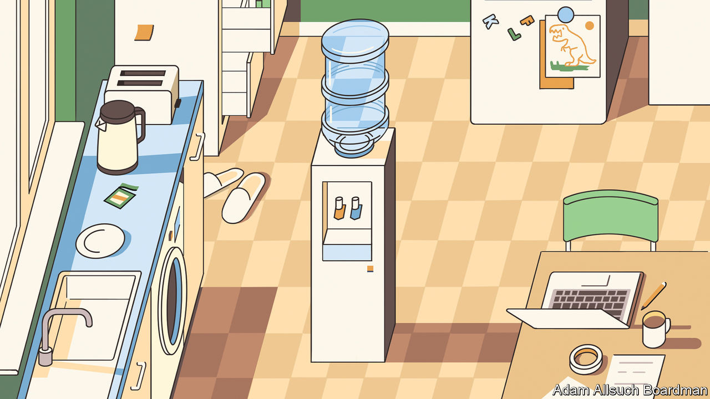
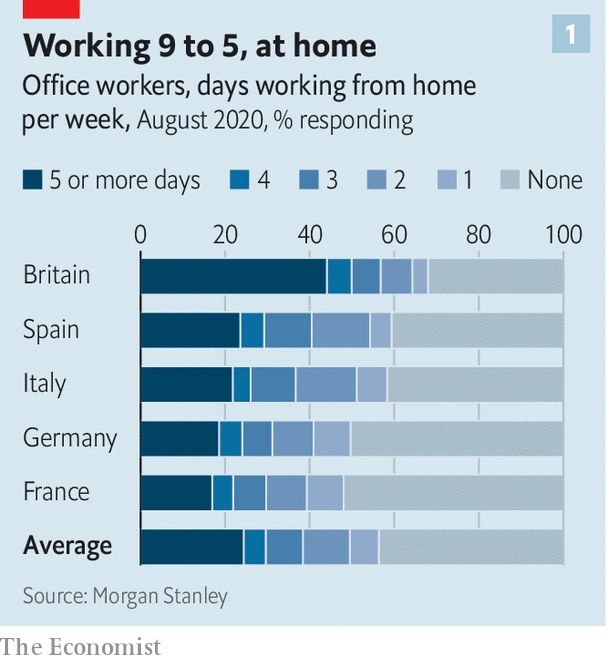
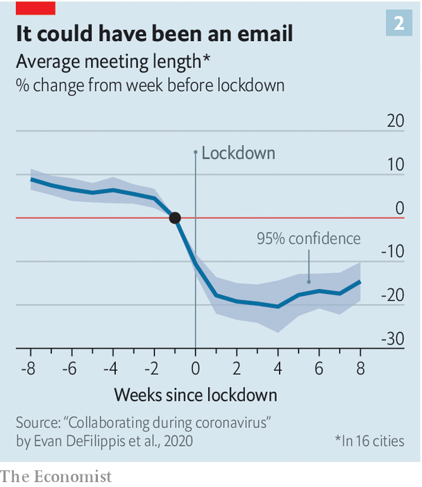
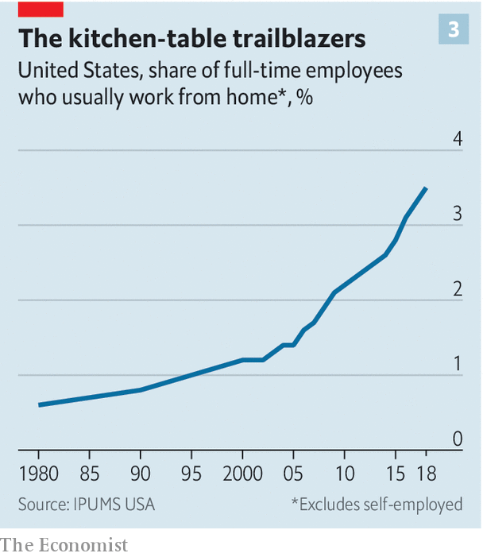
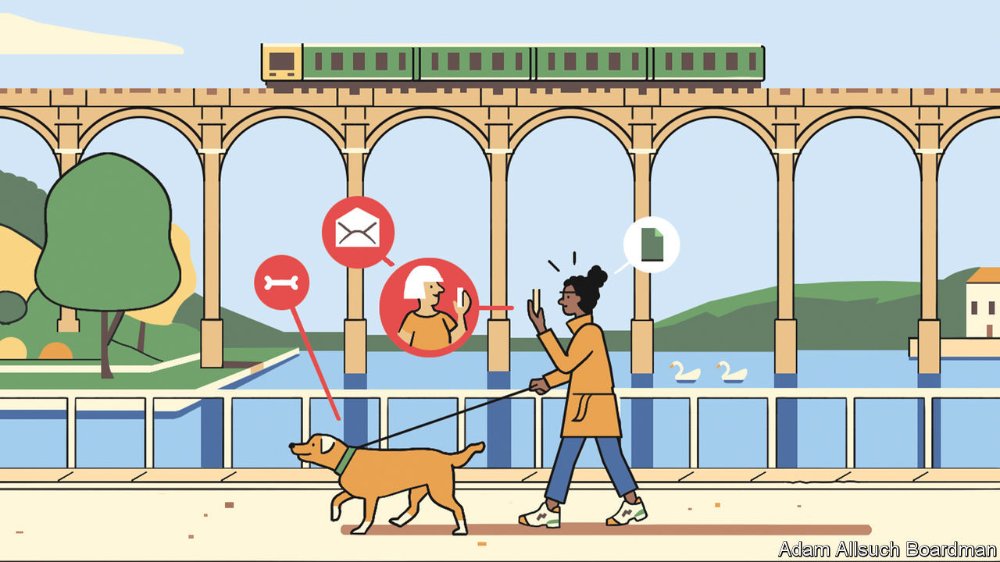

## The future of the office

# Covid-19 has forced a radical shift in working habits

> Mostly for the better

> Sep 12th 2020

Editor’s note: Some of our covid-19 coverage is free for readers of The Economist Today, our daily [newsletter](https://www.economist.com/https://my.economist.com/user#newsletter). For more stories and our pandemic tracker, see our [hub](https://www.economist.com//news/2020/03/11/the-economists-coverage-of-the-coronavirus)

SELF-STYLED visionaries and people particularly fond of their pyjamas have for decades been arguing that a lot of work done in large shared offices could better be done at home. With covid-19 their ideas were put to the test in a huge if not randomised trial. The preliminary results are now in: yes, a lot of work can be done at home; and what is more, many people seem to prefer doing it there.

This does not, in itself, mean the end of the non-home office. It does mean that there is a live debate to be had. Some companies appear relaxed about a domestic shift. On August 28th Pinterest, a social-media firm, paid $90m to end a new lease obligation on office space near its headquarters in San Francisco to create a “more distributed workforce”. Others seem to be against it. Also that month, Facebook signed a new lease on a big office in Manhattan. Bloomberg is reportedly offering a stipend of up to £55 ($75) a day to get its workers back to its building in London. Governments, on which some of the burden will fall if the pandemic persists, are taking a similar tack, encouraging people “back to work”—by which they mean “back to the office”.

They face a difficult task. For working from home seems to have suited many white-collar employees. As lockdowns have eased, people have gone out into the world once more: retail spending has jumped across the rich world while restaurant reservations have sharply risen. Yet many continue to shun the office, even as schools reopen and thus make it a more feasible option for working parents. The latest data suggest that only 50% of people in five big European countries spend every work-day in the office (see chart 1). A quarter remain at home full-time.

This may be due to the residual fear of covid-19 and the inconvenience of reduced-capacity offices. Until social-distancing guidance ends, offices cannot work at full steam. The average office can work with 25-60% of its staff while maintaining a two-metre (six-foot) distance between workers. Offices which span more than five floors rely on lifts; the queues for access, when only two people are allowed inside one, can stretch around the block.

Some offices are trying to make themselves safer places to work. The managers of a new skyscraper in London, 22 Bishopsgate, have switched off its recirculated air-conditioning. Others have installed hand-sanitising stations and put up plastic barriers. But even if offices are safer, it can still be hard to get there. Many employees do not want to or are discouraged from using public transport—and one-quarter of commuters in New York City live more than 15 miles (24km) from the office, too far to walk or cycle.

However it also appears to be the case that working from home can make people happier. A paper published in 2017 in the American Economic Review found that workers were willing to accept an 8% pay cut to work from home, suggesting it gives them non-monetary benefits. Average meeting lengths appear to decline (see chart 2). And people commute less, or not at all. That is great for wellbeing. A study from 2004 by Daniel Kahneman of Princeton University and colleagues found that commuting was among the least enjoyable activities that people regularly did. Britain’s Office for National Statistics has found that “commuters have lower life satisfaction...lower levels of happiness and higher anxiety on average than non-commuters” (see [article](https://www.economist.com//britain/2020/09/12/covid-19-and-the-end-of-commuterland)).

The working-from-home happiness boost could, in turn, make workers more productive. In most countries the average worker reports that, under lockdown, she got more done than she would have in the office. In the current circumstances, however, it is hard to be sure whether home-working or office-working is more efficient. Many people, particularly women, have had to work while caring for children who would normally be in school. That might make it seem as though working from home was less productive than it could theoretically be (ie, when the kids were in school).

But there are lockdown-specific effects which create the opposite bias, making work-from-home seem artificially productive. During lockdown workers may have upped their game for fear of being let go by their company—evidence from America suggests that more than half of workers are worried about losing their job due to the outbreak. A separate problem is that most studies under lockdown have relied on workers to self-report their productivity, and the data generated in this way tend not to be very reliable.

Research published before the pandemic provides a clearer picture. A study in 2015 by Nicholas Bloom of Stanford University and his colleagues looked at Chinese call-centre workers. They found that those who worked from home were more productive (they processed more calls). One-third of the increase was due to having a quieter environment. The rest was due to people working more hours. Sick days for employees plummeted. Another study, looking at workers at America’s Patent and Trademark Office, found similar results. A study in 2007 from America’s Bureau of Labour Statistics found that home-workers are paid a tad more than equivalent office workers, suggesting higher productivity.

The experience of lockdown has simply accelerated pre-existing trends, thinks Harry Badham, the developer of 22 Bishopsgate. That may be an understatement. Although the share of people regularly working from home was rising before the pandemic, absolute numbers remained small (see chart 3). According to one view, the fact that office-working was so dominant until recently reveals that it must be more efficient than home-based work both for firms and for workers. By this logic the success of a country’s emergence from lockdown can be measured by how many people are back at their desks.

But there is another interpretation. This says that home-working is actually more efficient than office-work, and that the glory days of the office are gone. The office, after all, came into being when the world of work involved processing lots of paper. The fact that it remained so dominant for so long may instead reflect a market failure. Before covid-19 the world may have been stuck in a “bad equilibrium” in which home-work was less prevalent than it should have been. The pandemic represents an enormous shock which is putting the world into a new, better equilibrium.

Brent Neiman of the University of Chicago suggests three factors which prevented the growth of home-working before now. The first relates to information. Bosses simply did not know whether clustering in an office was essential or not. The past six months have let them find out. The second relates to co-ordination: it may have been difficult for a single firm unilaterally to move to home-working, perhaps because its suppliers or clients would have found it strange. The pandemic, however, forced all firms who could do so to shift to home-working all at once. Amid this mass migration, people were less likely to look askance at companies which did so.

The third factor is to do with investment. The large fixed costs associated with moving from office- to home-based work may have dissuaded firms from trying it out. Evidence from surveys suggests that firms have in recent months spent big on equipment such as laptops to enable staff to work from home; this is one reason why global trade has held up better than expected since the pandemic began (see [article](https://www.economist.com//finance-and-economics/2020/09/12/how-has-trade-survived-covid)). Such investments are made at the household level too. In many rich countries the market for single-family houses is stronger than for apartments. This suggests that people are looking for extra space, possibly for a dedicated home office.

The extent to which home-working remains popular long after the pandemic has passed will depend on a bargain between companies and workers. But it will also depend on whether companies embrace or reject the controversial theory that working from an office might actually impede productivity. Since the 1970s researchers who have studied physical proximity (ie, the distance employees need to travel to engage in a face-to-face interaction) have disagreed on the question of whether it facilitates or inhibits collaboration. The argument largely centres on the extent to which the bringing-together of people under one roof promotes behaviour conducive to new ideas, or whether doing so promotes idle chatter.

Such uncertainty is exemplified by a study in 2017 by Matthew Claudel of the Massachusetts Institute of Technology (MIT) and his colleagues. Their study looked at papers and patents produced by MIT researchers and the geographical distribution of those researchers. In doing so, they found a positive relationship between proximity and collaboration. But when they looked at the buildings of MIT, they found little statistical evidence for the hypothesis that “centrally positioned, densely populated and multi-disciplinary spaces would be active hotspots of collaboration”. In other words, proximity can help people come up with new ideas, but they do not necessarily need to be in an office to do so.

However, not everything about working from home is pleasurable. In July a study from economists at Harvard, Stanford and New York University found that the average workday under lockdown was nearly 50 minutes longer than it was before, and that people became more likely to send emails after work hours. There is also wide variation between workers in how much they enjoy working from home. Leesman, a workforce consultancy, has surveyed the experience of more than 100,000 white-collar workers across the rich world during the pandemic. It finds that satisfaction with working from home varies according to whether that person has dedicated office and desk space or not.

And not everyone has the ability to work from home, even if they want to. Research published in April by Mr Neiman and Jonathan Dingel, both of the University of Chicago, found that across rich countries about 40% of the workforce were in occupations that could plausibly be completed from their kitchen tables. Evidence of actual working arrangements during the pandemic backs up those speculations. A paper from Erik Brynjolfsson of Stanford University and colleagues, looking at American data, suggests that of those employed before the pandemic began, about half were working from home in May.

Indeed, it is uncertain whether the benefits of working from home can last for a sustained period of time. Mr Bloom’s co-written study on Chinese call-centre workers is one of the few to assess the impact of working from home over many months. He and his colleagues found that, eventually, many people were desperate to get back to the office, if only every now and then, in part because they were lonely. Some companies which have tried large-scale remote working in the past have ultimately abandoned it, including Yahoo, a technology firm, in 2013. “Some of the best decisions and insights come from hallway and cafeteria discussions, meeting new people, and impromptu team meetings,” a leaked internal memo read that year.

The challenge for bosses, then, is to find ways of preserving and boosting employee happiness and innovation, even as home-working becomes more common. One solution is to get everyone into the office a few days a month. An approach whereby workers dedicate a chunk of time to developing new ideas with colleagues may actually be more productive than before.

A study from Christoph Riedl of Northeastern University and Anita Williams Woolley of Carnegie Mellon University, published in 2017, suggested that “bursty” communication, where people exchange ideas rapidly for a short period of time, led to better performance than constant, but less focused, communication. Not much evidence exists that serendipity is useful for innovation, even though it is accepted by many as a self-evident truth. “A lot of people made a lot of money selling this watercooler idea,” says Mr Claudel of MIT, referring to the growth in recent decades of open-plan offices, co-working spaces and trendy “innovation districts”.

Coming into the office now and then is not the only way of generating bursty communication. The same can be achieved, say, with corporate retreats and get-togethers. Gitlab, a software company, has been “all-remote” since it was founded in 2014. With no offices, it gathers together its 1,300 “team members”, who live in 65 different countries, at least once a year for get-togethers and team bonding.

Similarly, companies such as Teemly, Sococo and Pragli offer “virtual offices”, making it easier to communicate with colleagues, rather than going through the rigmarole of scheduling a video call. Using video messaging from Loom, a worker can record her screen, voice and face and instantly share it with colleagues—more useful than a conventional video call, as the video can be sped up or rewound. Gitlab’s workers follow a “nonlinear” workday—interrupting work with bouts of leisure. Rather than talk to their colleagues over live video calls they engage in “asynchronous communication”, which is another way of saying they send their co-workers pre-recorded video messages.

More frequent working from home will also demand the use of new hardware, and the withering away of other sorts. At present, many companies host large data-centres, but these have proved less efficient as more people work from home. Goldman Sachs reckons that investment in traditional data infrastructure will fall by 3% a year in 2019-25. In its place, companies are likely to spend more on technology which allows workers to replicate the experience of being in the same physical space as someone else (higher-quality cameras and microphones, for instance). The more utopian technology analysts reckon that within five years, people will be able to put on a VR headset and immerse themselves in a virtual office—bad strip-lighting, and all.

All this has wide-ranging implications for public policy. At present it is impossible to know whether home-workers will find it easier or harder to bargain with their employer for pay rises and improvements in conditions, though the idea of asking for a raise through a video chat is hardly an appealing one. Employers may also find it easier to fire remote workers than if they had to do it face-to-face. If so, then calls may grow for governments to give home-workers greater protections.

Another problem relates to employment law, argues Jeremias Adams-Prassl of Oxford University. Just as the rise of the gig economy has prompted questions and court cases about what it means to be an employee or self-employed, the increased popularity of home-working puts pressure on laws which were constructed around the assumption that people would be toiling away in an office. No one has yet thought through how firms should go about monitoring contractual working time in a world where nobody physically clocks in, nor about the extent to which firms may surveil workers at home.

Battles over employers’ responsibilities to their home-workers surely cannot be far away. Should a business pay for a worker’s internet connection or their heating in the dead of winter? Grappling with such questions will not be easy. But governments and firms must seize the moment. The pandemic, for all its ill effects, offers a rare opportunity to rewire the world of work. ■

## URL

https://www.economist.com/briefing/2020/09/12/covid-19-has-forced-a-radical-shift-in-working-habits
