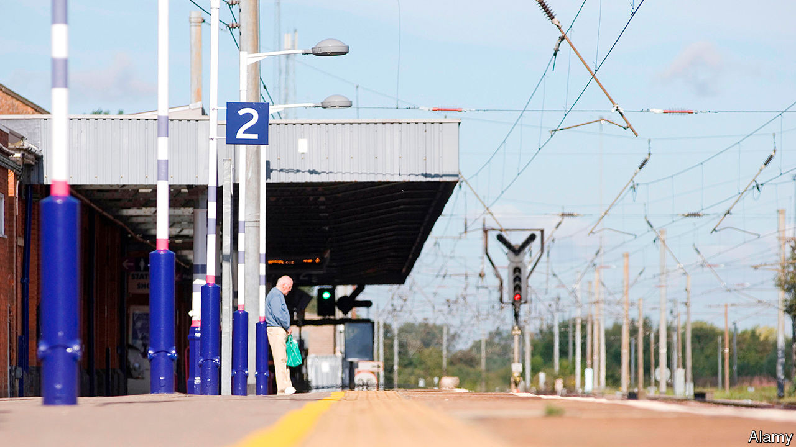

## Away from the bustle

# Covid-19 and the end of commuterland

> The pandemic is changing British suburbs just as profoundly as cities

> Sep 12th 2020HITCHIN

ROBERT EDWARDS and Mario Stephen have responded oddly to the coronavirus pandemic and the crash in high-street spending that it has caused. They have opened a hair salon. Although both men trained and worked for years in London, their new salon is in Hitchin, a town of some 35,000 people that is 50km north of St Paul’s cathedral. After a couple of months, business is good, says Mr Stephen, from behind a face mask and visor: “The lockdown made me realise that I don’t need to be in London any more.”

Covid-19 began as an urban disease. It appeared in Wuhan, China, and spread quickly through big international cities; in Britain, Birmingham and London became hotspots. But the virus did not stay urban for long, and its effects can be seen far beyond the densely populated cores. It has profoundly changed suburbs and commuter towns like Hitchin. In effect, covid-19 has abolished commuterland—a change that is more benign than it sounds.

Commuterland used to be primarily a place for living. It was liveliest at weekends. In his first novel, “Metroland”, Julian Barnes described it as a zone of golf courses, pub lunches, learner drivers practising three-point turns and the sound of lawnmowers “accelerating, braking, turning, accelerating, braking, turning”. On Mondays commuterland fell quiet as people—especially men—took the train back to work in London.

Covid-19 has changed all that. The rise of home-working among the salariat means that Britain’s railways are almost as quiet as the London Underground. According to the Department for Transport, in the last week of August, the number of passengers was 37% of the normal level for the time of year. The car park at Hitchin railway station, normally close to capacity, is about one-quarter full on weekdays.

For high-street businesses in big cities, the loss of commuters is a disaster, compounding the damage from a slump in foreign tourism. The British Retail Consortium, a trade group, says that overall high-street footfall was down by 42% in August compared with a year ago. Central London is especially quiet. Before covid-19 more than 900,000 people (a fifth of the capital’s workers) commuted in. Many of them were wealthy.

But London’s loss is a boon for the commuter towns near it. Charlotte Gatward, who runs Gatwards of Hitchin, a 260-year-old jeweller’s shop, says that commuters who used to pop out for a pendant during their lunch breaks in London are now shopping closer to home. It is difficult to know how healthy Hitchin’s shops really are—like shops everywhere, they have been given government grants and loans. What is certain is that few have shut, and some new shops have even opened. “In the last six weeks I’ve done five ribbon-cuttings,” says Tom Hardy, who manages the town centre for the local business improvement district.

Like almost all commuterland towns, Hitchin also contains some offices and factories—which are fairly quiet. LV, an insurer, normally has 300 workers in an office park near the town centre. Only about 50 are there at the moment, with another 40 expected to return over the next month. Some property analysts believe that suburban offices will hold up better than city-centre ones, because workers can easily drive to them, thereby avoiding germs on trains and buses. Hitchin suggests that might not be true.

Commuterland is becoming a more desirable place to live. It has plenty of gardens and spare bedrooms that can be converted into offices, which are more valuable if you are working from home. It lacks excitement, but so do big cities at the moment. Dataloft, a consultancy, calculates that residential rents rose in most outer-London boroughs between the second quarter of 2019 and the second quarter of 2020, including a swathe of suburban north London from Hillingdon (where Mr Barnes grew up) to Enfield. At the same time, rents fell in most inner-London boroughs, partly because many corporate flats and Airbnb properties were dumped on the market.

Yet the suburbs and commuter towns cannot expand in response to growing demand. London’s huge green belt, which is three times larger than the city, makes home-building hard. Local NIMBYs make it harder. The residents of Hitchin have seen off plans to build lots of houses to the south of the town, and are now unhappy about a scheme to put up 700 homes to the north-east. “Hitchin is a lovely town—why spoil it?” wrote one local, in response to a planning consultation. “Bats etc have been spotted on the site,” noted another. Hertfordshire, the county that includes Hitchin, built 2,620 new homes last year. That is a few more than normal, but not many given its population of 1.2m.

NIMBYism might even intensify, simply because people have more time on their hands. Ellie Clarke, an authority on planning issues at the Hitchin Forum, a local group, says that it has always been hard to persuade commuters to come to meetings. They are tired and often cannot attend before the late evening. Now that they are working from home, she expects that they will become more involved with “the nitty-gritty” of local issues.

Though subtle, that narrowing focus could be one of the most profound effects of covid-19. Bim Afolami, Hitchin’s Conservative MP, says that his party had worried about the steady drift of urbanites into suburbia and commuter towns. Urbanites tend to vote Labour, and they bring their opinions with them. If they are no longer commuting regularly, though, they could turn parochial quicker than they otherwise would. As Mr Afolami puts it, “the prism through which they view the world” will become less urban and more local—meaning, he hopes, more Tory.

These changes may come as a shock to anybody who has watched London and its hinterlands over the last few decades. The city has been on a high. Yolande Barnes, who follows property at University College London, thinks that people have become so used to London’s ever-rising house prices, and its magnetic power over young people, that they have come to think it could never fail. But before the 1980s commuterland seemed more attractive. As she puts it, great cities breathe in and out. At the moment London is breathing out. ■

Editor’s note: Some of our covid-19 coverage is free for readers of The Economist Today, our daily [newsletter](https://www.economist.com/https://my.economist.com/user#newsletter). For more stories and our pandemic tracker, see our [hub](https://www.economist.com//news/2020/03/11/the-economists-coverage-of-the-coronavirus)

## URL

https://www.economist.com/britain/2020/09/12/covid-19-and-the-end-of-commuterland
