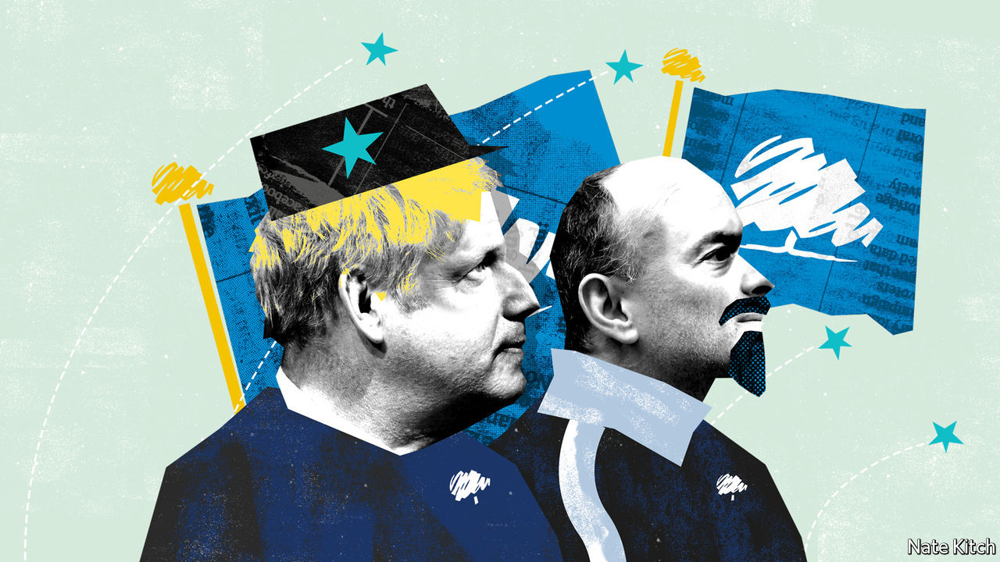

## Bagehot

# The modern Tory party’s uncompromising nature has deep historical roots

> Edmund Burke and Silicon Valley make for a potent combination

> Sep 12th 2020

TODAY’S CONSERVATIVES are always smashing things up or threatening to smash things up. Having taken on the BBC, the civil service, Parliament and the Supreme Court, the government has now graduated to international law. Boris Johnson is so determined to reverse elements of the withdrawal agreement with the European Union—an agreement that he negotiated, signed and campaigned on in the general election—that he is willing to break the terms of it. If this means leaving the EU without a deal that would be a “good outcome for the UK”, according to Mr Johnson.

Where does this attitude come from? There is a dash of Donald Trump-style bullying. Threats against the BBC have frightened it into reining in its more outspoken journalists. The savaging of the civil service has produced a more compliant cohort of permanent secretaries. There is also a dash of Silicon Valley. Dominic Cummings, Mr Johnson’s adviser, likes talking about “creative destruction”, with an emphasis on the destruction, and “moving fast and breaking things”, with an emphasis on the breaking. But the willingness to attack also has deep roots in the Conservative tradition.

The conventional view of British conservatism is that it is uniquely flexible. The Tories are the world’s oldest conservative party, the argument goes, because they have avoided the mistake, common on the continent, of looking for ditches to die in. Yet there is also a more bloody-minded Conservative tradition, one well expressed by Lord Salisbury, three times prime minister, when he wrote that “hostility to radicalism, incessant, implacable hostility, is the essential definition of Conservatism. The fear that the Radicals may triumph is the only final cause that the Conservative Party can plead for its own existence.”

Conservatism was forged in reaction to the French revolution, and has repeatedly renewed itself in reaction to slower, milder revolutions, such as the rise of the mixed economy and the evolution of the European Union. There is a limit to the party’s willingness to compromise with such change. Even Robert Peel, the hero of liberal conservatism and champion of free trade, insisted that, at some point, you have to be willing to say to the “restless spirit of revolutionary change, ‘Here are thy bounds, and here shall thy vibrations cease’.” Conservatives eventually ran out of patience with the mixed economy when strikes became a way of life. They are now running out of patience with parts of the liberal revolution. People who made peace with the gay-rights revolution are drawing the line at treating sex as a “social construct”.

This tough-minded conservatism starts with the belief that the best way to prevent (or reverse) revolutions is to learn from them. Conservatives are often the harshest critics of the old regime because they realise the only way to save it is to revitalise it. They can also be secret admirers of revolutionaries. Edmund Burke’s “Reflections on the Revolution in France”, the foundation text of modern conservatism, is full of laments about the decadence of the old regime (“sluggish, inert and timid”) and pleas to learn from the Jacobins. “To destroy that enemy”, he says, “the force opposed to it should be made to bear some analogy and resemblance to the force and spirit which that system exerts.”

Learning from revolutionaries means being willing to engage in ideological struggle. Joseph Schumpeter argued that the problem with business people is that they can’t “say boo to a goose”. They need clear-sighted intellectuals to do the boo-saying for them. It also means being willing to sanction some extraordinary measures, if that is the only way to prevent the locomotive of history from heading over the cliff.

This tradition has been powerfully reinforced by American conservatism, which is tied to its British cousin by a network of think-tanks, fellowships and conferences. Barry Goldwater was regarded as nutty when he pronounced that “extremism in the pursuit of liberty is no vice...Moderation in the defence of justice is no virtue.” In the current Republican Party such sentiments are mainstream. Michael Anton presented revolutionary conservatism in its purest form by dubbing the 2016 election “the flight 93 election”, alluding to United Flight 93, which crashed in a field in Pennsylvania on September 11th 2001: “Charge the cockpit or you die.” He has now published an equally apocalyptic book on the forthcoming election, “The Stakes: America at the Point of No Return”.

Though nobody on the British right has been quite as apocalyptic, the long-term impact of revolutionary conservatism will be bigger on Britain than America. The odds are that Donald Trump will lose the next election, perhaps taking the Republican majority in the Senate with him. Brexit has made revolutionary conservatism the default option of the British right. The government’s willingness to break international law has troubled some Conservatives. But the striking thing is how few have spoken out.

The party is now dominated by revolutionary Conservatives. Moderates have been purged over Brexit and hard men hold all the highest positions. The likes of Mr Cummings and Michael Gove have studied Lenin and Gramsci, as well as bloody-minded British conservatives such as Maurice Cowling and Norman Stone. They are determined to do for the liberal establishment what they have already done for the European establishment.

These revolutionaries have troops on the ground. If left-wing revolutionaries deal in hope for a better future, however illusory, conservative ones deal in something even more powerful: feelings of loss. The Conservatives have a core of older voters who fear they are losing their country to woke activists. In the last election it added a new army of working-class Britons who fear they have lost their way of life to globalisation and their old party, Labour, to distant elites. These diverse constituencies are united by a common demand that these “vibrations” should cease—and a common willingness to do whatever it takes to make them stop. ■

## URL

https://www.economist.com/britain/2020/09/12/the-modern-tory-partys-uncompromising-nature-has-deep-historical-roots
