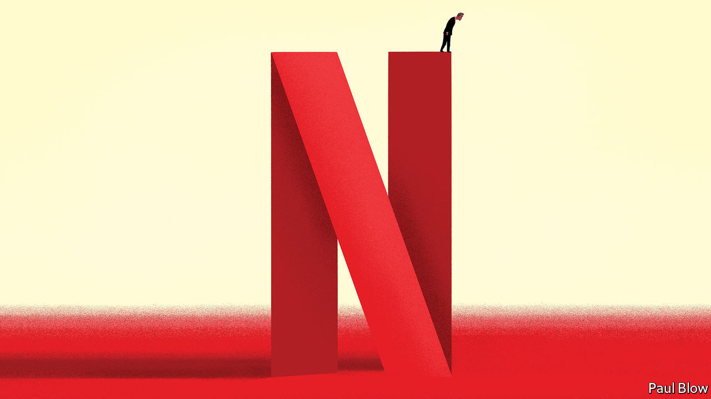
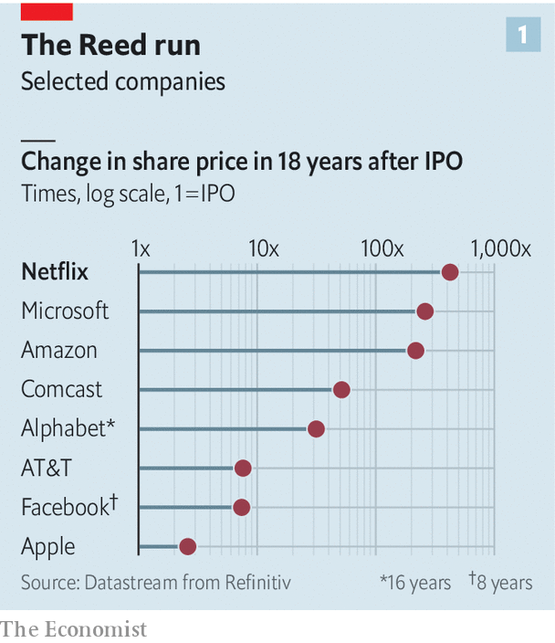
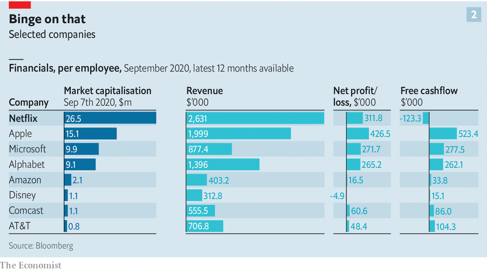

## The Hastings doctrine

# Can Reed Hastings preserve Netflix’s culture of innovation as it grows?

> The streaming giant’s curious management style faces challenges on several fronts

> Sep 12th 2020

THE BEST way to stay innovative, many bosses will tell you, is to hire the best people and let them get on with it. Few take this as literally as Reed Hastings of Netflix. The video-streamer’s employees can take as much holiday as they fancy and put anything on the company’s tab so long as, to cite the entirety of its corporate expense policy, they “act in Netflix’s best interest”. Anyone may access sensitive information like a running tally of subscribers, which Wall Street would kill for. Executives seal multimillion-dollar deals without sign-off from top brass. High-achievers are rewarded with the plushest salaries in the business—whether their business is writing computer code or film scripts. Underperformers are unceremoniously cut loose.

It sounds like a recipe for expensive anarchy. But managing “on the edge of chaos”, as Mr Hastings mischievously puts it, has served Netflix well. Most of its 7,900 full-time workers seem happy being treated like professional athletes, paid handsomely as long as no one can do their job better. Each generates $2.6m in annual revenue on average, nine times more than Disney employees, and $26.5m in shareholder value, three times more than a Googler does.

Investors lap it up as hungrily as Netflix binge-watchers, who now number 193m worldwide. Since going public in 2002 the firm’s share price has risen 500-fold (see chart 1), in the top ten 18-year runs in America Inc’s history, as Mr Hastings points out with a hint of pride in his voice. This year it briefly overtook Disney to become the world’s most valuable entertainment company.

This track-record has earned Mr Hastings kudos. A PowerPoint “culture deck” outlining his management philosophy has been viewed 20m times since he posted it online 11 years ago. Sheryl Sandberg, Mark Zuckerberg’s right-hand woman at Facebook, has called it the most important document ever to emerge from Silicon Valley. A new book in which Mr Hastings fleshes out those 125 slides is destined for the bestseller list. But it raises a question: are the “No Rules Rules” of the title the right set as Netflix metamorphoses from California startup into global show-business colossus?

It is easy to put too much stock in corporate culture, which can be a story triumphant companies tell themselves after the fact. GE’s rise in the 1990s had more to do with financial engineering than with the much-aped habit introduced by Jack Welch, the conglomerate’s CEO at the time, of ranking employees and “yanking” the bottom 10%. Netflix would not be where it is without its boss’s uncanny foresight to bet on streaming in the late 2000s, or the uncannily flat-footed response from Hollywood incumbents, which took a decade to grasp the threat. Investors have displayed deep reserves of cheap capital, and deeper ones of patience. Over the past year the firm’s prodigious revenue-generators each burned through $123,000 of cash (see chart 2); this year quarterly cashflow turned positive for only the first time since 2014. Luck played a role, as when cut-price DVD players debuted just in time for Christmas in 2001, months after the dotcom crash forced Mr Hastings to lay off a third of his 120-odd workers, from what was then a DVD-by-mail rental service.

Still, as Michael Nathanson of MoffattNathanson, a consultancy, observes, “Every time that Netflix faced a roadblock it found a clever way to work around it and emerge stronger.” Most notably, when TV networks and studios at last woke up to the reality of streaming and began to hog content licences, Netflix started producing its own shows, and later feature films. The swivel might have taken longer with employees bogged down in chains of approvals. “Radical candour”, whereby everyone’s ideas, from Mr Hastings down, can be challenged by all-comers, helps weed out bad ones. “Sunshining”, the stomach-churning spectacle of publicly explaining choices, helps not to repeat mistakes. Senior Netflixers’ “ability to swallow their pride is truly exceptional”, says Willy Shih of Harvard Business School, who has written two case studies on the firm.

Now this innovation-friendly culture is under fire on three fronts. The first two—the firm’s growing size and scope—are internal to Netflix. The third source of pressure comes from the outside.

Start with size. The flat hierarchy and frankness that works in Silicon Valley, with its narrow range of temperaments and socioeconomic backgrounds, is harder to sustain in a global workforce that has swelled nearly fourfold in five years (more if you include temporary contractors, who now number over 2,200, up from fewer than 400 in 2015). Asians, Europeans and Latin Americans can find visitors from headquarters “exotic”, in Mr Hastings’s words. Negotiating “context”, as Netflix managers and their subordinates do constantly in the absence of explicit rules, offers useful flexibility. But it takes time that could be spent perfecting a product—ever more of it as tacit cultural understanding is diluted by international expansion. Revenue per worker is down by 7% from 2015.

Many countries grant workers more protections than America does. This is a problem for the “keeper test”, which requires managers constantly to question if they would fight to stop their underlings from leaving—and, if the answer is “no”, immediately send the individual on their way with generous severance. These golden handshakes, which range from four months’ salary in America to more than six months in the Netherlands, are “too generous” to reject, says Mr Hastings. Netflix has not been sued even in Brazil, where employee lawsuits are a national sport to rival football. The bonhomie may not last.

A larger workforce poses a separate risk to internal transparency. Even while the attrition rate hovers at around 10%, the number of ex-Netflixers with knowledge of the firm’s finances and strategic bets is now growing by hundreds each year. Unwanted disclosures have been rare and, says Mr Hastings, immaterial. But, he concedes, serious leaks may be “a matter of time”.

The second challenge has to do with Netflix’s sectoral girth. In its first decade it was primarily a firm of technologists like Mr Hastings, whom his co-founder, Marc Randolph (who left the firm in 2003), likened to the hyper-rational, emotionless Mr Spock in “Star Trek”. That was never entirely fair—Netflix products are data-driven but Mr Hastings attaches as much weight to judgment in managing people as Captain Kirk ever did. Still, by the standards of Tinseltown, where he now spends a couple of days most weeks amid studio intrigues and moody showrunners, he and his firm can come across as robotic.

One producer who has worked with Netflix detects hints of its horizontal hierarchy permeating Hollywood “by osmosis”. This can speed things along. But, she grouses, “sometimes you need a production assistant to assist, not commission scripts.” At the same time, Netflix missed a chance to revolutionise other old studio ways. The $150m five-year deal it signed in 2018 with Shonda Rhimes, a star TV producer, may be more generous than most networks could afford. But it is Hollywoodian in its structure, says a former executive—and antithetical to the keeper test.

Moreover, Netflix may have no choice but to expand into new industries. This would be a departure from its laser focus on its core product: quality streamed entertainment. But show business is increasingly the preserve of conglomerates. Disney has theme parks, merchandising and TV networks. Comcast (the cable giant that owns NBCUniversal) and AT&T (the telecoms group which controls HBO and WarnerMedia) possess the pipes along which content flows. Apple’s and Amazon’s Hollywood ambitions are tethered to their powerful technology platforms.

Disrupting sluggish behemoths is one thing. Competing with them head-on may require a different trade-off between flexibility and efficiency. It may also mean takeovers. Mr Hastings has no shopping plans. But a strong culture, he admits, “is a material weakness if you are going to make big acquisitions”. Cultural sparks could fly when you integrate more than a few dozen people, as they flew when his first firm, Pure Software, bought rivals in the 1990s.

The third set of challenges is external. Covid-19 has muted the exchange of ideas. It is also harder to evaluate—and dismiss—people by Zoom; Netflix’s 12-month rolling attrition rate has declined by a third, to 7%. This week Mr Hastings said he does not see “any positives” to home-working.

Then there is public pressure for corporate America to care more about diversity. Mr Hastings added inclusion to Netflix values in 2016 but it barely features in his investor letters or annual reports. He acknowledges a tension between the desire for diversity and Netflix’s arch-meritocratic ideals (the firm eschews quotas, as it does all management metrics, in favour of that Kirkian judgment). Its corporate temperament screams “hypermasculine”, as Erin Meyer, Mr Hastings’s co-author and professor at INSEAD business school in France, has herself noted. And one person’s radical candour is another’s microaggression.

Netflix shareholders and their representatives on the board have confidence that Mr Hastings can reconcile these strains. He has given them plenty of reasons to trust his own judgment. But he is fully aware that his position is safe only as long as he can keep the magic going. The keeper test applies to him, as well.■

## URL

https://www.economist.com/business/2020/09/12/can-reed-hastings-preserve-netflixs-culture-of-innovation-as-it-grows
