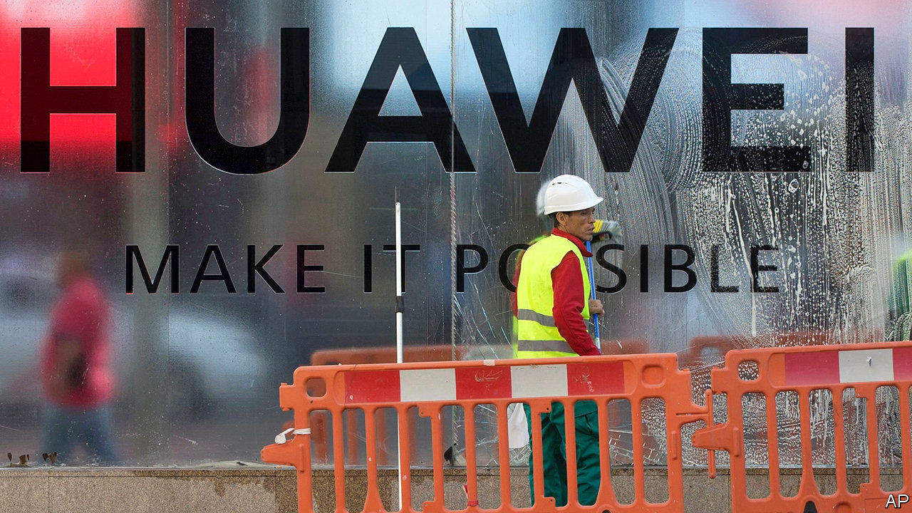

## Creative destruction

# How America’s war on Huawei may boost Chinese technology

> From September 15th the Chinese telecoms giant will no longer be able to buy vital semiconductors

> Sep 12th 2020

HUAWEI IS ON the ropes. From midnight on September 14th the Chinese technology giant will be cut off from essential supplies of semiconductors. Without chips it cannot make the smartphones or mobile-network gear on which its business depends. America’s latest rules, finalised on August 17th, prohibit companies worldwide from selling chips to Huawei if they have been made with American chipmaking kit. American semiconductor companies, for which Huawei has been a lucrative customer, have implored their government to extend the deadline, as have their industry bodies. A full reprieve looks unlikely.

Huawei now looks likely to follow one of three paths. The first involves Washington granting licences to suppliers so that they can sell chips to the firm in a limited fashion. This would let Huawei stay in business—just about. MediaTek, a Taiwanese chipmaker that is one of its main suppliers, has petitioned America’s Department of Commerce (DoC) for such a permit. To keep Huawei’s edge blunt, suppliers keen to produce chips designed by its in-house semiconductor unit, HiSilicon, are unlikely to be issued such dispensation.

Even a debilitated Huawei may not satisfy America. The DoC’s default setting is to deny permits. That would force the Chinese firm to take more desperate action, such as making its own chips using older technology that could be sourced from supply chains that do not include American firms. Pierre Ferragu of New Street Research, a telecoms-and-technology research firm, expects Huawei to do this within 12 months.

This path has just become rockier. On September 4th Reuters reported that America’s Department of Defence has proposed putting Semiconductor Manufacturing International Corporation (SMIC), China’s leading chipmaker, on the same blacklist as Huawei. The Pentagon alleges that SMIC works with China’s armed forces, and so poses a threat to national security. A blacklisting would destroy SMIC’s business, which relies on American machine tools. Its share price fell by almost a quarter on the news. SMIC denies having military ties and said it is in “complete shock”. The threat of such action may dissuade SMIC from teaming up with HiSilicon, as Huawei might have hoped.

This leaves the third eventuality. Huawei may go bust, or be forced to sell off bits of its business. This would not happen immediately: at the end of 2019 it had cash reserves of 371bn yuan ($53bn), enough to cover operating costs for a year and a half. But if push comes to shove, it may offload HiSilicon. Huawei’s chip-design arm is one of the most advanced such outfits in the world. According to IC Insights, a firm of analysts, HiSilicon broke into the global top-ten design companies by revenue in the first half of 2020, the first Chinese firm to do so. Since it will no longer be able to design chips for its owner after September 14th, HiSilicon could profitably focus on doing so for third parties in China. That would generate a new revenue stream for Huawei. If instead Huawei were forced to shut HiSilicon, its laid-off engineers would be snapped up by chip-design teams at other Chinese technology giants like Alibaba, Tencent and ByteDance. Or they could start new design firms of their own; many are said to be slipping out pre-emptively.

Each scenario worries firms like Qualcomm. The big American chip-designer lists Chinese competition as a risk in its annual filings. Last year Chinese sales made up $11.6bn out of Qualcomm’s $24.3bn in revenue. A HiSilicon liberated from Huawei would threaten those sales.

Huawei is putting on a brave face. It says it will spend over $20bn on research and development this year, $5.8bn more than in 2019 and about as much as Amazon, a firm with double its sales. It hopes to gain new revenue streams less vulnerable to American attacks. These are unlikely to let up even if Joe Biden becomes president next year. But as Uncle Sam tightens the grip, it risks squeezing Chinese technology into a form which it no longer controls. Huawei hopes to hang on until then.■

## URL

https://www.economist.com/business/2020/09/12/how-americas-war-on-huawei-may-boost-chinese-technology
