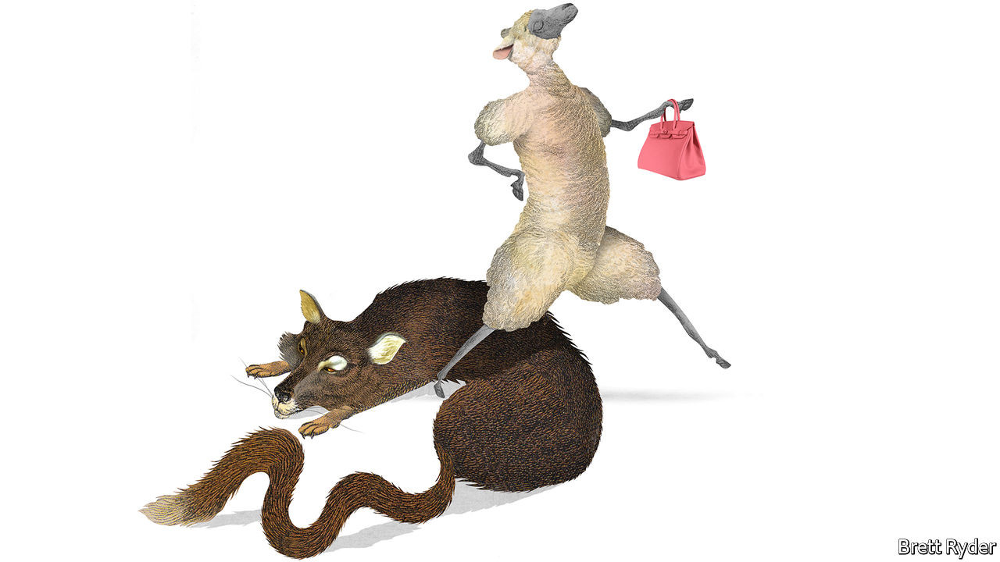

## Schumpeter

# How Hermès got away from LVMH—and thrived

> The family behind the luxury brand has succeeded by sticking to what it does best: timeless elegance

> Sep 12th 2020

IN THE AUTUMN of 2010 le tout Paris of business braced for the sad, if predictable, end of an era. After 173 years and six generations, Hermès, a purveyor of handbags to bankers and neckties to their husbands, was to become part of LVMH. The champagne-to-evening-gowns mastodon, home to Louis Vuitton and Christian Dior, among many others, had disclosed a stake of 17% and rising. Bernard Arnault, LVMH’s boss, with a knack for closing in on companies he admires, had only to pick off a few Hermès heirs ready to cash out. Bankers assumed the “wolf in cashmere” would take mere weeks to gobble up his elegant prey.

Fast forward to autumn 2020, and the various descendants of Thierry Hermès not only still control their family’s firm, they have beaten LVMH at its own game. One of their own, Axel Dumas, has reclaimed the helm from an outside manager. Mr Arnault has all but scarpered off the Hermès shareholder register and moved on to other targets, though not always successfully: on September 9th LVMH said it would not go ahead with a $17bn bid for Tiffany, an illustrious American jeweller. By just about any measure, Hermès has led the luxury pack, nearly trebling revenues between 2010 and 2019, to €6.9bn ($7.7bn). Operating margins last year hit 34%, best in the industry. Even as it has been roiled by covid-19, its market capitalisation has risen this year to €78bn, while big competitors have shrunk.

Plenty of companies, particularly those with family histories, resist the lure of takeovers by bigger rivals. Often the decision is guided by pride rather than financial sense. Hermès provides a road map of how to stay independent—and how it can pay off.

The first step was to keep the wolf at bay. Though listed since 1993, most of Hermès’s shares belonged to 60 or so descendants, split into various branches. Hermès threw up all manner of defences. Mr Arnault was publicly rebuked as a corporate raider (less polite language was used). Lawyers attacked the underhand way in which his stake was built through complex financial products that skirted disclosure rules (LVMH was later fined €8m by the markets regulator). Ultimately, Hermès family members eager to remain in charge created a structure which pooled just over 50% of shares, committing themselves to owning their stakes come what may until 2031. By 2017 Mr Arnault had given up.

The second step is to use independence wisely. That Mr Arnault coveted Hermès is testament to its good management. But the general rule in the past decade has been that multibrand conglomerates like LVMH, Richemont (home of Cartier and Montblanc) or Kering (Gucci and Saint Laurent) hold an edge over single-brand outfits like Burberry, Prada or Hermès. The cost of building new e-commerce capabilities can be spread more widely; size gives a bargaining advantage with landlords. Creators are lured to the biggest names in a virtuous loop of desirability.

Hermès might have struggled to compete head-on. So instead—and this is the wise part—it played to its strengths. While rivals flocked to the fashionable, ostentatious and cutting-edge, it erred on the side of discretion, timelessness and tradition. Its biggest hits today, the Birkin and Kelly handbags that often sell for $10,000 or more, are refreshed versions of what it has sold for decades. It can do whimsy and eye-catching: its website currently features a functioning porcelain skateboard, a snip at €3,350. And whereas a Dior dress will last one season, an Hermès product is for life. As creative directors shuffle from one brand to the next, at Hermès the same designer has overseen menswear since 1988.

Understatement works as a strategy only because Hermès enjoys an aura of exclusivity. This gives it pricing power to sell knick-knacks for over ten times what they cost to make. Waiting lists for Birkins stretch for years. Because much of what it sells carries through the seasons, Hermès does not need discounts to get it off the shelves. That preserves both margins and the brand, a luxury group’s most valuable asset. The firm claims not to have a marketing department. It is the kind of claim a clever marketing department might dream up, but Hermès does spend only around 5% of revenues on advertising and promotions, half the share of rivals.

The stolid approach has paid off in the pandemic. Sales will probably drop this year because of store and factory closures in the spring. But Hermès looks in better shape than its competitors, says Luca Solca of Bernstein, a broker. It is less reliant than they are on Asian tourists shopping in Paris or New York. It makes most of its wares itself, so does not need to bail out third-party suppliers. Demand wobbles are less of a problem given those long waiting lists. And if well-heeled consumers are to spend in a recession, they favour timeless brands.

For success to endure, Hermès heirs may require one more thing. The company is a digital laggard. A mere 2-3% of its sales last year came from its website, half its rivals’ share. Its Instagram account—a measure of a brand’s buzziness—has just 10m followers, compared with 41m for Chanel or Gucci. It lacks younger consumers who inject brands with vitality; according to Citigroup, a bank, only a quarter of sales are to Gen-Zs or millennials (the oldest of whom are about to turn 40).

Mr Dumas is alive to this. Hermès has started to branch out into cosmetics, offering aspiring shoppers a cheaper entry point than Birkins (or skateboards). It has invested in a Chinese venture, Shang Xia, that may be useful if consumers in China—big buyers of luxury goods—start coveting local baubles instead of French ones.

Such moves are not so different from Mr Arnault’s. He might have executed the same savvy strategy at Hermès; LVMH executives still speak of the “brand that got away” with reverence. But the Hermès clan can draw satisfaction from the fact that their investment in the family firm has yielded returns of over 400% since 2010—even juicier than if they had traded their stakes for LVMH shares. ■

## URL

https://www.economist.com/business/2020/09/12/how-hermes-got-away-from-lvmh-and-thrived
