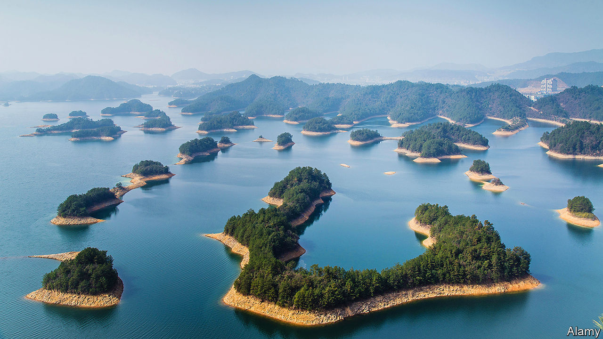
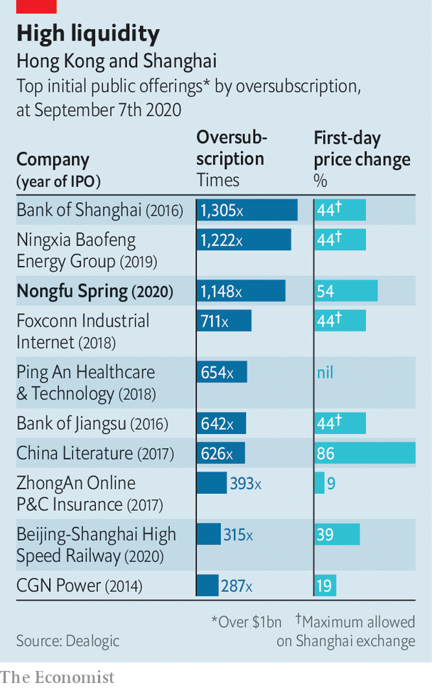

## Beverages

# Nongfu Spring is a hit with tipplers and investors alike

> China’s leading water bottler has a blistering stockmarket debut

> Sep 12th 2020XIAMEN

“WE ARE NOT manufacturers of water. We are porters of nature.” So goes a famous quip by Zhong Shanshan, the 66-year-old founder and boss of Nongfu Spring, China’s most popular brand of bottled water. On September 8th the Hangzhou-based bottler listed on Hong Kong’s bourse to spectacular fanfare. Demand for shares from retail investors outstripped supply by 1,148 times (see chart). The share price shot up by 60% over the first three days of trading. Its market capitalisation reached $53bn. Mr Zhong, who still owns 84% of Nongfu Spring, is now China’s third-richest person, narrowly trailing two tech moguls: Jack Ma of Alibaba and (unrelated) Pony Ma of Tencent. 

Rising disposable incomes and public anxiety about the safety of tap water, which is unfit to drink in most of China, have fuelled demand among Chinese for the bottled variety. Consumption per person of bottled water rose from 41 litres in 2014 to 59 litres in 2019, according to data from Mintel, a market-research firm. Americans, by comparison, guzzled an average of 141 litres last year. That suggests Chinese bottlers still have plenty of room for growth, not least because tap water in America is (typically) potable.

Nongfu Spring is the runaway industry leader. It accounted for 29% of the volume sold in China in 2019. Foreign brands such as FIJI Water, Evian (owned by Danone) and Aquafina (part of PepsiCo) are easily spotted in many Chinese supermarkets. But none has a market share greater than 6.5%, reckons Mintel.

One reason for Nongfu’s success is its effort to cater to all market segments. Stingy folk can buy a mass-market 380ml-plastic bottle for as little as 1.5 yuan ($0.22). The well-heeled may opt for the glass-bottled version, which comes with “award-winning” designs and retails for 30-45 yuan. In between you can get a lithium-rich liquid which is claimed to benefit the nervous system. Total revenues across Nongfu’s waters increased by 42% between 2017 and 2019, to 14.3bn yuan. Gross margins held steady at an impressive 60%.

Nongfu sceptics point out that the bottled-water industry, in China and elsewhere, has few technical barriers to entry. The main raw material is polyethylene terephthalate (PET), a plastic that is cheap and easy to process. No special knowledge is required. Evergrande, a Chinese property developer, boasts its own line of bottled water called Evergrande Spring. The water itself tends to be an afterthought.

Not in Nongfu’s case. As its aggressive marketers never tire of stressing, it possesses water-extraction permits for ten of China’s most famous unspoilt bodies of water—from Thousand Island Lake in the eastern province of Zhejiang to Mount Tianshan in the remote western region of Xinjiang. The permits, granted by local governments for up to 30 years, are a moat against competitors. Loris Li, an independent analyst of China’s beverage industry, observes that “the quality of the original water source” can be a strong point of brand differentiation.

Nongfu Spring has another edge: it is seen as close to Chinese officialdom. At high-level political summits, rows of Nongfu bottles arranged on tables are a common sight. As sources of advantage go, it doesn’t get better than this in China. ■

## URL

https://www.economist.com/business/2020/09/12/nongfu-spring-is-a-hit-with-tipplers-and-investors-alike
