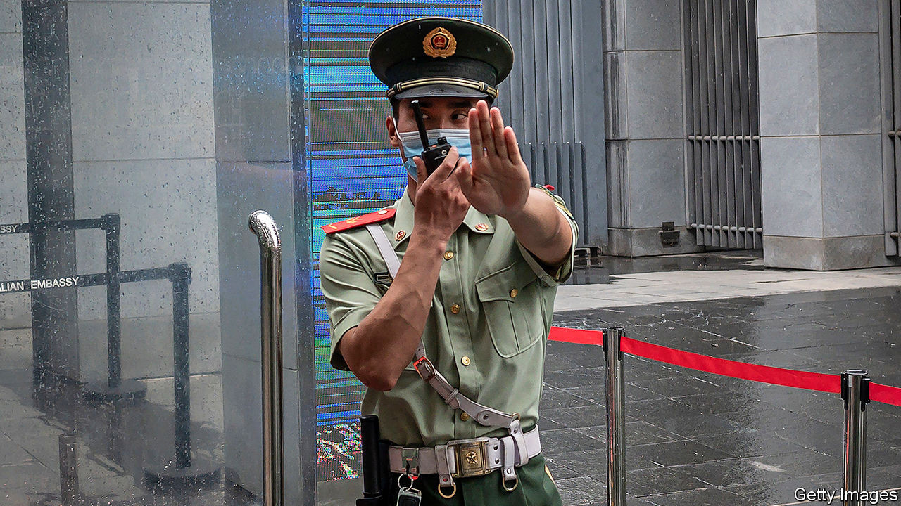

## Bumping heads

# Tensions between China and the West threaten journalism

> The abrupt departure from China of two Australian correspondents highlights new perils for Western media

> Sep 9th 2020

AROUND MIDNIGHT on September 2nd, seven state-security officers knocked on the door of Bill Birtles, an Australian journalist in Beijing. He was told he was involved in a case and ordered not to leave China. Instead of detaining him, however, the police said they would call him in the afternoon to arrange an interview.

At the same time in Shanghai six police visited the flat of another Australian journalist, Michael Smith, to deliver a similar message. Instead of waiting for follow-up calls, the two journalists took refuge in Australian diplomatic missions. After long negotiations, Australian and Chinese officials reached a deal. The police were allowed to interview the pair on condition that the exit ban was lifted. On September 7th the correspondents flew to Sydney.

The targeting of Mr Birtles and Mr Smith appeared to reflect worsening relations between China and Australia, which have been at odds over everything from China’s handling of the coronavirus outbreak to Australia’s exports of beef and barley. The police said they wanted to ask the two about their links with Cheng Lei, an Australian journalist working for Chinese state television who was detained in August under China’s national-security law. But during the interviews, the police raised only perfunctory questions about Ms Cheng. “It was about harassing us,” says Mr Birtles. “I think the whole thing was premeditated by the Chinese government. They wanted to get us out without expelling us. It’s a good outcome for China—now there is no Australian media on the ground in China.”

The journalists’ departure was also a sign of how increasingly precarious foreign reporters’ lives are becoming in China. The Communist Party has never had an easy relationship with them, but has largely tolerated their presence. Tensions with the West are changing this. In the first half of 2020 China forced 17 foreign reporters to leave. Previously it had only pushed the occasional one out.

The surge is in part a response to America’s scaling back of the Chinese media presence in the United States. But it coincides with a more disdainful attitude towards the Western media generally among Chinese officials. Foreign journalists who are ethnic Chinese often get treated worst. While reporting this month on protests in Inner Mongolia, a northern region, Alice Su of the Los Angeles Times was detained for more than four hours. An officer grabbed her throat with both hands and shoved her into a cell. She was not allowed to contact the American embassy.

In the case of the Australians, the Chinese government may have felt it had cause to retaliate. On September 8th China’s state news agency, Xinhua, said Australian intelligence officers had searched the homes of Chinese journalists in Australia in June, questioning them and seizing their computers and mobile phones. The journalists were told to remain silent about the incident, Xinhua reported. Australian security agencies have refused to comment.

Western reporters, naturally, writhe at China’s growing tendency to treat them as proxies of their governments (their job is not the same as that of Chinese state-media workers). But as the Australians’ plight has shown, they may increasingly have to turn to their governments for help. ■

## URL

https://www.economist.com/china/2020/09/09/tensions-between-china-and-the-west-threaten-journalism
