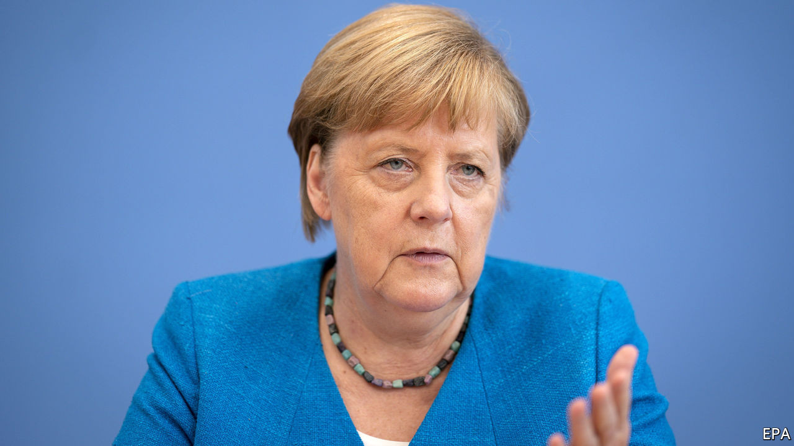

## “Understanding” Russia has limits

# Angela Merkel is losing patience with Vladimir Putin

> Yet despite the poisoning of Russia’s top dissident, a gas pipeline to Germany may go ahead

> Sep 12th 2020BERLIN

VLADIMIR PUTIN and his officials refuse to utter the name of Alexei Navalny, the Kremlin’s leading opponent, in public. But in Berlin, where Mr Navalny has been recuperating in hospital since his poisoning in Siberia on August 20th, he is the talk of the town. Mercifully, on September 7th he emerged from a medically induced coma. German doctors caution that it is too early to assess the long-term damage to his health. The harm to Germany’s relations with Russia, though, is already clear.

Few global leaders have known each other as long as Mr Putin, inaugurated in 2000, and Angela Merkel, who took office as Germany’s chancellor five years later. At moments of crisis they have spoken daily. But familiarity has bred a certain contempt. In 2014, fed up with Mr Putin’s lies over Ukraine, the chancellor press-ganged the rest of the EU into imposing economic sanctions on Russia. Defying expectations, and a good chunk of Germany’s business lobby, they have held ever since. Since then a steady drip of Russian offences, including the extensive Kremlin-directed hacking of the Bundestag’s computer systems in 2015 and last year’s contract killing of a Chechen dissident in a Berlin park, has further soured the mood.

Mrs Merkel’s response to the attack on Mr Navalny, including demands (as yet unmet) for a thorough Russian investigation, has been uncharacteristically assertive. The poisoning has thinned the ranks of Germany’s habitual Putin-Versteher (“understanders”), opening space for her to take further measures. At the EU level, the default mode for German foreign policy, “horizontal” sanctions—ie, not aimed at specific countries—based on the poisoners’ violation of chemical-weapons bans are possible. Yet the debate in Germany has focused on Nord Stream 2, an almost completed €9.5bn ($11bn) undersea pipeline that could double gas deliveries from Russia’s Yamal peninsula to the German coast, and from there to the rest of Europe.

Eastern Europeans and Americans detest Nord Stream 2 for, as they see it, handing leverage and cash to the Kremlin and undercutting the transit fees earned by Ukraine from an existing land pipeline. (A Polish minister once compared the project to the Nazi-Soviet pact of 1939.) Mrs Merkel, who inherited Nord Stream 2 from Gerhard Schröder, her Putin-Versteher predecessor, has confided to her European counterparts that she is no fan of the project. Yet for years, in line with a German tradition that seeks to separate energy deals with Russia from geopolitics, she has resisted entreaties to ditch it.

Now there are signs of a shift. On September 6th Heiko Maas, the foreign minister, said that continued Russian stonewalling over Mr Navalny may “force” Germany to rethink the pipeline deal. Mrs Merkel let it be known via her spokesman that she concurred. This “raises the stakes”, argues Janis Kluge, a Russia-watcher at the German Institute for International and Security Affairs. Although no details have been offered, Mrs Merkel would not have shifted ground without a plan.

Yet it may be more an attempt to squeeze Mr Putin than a genuine threat. A U-turn on Nord Stream 2 would infuriate German business people and might require payng billions of euros to many European companies. Mrs Merkel has reportedly told her party that she remains undecided on how to proceed. And many in her camp are wary of spiking the deal. “To frame the answer only via Nord Stream 2 would distract from Russia’s violation of the OPCW [Organisation for the Prohibition of Chemical Weapons],” says Roderich Kiesewetter, an MP for Mrs Merkel’s Christian Democrats, who would prefer a Europe-wide response.

The picture is clearer with Belarus. The EU is set to impose travel bans and asset freezes on Belarusian officials responsible for the rigged election in August and for the brutal treatment meted out in its aftermath, most recently to Maria Kolesnikova, an opposition leader detained on September 7th. Formally, the Belarus and Russia sanctions debates are proceeding on separate tracks. But as Mrs Merkel weighs her options over Russia, the escalation in Minsk will not be far from her mind. ■

## URL

https://www.economist.com/europe/2020/09/12/angela-merkel-is-losing-patience-with-vladimir-putin
