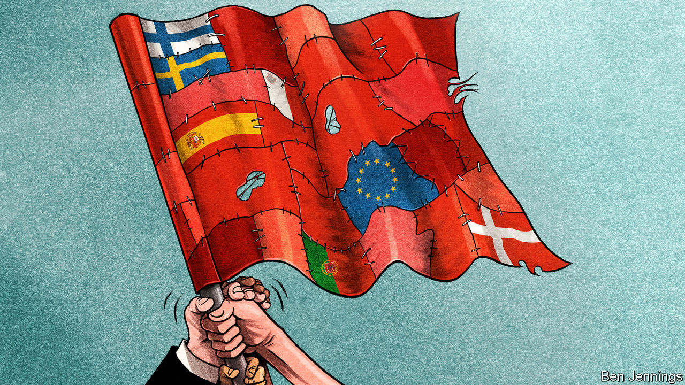

## Charlemagne

# Last of the centre-lefties

> How social democracy survives in a few corners of Europe

> Sep 12th 2020

ARGUMENTS ARE always worse when they involve family, politics or money. They are especially bad when they contain all three. So it proved when EU leaders sat down this summer for four days of talks about issuing €750bn-worth ($884bn) of common debt. Rather than left versus right, the main fight was left-on-left. Europe’s small band of social-democratic siblings attacked each other. On one side were Portugal and Spain, who wanted the cash handed out as non-repayable grants. Meanwhile, their supposed political allies from Denmark, Sweden and Finland tried to stop them. It is not just money that divides the EU’s dwindling bunch of centre-lefties. Portugal and Spain have both been advocates of allowing more refugees into Europe. Social democrats across Scandinavia demand the numbers are cut. “We won’t tolerate any xenophobic rhetoric,” declared António Costa, the Portuguese prime minister, in one speech. Denmark, meanwhile, calls for control of non-Western immigration. Siblings can often look very different.

What they share, however, is a worry about the family’s future. Alongside Malta, a social-democratic speck in the middle of the Mediterranean, the five countries have the last remaining centre-left leaders in the EU. Their brothers and sisters have fallen on hard times. In France, the Socialists are barely a rump. At the most recent election in the Netherlands the Dutch Labour Party managed to lose three-quarters of its MPs. In Germany, the Social Democrats are stuck in an unhappy (and seemingly unending) coalition with Angela Merkel’s Christian Democrats. By contrast, the social democratic parties of Iberia and Scandinavia are hanging on. Should their relatives be taking notes?

Portugal is the golden child for lefties fed up with being hammered in elections. Mr Costa, Portugal’s barrel-chested leader, has warned of the perils of grand coalitions across the political spectrum. Instead he has opted for a ragbag partnership with an assortment of communists and leftists. Critics labelled it geringonça (a “contraption”). But the ungainly device has worked. It raised the minimum wage and reduced the hours that public-sector workers toil. It was not all a socialist dream: the government maintained plans to curb the country’s deficit. Voters still liked what they saw. Last year Mr Costa won re-election and is governing as a minority administration. It was a similar story in Spain. Pedro Sánchez, Spain’s socialist prime minister, once said he “wouldn’t sleep at night” if he made an alliance with Podemos, a more radical left-wing party. A few months later, he had reached a deal with them. A leftward shift, followed by partnership with even leftier rivals, marks the Iberian method.

Others may struggle to follow these tactics. Centre-left parties in Portugal and Spain can rely on a pool of working-class votes that has disappeared in other countries, points out Pedro Magalhães of the University of Lisbon. Whereas challenger parties have sprung up in much of the EU, there are fewer such options in Portugal, where Mr Costa’s Socialists and their centre-right (and oddly named) rivals, the Social Democratic Party, have long dominated the political spectrum. New parties have emerged in Spain, but they have not successfully courted the base of Mr Sánchez’s Socialist Workers’ Party (PSOE). Podemos mainly attracted well-educated urban voters, of the tribe that Thomas Piketty calls the “Brahmin left”. PSOE’s bedrock of boomers remained solid, even if Podemos did run the party close in 2016. Nationalist anti-immigrant parties such as Vox have made little headway, as Iberia remains largely unperturbed by a debate on immigration that has roiled much of the rest of Europe. Circumstances, then, rather than strategy lurk at the heart of the survival of Iberian socialism. Compared with the rest of the EU, Iberia resembles a political Galapagos island for the centre-left: there are fewer predators, allowing it to evolve in its own peculiar way.

Scandinavia’s situation is more recognisable. Neuralgic issues such as immigration strain the typical base of social-democratic parties, an alliance of the working class and better-educated middle-class professionals. The Danish Social Democrats have, seemingly, had success with a platform of left-wing economics and tough policy on immigration. Mette Frederiksen, the prime minister, spelled out the shift in a speech. In 1980, 1% of people in Denmark were “non-Western”, she explained. Now it is nearly one in ten. Her solution? A limit on “non-Western immigration” into Denmark. But the policy was a vote-swapper, rather than a vote-winner. Whereas some voters came back from the Danish People’s Party, a far-right opposition party, others quit, fed up with the anti-immigration tone. Again it was the so-called Brahmin left who departed. Importantly, points out Karina Kosiara-Pedersen, a professor at Copenhagen University, these voters drifted to other parties on the left. This enabled the Danish Social Democrats to take power in a left-wing coalition, displacing their liberal rivals.

Scepticism about the Danish approach abounds. Straight switchers from centre-left to the populist right are rare, points out Tarik Abou-Chadi from the University of Zurich. Nor is it a viable long-term strategy. Trying to rebuild with the votes of a dwindling traditional working class alone—especially at the expense of a growing band of well-educated, relatively liberal voters—is risky. Rather than reforge the old alliance of the working class and liberal middle class, the Danish method is an admission of defeat.

The days of social-democratic parties mopping up nearly half of all voters, as happened in their post-war peak, are over. Neither the Danish nor the Iberian path is easily copied. What they do demonstrate is that an era of complicated and cumbersome coalitions and pacts looms, with different parts of the centre-left going after different segments of left-wing voters. As the base of centre-left parties fragments, so will the parties themselves. Their family reunions will only become more fractious. ■

## URL

https://www.economist.com/europe/2020/09/12/last-of-the-centre-lefties
