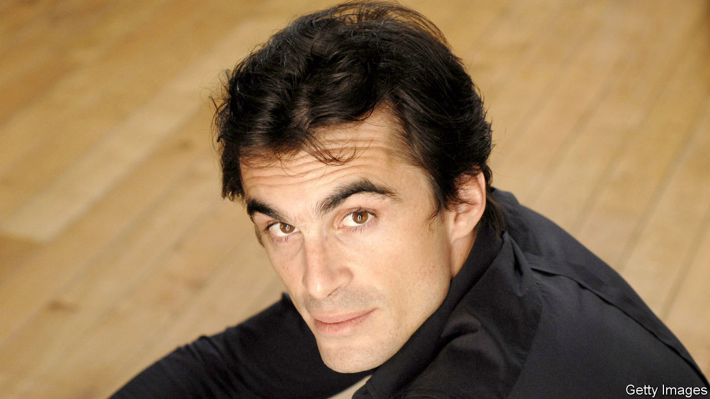

## Les liaisons prétentieuses

# Sex, lies and philosophy on the Paris left bank

> A new French novel settles scores among the bed-hopping intelligentsia

> Sep 12th 2020PARIS

A  FRENCH LEFT-BANK philosopher runs off with his father’s younger lover, who is herself now married to an ex-president, during his own failed marriage to a novelist, the daughter of another Parisian philosopher, who was his father’s best friend. Were a scriptwriter to pitch the plot, it would be dismissed for convoluted implausibility. Except that this story, which captures with no apparent irony the intertwined lives of Latin Quarter intellectuals, is true.

In “Le Temps Gagné” (Time Saved, a characteristically Proustian reference), published last month, Raphaël Enthoven settles a score with his ex-wife, Justine Lévy (the fictional “Faustine”). She is the daughter of Bernard-Henri Lévy (“Elie”), a French public intellectual with a line in crisp white shirts and moral outrage. In a novel of her own in 2004, Ms Lévy was unsparing in fictionalising Mr Enthoven (“Adrien”), who walked out on her for Carla Bruni, his father’s then partner. (They had a son together, and Ms Bruni later married Nicolas Sarkozy.)

Mr Enthoven returns the favour. “Faustine” “wasn’t really pretty but had these cheeks.” Their marriage was “not really mine” but also “that of my father with his best friend”, who united two intellectual clans. Tout Paris attended their wedding. The marriage lasted “Four years. Ten million days.” Adding irony to insult, he fell for “Beatrice” while staying at the Moroccan villa belonging to “Elie”, his wife’s father. After the book came out, Mr Enthoven’s father, Jean-Paul, cut off contact with his son.

The novel has all the ingredients to enthral the Paris left bank: philosophy bien sûr, but also sex, psychoanalysis and narcissism. Mr Enthoven describes the day that, as a boy, gazing at his reflection in a train window, he realised that “I was handsome. Objectively handsome.” Did all this really happen? The answer, of course, depends on whose truth it is. Mr Enthoven prefaces his novel thus: “This story is entirely imagined, because I lived it from the beginning to the end.”

## URL

https://www.economist.com/europe/2020/09/12/sex-lies-and-philosophy-on-the-paris-left-bank
