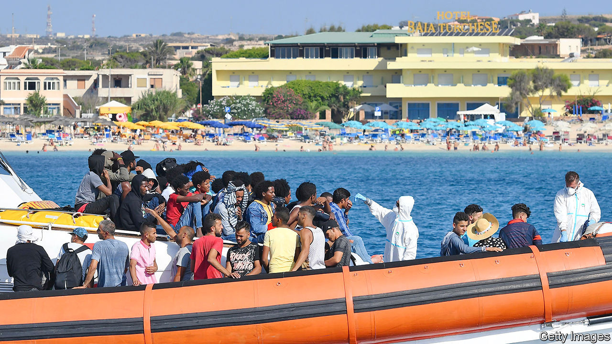

## Blamed for the virus

# The number of migrants arriving in Italy is up again

> But they are coming from different places

> Sep 12th 2020ROME

AFTER A PAUSE because of bad weather, the landings began again on September 8th. Three boats carrying 56 people reached Italy’s southernmost island, Lampedusa. A sailing vessel with 62 aboard put into the port of Crotone on the Italian mainland.

That day’s events highlighted the ways that migration across the central Mediterranean has changed. First, and most obviously, it has increased again. According to the International Organisation for Migration, by September 2nd, 21,927 people had reached Italy or Malta this year by sea: 47% more than in all of 2019. By the end of August, the reception centre on Lampedusa, which has a capacity of 192, was trying to cope with around 1,500 people. Still, the number, which is about as big as it was in 2018, is far below its peak of 2016, when more than 180,000 arrived on the shores of the two countries.

This year’s shift has been towards smaller groups on smaller vessels, organised by the refugees themselves rather than by people-smugglers. The arrival points have been more varied, too. Most notably, only a minority of recent immigrants are from sub-Saharan Africa.

That is partly because of lockdowns against covid-19. But it is also happening because the coastguard in Libya, until recently the main departure point, has been more effective since receiving training and equipment from Italy to boost its ability to intercept migrant vessels.

Instead, Tunisians have accounted for more than 40% of this year’s arrivals in Italy, according to the UN’s High Commission for Refugees. The pandemic is responsible for this change, too. It has turned an ailing Tunisian economy into a stricken one. Heavily dependent on tourism, its GDP shrank by 22% in the second quarter, while unemployment rose to 18%. It is not just Tunisia’s poor who have fled across the sea. One woman got off a boat in July wearing sunglasses, a wide-brimmed straw hat and with a poodle on a lead.

In August Italy’s interior and foreign ministers went to Tunisia to see President Kais Saied and members of his government. During the visit it emerged that Italy would provide €11m to help Tunisia in its efforts to stem the migrants’ flow.

Covid-19 has also prompted the hard-line right-wing opposition in Italy to argue that the rise in new cases of the virus since early August is due to the rise in the number of incoming migrants. Matteo Salvini, leader of the hard-right Northern League, claimed that migrants on Lampedusa infected with the virus were mingling with Italian holidaymakers who were then carrying it back to their regions of origin. Giorgia Meloni, who leads the Brothers of Italy party, which has roots in neo-fascism, wrote on Facebook that “the link between clandestine immigration and increases in infection cannot be ignored.”

Yet a report by Italy’s national public-health institute found that, although arrivals from abroad had accounted for a growing proportion of infections since mid-June, the virus was mostly spread either by Italians returning from holidays abroad or by foreigners resident in Italy who had travelled to and from their countries of origin. There was no increase in the number of outsiders arriving with the virus, whether as tourists or as migrants.

But facts are one thing and politics another. The centre-left government, facing regional elections later this month, cannot afford to look soft on immigration. On September 8th Sea Watch, a German NGO that conducts search-and-rescue operations in the Mediterranean, said its spotter plane had been grounded by the authorities after identifying around 2,600 people in danger. “The Italian government has closed our eyes on the central Mediterranean,” said Sea Watch’s spokeswoman. ■

## URL

https://www.economist.com/europe/2020/09/12/the-number-of-migrants-arriving-in-italy-is-up-again
