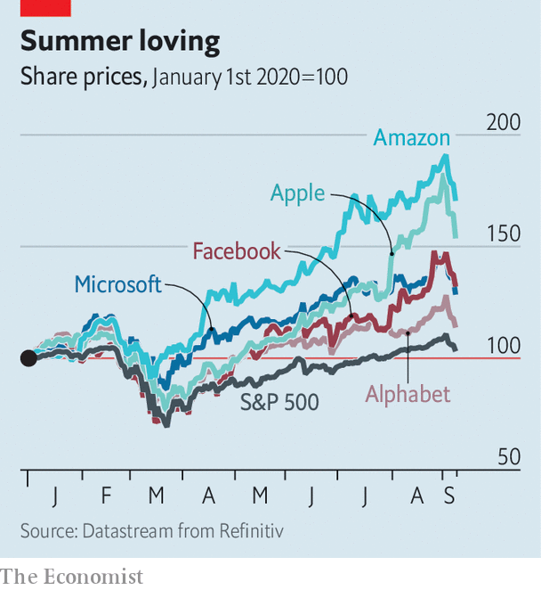
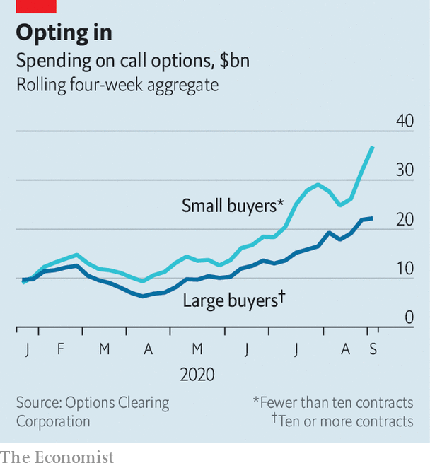

## Techtonic shifts

# Beware the power of retail investors

> Armed with derivatives, they are raising the volatility of tech stocks

> Sep 12th 2020NEW YORK

THE END of the summer often brings about a dose of realism. Children bemoan the end of their leisurely holidays and trudge back to the classroom. Summer-lovers return from the beach. This time of the year often brings stockmarket investors back to Earth, too. On average, since the 1950s, September has been the worst month for American shares.

Could it be happening again? The end of summer has brought a burst of volatility to the share prices of America’s tech giants, especially the five “mega-cap” firms—Alphabet, Amazon, Apple, Facebook and Microsoft—that had driven the Nasdaq, an index of tech stocks, and the S&P 500, a broader index, to record highs in late August (see chart). After a blistering three-day sell-off, on September 9th stockmarkets rebounded, suggesting investors are still seeing buying opportunities when markets dip. But the dramatic swings have highlighted a shift in market dynamics that may continue to foster instability. It is driven by a rare combination of retail investors and high-octane derivatives trading.

Derivatives have been called weapons of mass destruction. In this case the masses have weaponised themselves with call options, a type of derivative that gives the buyer the right, but not the obligation, to buy a stock at a given “strike” price on a specific date in the future. Options can have an outsized impact on prices because they leverage investments—a buyer might spend just $1,000 to purchase an option that could give him a position worth $10,000 or $20,000. If a stock price rises above the strike price before the option’s expiry, the holder can buy the share at the lower price and pocket the difference. Otherwise, the option expires worthless. The total nominal value of calls traded on individual American stocks hit a record high in the last two weeks of August, averaging $335bn a day, according to Goldman Sachs—the first time the average daily volume of traded stock options has exceeded trading volume for the shares themselves. The volume of calls was more than triple the rolling average between 2017 and 2019.

Two types of option activity stand out. The first is institutional trading, in particular the huge option positions purchased by SoftBank, the Japanese conglomerate run by Masayoshi Son. On September 4th the Financial Times reported that SoftBank had purchased $4bn-worth of call options on American tech companies. The notional value was about $30bn.

The second is the rapid growth in purchases of call options by small traders (see chart), dubbed the “Robinhood effect” after the popular platform on which many retail investors punt. Historically, large orders of options—in bundles of more than ten contracts, or around $10,000-worth—were the dominant source of options-buying. But through 2020 small buyers, who acquire fewer than ten contracts at a time, have taken a bigger share of the market. This trend has been especially pronounced over the past four weeks. Small buyers have spent more than $37bn on call options, giving them a notional exposure probably in the region of $500bn or more. Even with the five “mega-cap” tech stocks worth a combined $6trn, that gives them a lot of clout.

Who bears most responsibility for the volatility? First, small-trader flow is much larger in size, although it was likely dispersed among more listed companies. Second, and more importantly, although both types of buyer purchased options, the trades differ greatly. The options bought by SoftBank are reported to be long-term (three- or six-month) bets on the biggest tech firms, like Amazon and Microsoft. They were also “delta-hedged”, as is typical for institutional investors, meaning that at the same time as SoftBank bought the options, its bankers also sold the underlying stocks in proportion to the exposure the option gave them. This is important, because it means that the marketmakers who sold SoftBank the options did not immediately have to hedge their position by buying up shares in, say, Microsoft or Amazon.

This is different to the type of option that retail investors typically buy, which is a call option purchased “naked”, ie without a hedge. Significant volumes of unhedged call options will force the marketmakers to buy up shares in the underlying stocks, creating a positive—and potentially euphoric—feedback loop. Adding to this dynamic is the short-dated nature of the derivatives. The value of an option that is short-lived moves rapidly as the share price moves. As expiry approaches, any increase in the price of the stock makes the option more valuable. Moreover, it means that the marketmakers who sold the option will quickly need to bolster the size of their hedges, increasing the upward momentum. These differences make it more likely that retail flows were a bigger driver of momentum in tech stocks in August than SoftBank was.

This heavy use of derivatives may also explain some unusual market dynamics. Because shares tend to inch higher steadily, but drop more rapidly, rising markets usually occur amid falling volatility. However, the leaps in share prices in recent weeks have caused the correlation between falling volatility and rising prices to break down for the first time since 2018.

What does this imply about the future performance of tech stocks? Because of the influential role of turbocharged retail investment, prices can be expected to remain choppy. Moreover, the market is entering a period where typical covid-19-related volatility may be exacerbated by the twists and turns of America’s presidential election.

That said, much of the tech recovery from the lows in March was rooted in fundamental shifts, like policy interventions, or pandemic-prompted changes to consumer behaviour, such as online shopping, that have helped firms like Amazon. Even if the giddy obsession with tech firms exhibited during the summer fades, there may be little reason for investors to throw in the beach towel yet. ■

## URL

https://www.economist.com/finance-and-economics/2020/09/12/beware-the-power-of-retail-investors
