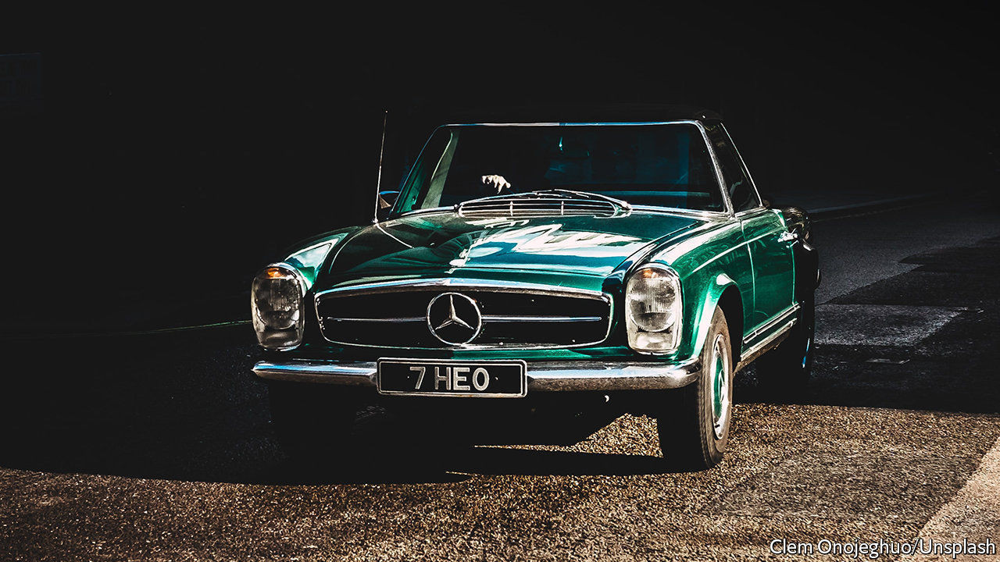

## Money in the Banksy

# How to bet on art and other baubles

> There’s an app for that

> Sep 10th 2020

IMAGINE OWNING a Claude Monet, a 1977 Lotus Esprit, or a thoroughbred racehorse. Some retail investors have got their kicks during the pandemic taking a punt on call options (see [article](https://www.economist.com//node/21791718)). But others prefer a slice of the high life. With a tap on an app—and often for less than the price of a bottle of champagne—they can fill their boots with expensive baubles.

This is fractional ownership, millennial-style. An investment idea more often associated with private jets and holiday homes has spread to art, vintage cars, sports memorabilia and other esoteric acquisitions, and has soared in popularity since covid-19 put other forms of betting on hold, its protagonists say.

The trend began after America’s Securities and Exchange Commission issued a rule in 2015 increasing the amount that firms could raise in “mini” initial public offerings (IPOs) to $50m. These are open to the public, not just “accredited” investors. Though industry-wide data are scarce, Anthony Citrano, founder of Acquicent, a fractional-ownership startup specialising in classic cars, estimates that the overall market was worth just under $50m at the start of the year. Now he reckons it has grown by a fifth. Rob Petrozzo of Rally Rd, which offers shares in vintage cars, wines and books, says under-30s have flocked to the platform.

Masterworks, founded in 2017, has sold 15 artworks with valuations of at least $1m during the pandemic, says Scott Lynn, its founder. That includes $1.5m-worth of shares sold in a company formed around a single artwork by Brian Donnelly, a former street artist known as Kaws. The price per share was only $20 but the risk factors in the IPO offer document were 15 pages long. The company has no history and expects no revenues, and the painting may be sold at a loss, it warned. Other mini-IPOs have been of works by Andy Warhol and Banksy.

Most commonly the startups acquire something enticing at an auction, say, or from a gallery, then form a firm directly linked to the asset, and sell shares in it. A different model is to acquire a minority stake in something belonging to a private owner or a gallery looking to find some liquidity but unwilling to part with the entire asset. “If I have a Cézanne in my living room, no one will know that I only own 60% of it,” says Kevin Conroy, a former board member of Sotheby’s, an auction house, and an adviser to Acquicent, which plans to use this approach. That model may appeal to museums struggling to make ends meet, he adds.

Some products may generate modest dividends for investors, through sponsored events or leasing arrangements. Investors sometimes have access to galleries run by a platform, or may win a draw to parade a racehorse in the paddock. But the ability to trade shares in secondary markets is rare, the expensive assets acquired are illiquid and fraught with risk, and some punters will inevitably lose their shirts. At least for a while, though, they can feel like they are living “The Great Gatsby” lifestyle. And if their bets go sour, there is always champagne.

## URL

https://www.economist.com/finance-and-economics/2020/09/10/how-to-bet-on-art-and-other-baubles
