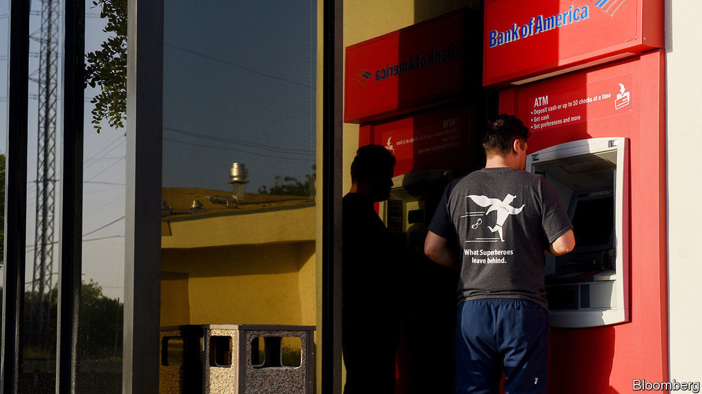

## Cyber heists

# How to launder ill-gotten gains

> A popular form of bank theft blends the digital and physical

> Sep 10th 2020

 WHEN WILLIE SUTTON was asked why he robbed banks, he reputedly replied: “Because that’s where the money is.” These days there is no need to don a mask and wave a gun: bandits can steal millions from their armchairs, wielding nothing more lethal than malicious code.

Cyber-thieves grow ever more persistent, with banks and cryptocurrency exchanges among the main targets. One estimate, from 2018, put total cyber-crime revenue at $1.5trn or more a year (including not only bank jobs but also theft of intellectual property, counterfeiting, data-ransoms and so on). It could be higher now, thanks to covid-19. Many financial firms have struggled to keep security tight with so many staff working from home.

Most big heists are carried out either by organised-crime groups or state actors. Focus on the latter has sharpened since hackers thought to be linked to the North Korean government stole $101m (and almost got away with another $850m) from Bangladesh’s central bank in 2016, after manipulating transfer instructions from SWIFT, a global payments tool with 11,000 members.

After a lull in activity, the North Koreans are back. American government agencies recently issued an alert warning that they have been cooking up new bank-robbing schemes to help fund the regime of Kim Jong Un, cash-strapped by sanctions.

One such scheme, known as an “ATM cash-out”, is described in a new report by SWIFT and the financial-consulting arm of BAE Systems, a defence contractor, on how cyber-heists are carried out and the gains laundered. Far from being all-digital, it involves hacking cash machines to spit out notes, which are grabbed by accomplices known as “money mules”. Among those who specialise in cash-outs are the BeagleBoyz, a group linked to the Reconnaissance General Bureau, a North Korean spy agency, who have attempted to steal nearly $2bn since 2015, say the American agencies.

The downside of attacking ATMs is that they hold limited amounts of cash. So the hackers do it in volume. Machines in upwards of 30 countries (including America) have been targeted in a single strike. But that also makes it labour-intensive: an attack on one bank, by a group called Lazarus, involved 12,000 ATM withdrawals across 28 countries, all made within two hours, according to the report.

The mules are also used to get the stolen cash back into the financial system. One common way to do this is to take it to a casino, convert it into chips, and then exchange it back into cash in the form of a cheque from the casino showing a legitimate transaction. This can then be deposited in a bank without ringing alarm bells.

Efforts to foil such schemes tend to focus on identifying mules from CCTV footage, then trying to connect dots up the chain of command. Some banks are taking more extreme measures. After being warned about the latest threat from North Korea, some Bangladeshi lenders have opted to shut their ATMs down between midnight and 6am to reduce the threat from cash-outs.■

## URL

https://www.economist.com/finance-and-economics/2020/09/10/how-to-launder-ill-gotten-gains
